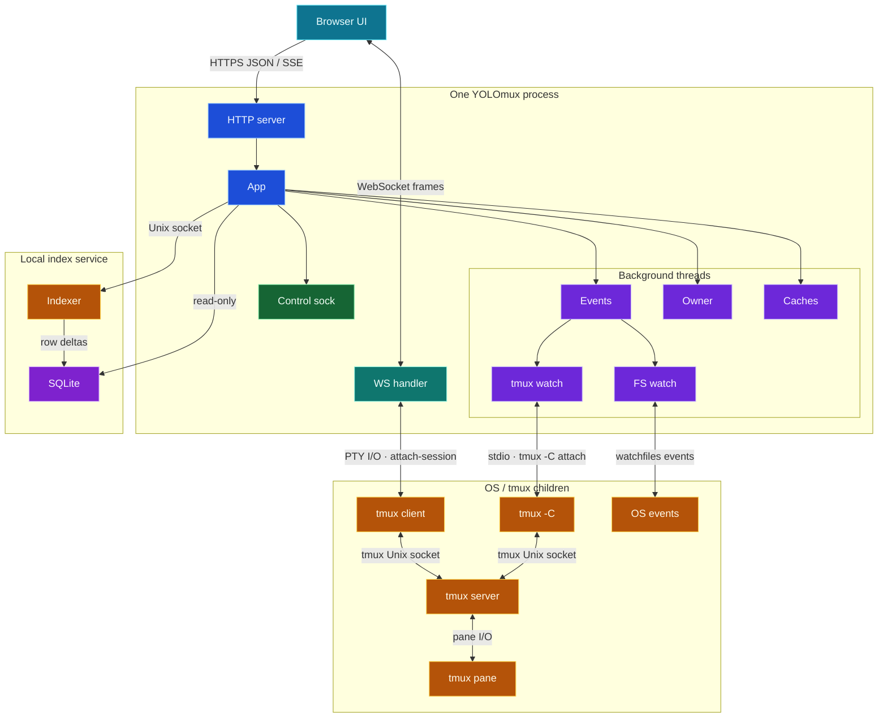
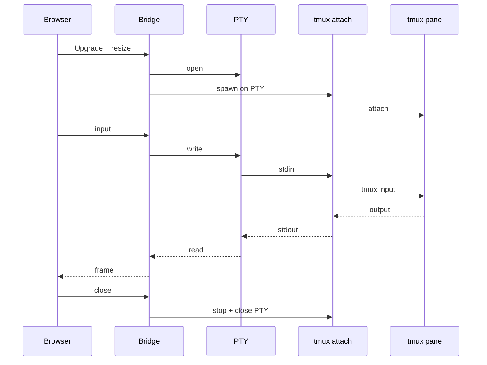
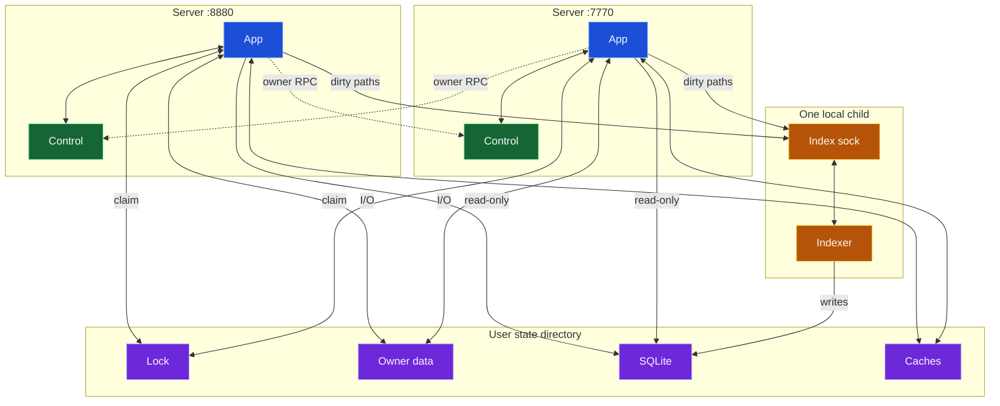

# YOLOmux

Browser tools for watching, driving, and summarizing tmux sessions.

`yolomux.py` serves an interactive UI that attaches browser xterm.js terminals to local tmux sessions and adds agent-aware controls around them. Two companion tools ship alongside it: `auto_approve_tmux.py` (YOLO auto-approval without the UI) and `tmux_wall.py` (a read-only snapshot wall).

Contributor and build instructions live in [`docs/DEVELOPMENT.md`](docs/DEVELOPMENT.md). AI-agent conventions live in [`AGENTS.md`](AGENTS.md), and detailed product behavior lives under [`docs/specs/`](docs/specs/).

## Requirements

- Python 3.10+
- tmux
- `openssl` on `PATH` (only needed for `--self-signed` HTTPS)

## Quickstart

Recommended local run: HTTPS, login-gated, all tmux sessions visible, and YOLO-enabled for new Claude/Codex sessions created from the UI.

```bash
git clone https://github.com/keivenchang/yolomux.git
cd yolomux
make setup          # pip install -e ".[yoagent]" + xterm.js assets + build the bundle  (run `make help` for more)
tmux new-session -A -s project1     # optional: create one if you do not already have tmux sessions
python3 yolomux.py --self-signed --dang   # or: make run
```

`make setup` checks for Python 3.10+ before doing any build work, then pip automatically installs every runtime dependency, including the native `watchfiles` filesystem-event backend. On an externally managed system Python (PEP 668), create and activate a virtualenv first (`python3 -m venv .venv && . .venv/bin/activate`), then `make setup`. Not using `make`? `pip install -e ".[yoagent]"` installs the dependencies + the `yolomux` command (pip also enforces Python 3.10+), then `npm install` for local xterm.js assets.

Native filesystem watching is validated on macOS and Linux. Other Unix-like systems are not a support guarantee: if their `watchfiles` backend cannot start, YOLOmux automatically retains its bounded polling fallback.

Open `https://localhost:9998/`. The first launch shows a setup page — see [First launch](#first-launch) below. With no `--sessions` filter, YOLOmux discovers every tmux session from `tmux list-sessions`. `--self-signed` creates a local HTTPS certificate under `~/.local/state/yolomux/tls/`; your browser will warn because it is not signed by a public CA. `--dang` is the short alias for `--dangerously-yolo`, which makes the UI's `+ Claude` and `+ Codex` buttons launch with their dangerous bypass flags.

## Runtime architecture

YOLOmux is one Python server process per listening port, not a Python process pool. It uses short-lived request threads and named background threads inside each server. Quick Open is the exception: a lazy, persistent local indexer child is the sole SQLite writer; servers submit work over a Unix socket and query committed snapshots read-only.



Activity/session-file cache refreshes, stats sampling, and watch-root handling remain thread-based within the elected server. Visible Finder/Differ paths are watched eagerly; the lazy Quick Open indexer batches their dirty paths for two seconds and writes only changed SQLite rows. The visible terminal is different: each browser WebSocket occupies one `ThreadingHTTPServer` request-handler thread and gets a `tmux attach-session` child connected through a pseudo-terminal, so terminal I/O never shares the HTTP request body path.





| Communication path | Used for | Transport |
| --- | --- | --- |
| Browser ↔ server | API requests, SSE notifications, terminal I/O | HTTPS JSON, SSE, WebSocket frames |
| WebSocket bridge ↔ tmux | One interactive terminal attachment per browser session | PTY plus a `tmux attach-session` child; that tmux client connects to the tmux server over tmux’s Unix socket |
| tmux signal watcher ↔ tmux | Pane/window/client lifecycle changes | Long-lived `tmux -C attach-session` control-mode child over stdin/stdout; its tmux client uses the tmux Unix socket |
| Server ↔ server | Owner refresh requests, status, runtime profiling, release/takeover | Local Unix-domain socket; newline-delimited JSON, mode `0600` |
| Server ↔ server election | One owner for expensive cross-process work | `flock` plus atomic JSON generation records under the state directory |
| Indexer ↔ Quick Open index | One writer, row-level index updates | Local Unix socket; indexer writes SQLite WAL, servers use read-only SQLite |
| Owner ↔ durable caches | Stats, activity, session-file state | Atomic JSON/files and locks for shared state |
| Native watcher ↔ OS | Filesystem changes for watched client roots | `watchfiles` backend; macOS/Linux validated, bounded polling fallback otherwise |

### Concrete transports

| Flow | Concrete mechanism |
| --- | --- |
| Browser → YOLOmux | HTTPS API/SSE and RFC 6455 WebSocket on the configured listener—`:8880` in the local macOS launch agent, or the port passed to `yolomux.py` (the setup example uses `:9998`). |
| Terminal WebSocket → tmux | The handler opens a PTY, then spawns `tmux attach-session [-r] [-f ignore-size] -t <session>:` with that PTY as stdin/stdout/stderr. Terminal bytes move over the PTY; tmux’s client then talks to its tmux server over tmux’s Unix socket, not a TCP port. `YOLOMUX_TMUX_SOCKET` adds `tmux -S <socket>` when a non-default tmux socket is required. |
| Signal watcher → tmux | A long-lived child runs `tmux -C attach-session -f read-only,ignore-size -t <session>:`. YOLOmux reads/writes tmux control-mode records on the child’s stdin/stdout; the child uses the same tmux Unix socket. |
| Server → elected server | Newline-delimited JSON request/response over a mode-`0600` Unix socket. Normally: `$YOLOMUX_STATE_DIR/control/yolomux-<pid>-<token>.sock`; a deterministic `/tmp/ycs-…/` path is used if the Unix socket pathname would be too long. RPC actions include `background_refresh`, `background_status`, `background_ping`, and `runtime_profile`. |
| Server → Quick Open indexer | Newline-delimited JSON over a mode-`0600` Unix socket. Normally: `$YOLOMUX_STATE_DIR/search_index/indexer.sock`; a deterministic short temporary path is used on systems with a Unix-socket pathname limit. Actions: `ping`, `status`, `enqueue`, and `unindex`. Requests are coalesced for two seconds; only the indexer writes SQLite. |
| Markdown → visual preview | Browser-local rendering; there is no SVG server or preview port. A changed Markdown content generation replaces its derived DOM, reruns Mermaid to a sanitized SVG/blob image, recreates inline media nodes, and rejects any late render from an older generation. |

The owner role is deliberately narrow: every server still accepts browser traffic and owns its own WebSocket/PTy children, while only the elected process runs the shared expensive roles and supervises the lazy indexer. If the owner becomes stale, another process can take over after the heartbeat/lock checks.

## First launch

On first run YOLOmux creates `~/.config/yolomux/auth.yaml` with every account commented out. No login works until you uncomment one:

```bash
# edit the file — nano, vim, whatever you prefer
nano ~/.config/yolomux/auth.yaml
```

Uncomment the admin entry (it uses your login username and a random generated password):

```yaml
users:
  - username: "yourname"
    password: "generated-password-shown-in-file"
    role: "admin"
```

Save the file. The setup page polls and reloads automatically — no server restart needed. Then log in.

To add a read-only guest account, uncomment (or add) a `readonly` entry:

```yaml
  - username: "guest"
    password: "guest"
    role: "readonly"
```

## Concepts

YOLOmux follows terminal-app terminology (iTerm2-style):

- **Pane** — a visible split region that holds one or more tabs and shows one at a time. Ordinary **Generic Panes** tile via draggable splits. Optional outermost **Side Panes** are narrow left/right specializations for Finder/Differ/Tabber and Side-created YO!* tabs; their role is explicit and cannot be exchanged with a Generic Pane.
- **Tab** — the thing shown inside a pane. Tab types: **tmux session** (terminal), **Finder** (file browser), **Differ** (changed files), **Tabber** (recent tabs/windows), **File** (text editor or image viewer), **Preferences**, **YO!agent**, and **YO!chat**.

When a Tab is a tmux session, that session has its own internal hierarchy — tmux sub-windows (`Ctrl-b n/p`) and tmux panes (`Ctrl-b %/"`) — which belong to tmux, not YOLOmux. Watch the overloaded word **pane**: a YOLOmux Pane is a browser layout split, a tmux pane is a split inside a tmux sub-window.

## Daily use

Open YOLOmux after setup. Existing tmux sessions appear as tabs. (The detailed pane/tab/Finder/Differ behavior contract lives in [`docs/specs/GUI.md`](docs/specs/GUI.md); this list is the daily-driver essentials.)

- Click a tab to show it in that pane. Use the `Tabs` menu to activate minimized or inactive tabs.
- With a mouse, trackpad, or Pencil, hover a tab for details; right-click, Control-click, or press the keyboard Menu key/Shift-F10 for actions without switching to that tab. On pure-touch screens, long-press a tab for the same bottom action sheet; drag instead to cancel it. Split actions place that tab on the named side and retain a useful `Drop a tab here` peer pane. `Expand pane` temporarily fills the workspace and restores the exact prior layout when used again.
- Press `?` for the responsive Keyboard Shortcuts and Legends dialog, including the green play, yellow pause, and red stop status glyph meanings.
- Drag a tab between same-role pane tab bars, drop near a Generic Pane edge to split it, or drop on the outer root edge for a full-span pane. A generic tab moved to the far right creates another Generic Pane, not a Side Pane. No tab can move or swap between Side and Generic roles. Pane roles, edges, splits, and percentages encode into the shareable page URL.
- Drag a Finder or Differ file row into a pane to open that file there; dropping near a pane edge opens it in a new split.
- Upload or paste files with drag-drop, clipboard paste, or the `+` button. Dropping a file on a terminal offers actions suited to an AI or shell pane.
- Use the pane Info Bar to switch tmux sub-windows (`0:bash`, `1:codex`, ...), cycle among a session's repositories with `< N/M >` or pick one from the `N/M` menu, open transcripts (`Tx`), request an AI summary (`AI`), or inspect the event log (`Log`).
- File -> `Search & Runs` opens a data pane that searches captured session events and summaries, then lists compact run history rows with prompt, cwd, agent, timing, final state, PR, and latest summary.
- File -> `YO!info` opens a grouped relationship tree over tabs, agents, paths, branches, pull requests, and Linear work.
- File -> `YO!stats` opens API/SSE events and performance graphs for host CPU/memory, NVIDIA or macOS GPU activity/memory, client traffic, agent status, and agent tokens. CPU shows system average plus YOLOmux servers; memory reports actual host/device bytes. Its first graph request shows only `Waiting for server stats...` until the server accepts a sample. Thereafter it loads retained history incrementally: widening a range preserves visible data while the missing interval loads, and one Retry action replaces the same loading slot if that request fails. The server compresses large JSON responses when the browser accepts gzip, and owner/follower servers expose the same durable global history while keeping each browser's client metrics private. Startup callers share one request per resource, so boot, SSE-ready, visibility, and Tabber rendering do not duplicate background-status, auto-approve, or activity reads. Client communication charts tolerate event-driven empty buckets and distinguish shared all-client bad-connection intervals from actual API/SSE, latency, and bandwidth samples, including after 24-hour history compaction; one stale client cannot shade a live peer, and zero labels align with the shared plot baseline. The detailed behavior contract lives in [`docs/specs/GUI.md`](docs/specs/GUI.md).
- The pane header pop-out button opens supported file previews, YO!info, and YO!stats in a detached browser window.
- File -> `YO!share...` creates short live magic URLs for the current YOLOmux layout. Defaults are short-lived, read-only, http links; write access requires https. The host can extend active shares and see connected users with duration, IP, and browser type. Replay details live in [`docs/specs/SHARE_MIRRORING.md`](docs/specs/SHARE_MIRRORING.md).
- File -> `Finder/Differ/Tabber` opens the three independent file-surface tabs. At 900px and wider they live in an explicit narrow left Side Pane; a missing one recreates that Side Pane, and Side tabs never enter Generic Panes. Below 900px there is no Side Pane and File opens only the selected surface in the sole full-width Generic Pane. Widening restores Finder/Differ/Tabber to the left while leaving YO!* tabs generic. Filesystem permission failures are reported in Finder instead of terminating the request. Quick Search is `Mod+P`; it hides clean deleted file tabs, keeps dirty buffers reachable when their backing path is missing, and restores clean tabs when the file reappears.
- Quick Open indexes are bounded accelerators. The default keeps at most 100,000 entries per root, starts one lazy local indexer on demand, and excludes common dependency/build directories. Paths displayed by Finder or Differ are batched at two seconds; hidden paths rely on the long safety refresh. The indexer incrementally replaces only changed subtrees and writes row deltas to SQLite. In Finder/File Explorer, right-click any directory and choose **Allow index** to add its root or **Disallow index** to remove it; Preferences -> Finder/File Explorer shows the same indexed-root list. That section also exposes **Quick Open exclusions** for descendants inside those roots. Add one rule per line: a plain absolute or home-relative subtree, `glob:<root-relative glob>` such as `glob:**/.uploads/**`, or `regex:<regular expression>` matched against a root-relative POSIX path such as `regex:(^|/)target(?:/|$)`. Advanced operators can also tune `file_explorer.index_max_files`, `index_refresh_seconds`, `index_persist`, `index_persist_max_files`, `index_persist_max_mb`, and `index_exclude_paths` in `~/.config/yolomux/settings.yaml`.
- Tabber lists open tabs and tmux sub-windows by recent activity. `Mod+B` hides Finder/Differ/Tabber or restores the default left Side Pane on wide layouts. The top-bar language picker changes the live UI language.
- YO!agent handles product questions, session watches, notifications, safe sends, wait-then-send jobs, and multi-agent handoffs. It can also watch an explicit roster until every agent is stably calm, then send one exact command to a separately named tmux session; it shows the roster, destination, blockers, and quiet window, and never sends twice across shared servers. Known phrasing is parsed locally; a configured AI backend may propose a flexible roster plan, but the server validates it and requires confirmation before that model-derived send. See [`docs/YOAGENT_SKILLS.md`](docs/YOAGENT_SKILLS.md) for setup and examples.
- File -> `YO!chat`, immediately after `YO!stats`, opens one global conversation shared by authenticated admin and readonly users whose servers use the same `YOLOMUX_STATE_DIR`; YO!share guests cannot access it. Human headers preserve the authenticated username's case, show the server-observed IP, use a stable per-person color from the shared theme, and show relative age for the first four hours before switching to an exact local timestamp; the composer border uses the same color as that user's sent messages. A non-persisted YO!agent introduction with one of several localized greetings remains first in the current timeline, named typing presence uses localized list formatting, history search stays absent until Cmd/Ctrl-F and its X hides it again, older messages load in bounded pages as you scroll upward, the composer grows with content only up to half the pane, and the keyboard/touch emoji picker lazy-loads its catalog. New content follows the bottom only while you are already viewing the tail; scrolling into older messages preserves that position and exposes New messages. `/yo <query>` stores the question, shares `YO!agent is typing…` through the normal typing lease without adding a fake history message, delegates to the existing YO!agent task/transcript/recommendation pipeline, renders the stored answer through the shared sanitized Markdown path, and shares it with every client. Searchable state lives in SQLite and exact messages are also journaled under `YOLOMUX_STATE_DIR/yochat-history/YYYY-MM-DD.jsonl` using UTC dates. Both are retained for seven days by default (`Preferences -> YO!chat` supports 1–365 days), the database is capped at 100,000 messages, and first load starts at the current tail.
- Cross-pane notifications appear in one global toast rail and identify their target tab without changing your current focus. Attention remains until acknowledged; completion, chat, PR, and job notices are coalesced by target. Clicking a notice opens its target and clears it. Uploads and file/editor errors remain in the pane where that direct action occurred. Preferences independently control in-YOLOmux and system notifications.
- Tab attention badges surface agents waiting for input or approval even when automatic approval is off. YOLOmux tracks one canonical Claude/Codex identity per physical tmux pane, so short-lived searches or tests that mention an agent name cannot create duplicate status rows or finished notifications. Visible spinner/timer history is bounded and resets when it disappears, so a reused tmux pane cannot inherit stale working state.
- The browser title, favicon badge, and topbar activity count report working Claude/Codex sub-windows, so two active agents inside one tmux session count as two everywhere.

For exact UI behavior, edge cases, and coverage, see [`docs/specs/GUI.md`](docs/specs/GUI.md).

### Copying terminal text

- Select text and press `Cmd-C` (Mac) / `Ctrl-C` (PC) to copy it to your browser clipboard. While a full-screen app like Claude owns the mouse, a normal drag goes to the app instead of making a selection — hold `Option` (Mac) / `Shift` (PC) and drag to force a real terminal selection, or just select inside the app: its own copy (sent as an OSC 52 escape) is forwarded to your browser clipboard automatically (the status line shows `copied N chars`).
- `Cmd-C` with nothing selected does nothing — it is never delivered to the running program. Plain `Ctrl-C` with nothing selected still sends `SIGINT` to interrupt the program.
- To copy the tmux copy-mode selection (server-side, via tmux), press `Cmd-Option-C` (Mac) / `Ctrl-Alt-C` (PC), or right-click and choose `Copy tmux selection`.
- Right-click keeps the current selection highlighted and offers `Copy` / `Copy without indent`. When Claude owns the visible highlighted block and sends it through OSC 52, the right-click menu must preserve that app-side block; it must not re-read and copy only the small text under the cursor.
- Right-clicking a URL in a terminal pane or rendered markdown puts `Open URL in a new tab` first, then `Copy URL`; when the visible selected text differs from the actual href, the menu labels that path explicitly as `Copy selected text`.
- After a terminal copy/open action consumes selected text, YOLOmux clears stale browser/xterm selection. Explicit `Copy tmux selection` also exits tmux copy-mode after copying so selected rows do not stay painted as green blocks.

The `YO` button toggles YOLO auto-approval for a tmux session. See [Agent permissions & YOLO](#agent-permissions--yolo).

## Running options

All tmux sessions, default behavior:

```bash
python3 yolomux.py --self-signed --dang
```

Custom port (default is `9998`, host defaults to `0.0.0.0`):

```bash
python3 yolomux.py --port 8080 --self-signed --dang
```

Background server:

```bash
setsid nohup env TERM=xterm-256color PYTHONUNBUFFERED=1 MALLOC_ARENA_MAX=2 python3 yolomux.py --self-signed --dang > /tmp/yolomux.log 2>&1 < /dev/null &
```

Specific tmux sessions only, optional filter:

```bash
python3 yolomux.py --sessions project1,project2 --self-signed --dang
```

## HTTPS / TLS

```bash
python3 yolomux.py --self-signed          # auto-generated cert, stored in ~/.local/state/yolomux/tls/
python3 yolomux.py --cert fullchain.pem --key privkey.pem   # bring your own
```

`--self-signed` requires `openssl` on `PATH`. Browsers warn because the certificate is self-signed; proceed past the warning.

## Authentication & roles

| Role | Can do |
| --- | --- |
| `admin` | Type into tmux panes, create sessions, upload files, toggle `YO`, switch tmux sub-windows, run AI summaries. |
| `readonly` | View panes, transcripts, branch metadata, logs, and YOLO status. Terminals are read-only. |

Cookies have a 90-day sliding lifetime and survive server restarts. Cookies are scoped by port, so dev and production servers on the same host do not overwrite each other. Changing a user's password invalidates existing cookies for that user.

## Agent permissions & YOLO

**Launching agents.** Claude's auto permission mode:

```bash
claude --permission-mode auto        # auto-handles most decisions
claude --dangerously-skip-permissions  # full bypass
codex --ask-for-approval never       # no approval prompts, sandbox still active
codex --dangerously-bypass-approvals-and-sandbox  # command approval and sandbox bypass
codex --dangerously-bypass-hook-trust             # hook trust bypass
```

`claude --dangerously-skip-permissions` bypasses Claude Code permission prompts.

`codex --dangerously-bypass-approvals-and-sandbox` lets Codex run model-generated commands without approval prompts and without the Codex command sandbox. `codex --dangerously-bypass-hook-trust` is separate: it allows enabled Codex hooks to run without persisted hook trust. It does not remove the normal command sandbox by itself.

**`--dang` / `--dangerously-yolo` (server flag).** Makes `+ Claude` / `+ Codex` buttons launch with the dangerous bypass flags:

```bash
python3 yolomux.py --self-signed --dang
```

With `--dang`, `+ Claude` launches `claude --dangerously-skip-permissions`, so permission prompts are bypassed for new Claude sessions (hooks and OAuth login are left intact — see the note above on why `--bare` is not used). `+ Codex` launches `codex --dangerously-bypass-approvals-and-sandbox --dangerously-bypass-hook-trust`, so both command approval/sandbox checks and hook trust checks are bypassed for new Codex sessions.

Without it, those buttons create plain `claude` / `codex` sessions. This flag does not change existing sessions.

**The `YO` toggle.** Per-session auto-approval for an existing tmux session. It watches the visible tmux screen and sends the approval key when the rule engine says the prompt is safe. Rules live in `~/.config/yolomux/yolo-rules.yaml`:

```yaml
default: ask
rules:
  - name: block destructive
    type: command
    match: [rm, rmdir, shred, dd, mkfs]
    action: block
    risk: delete
  - name: safe reads
    type: regex
    match: '^(ls|cat|grep|git (status|log|diff))\b'
    action: approve
    risk: read
```

The `tmux` menu has `Open rule file` and `Reload rules`. Set `yolo.dry_run: true` in Preferences to log what the rule engine would do without pressing a key.

The optional `risk:` field is a label shown in the YOLO event log. Keep it to the boring concrete set so the audit display stays consistent: `read`, `edit`, `network`, `process`, `delete`, `credential`, `unknown`. Any other string is accepted (the engine never rejects a rule for its risk label), it just won't be standardized.

## Remote access

YOLOmux binds `--host 0.0.0.0` (all interfaces) by default, on purpose: the product is built for reaching your sessions from a phone or another machine on a trusted LAN, and every request is gated by the login layer. If that's your setup, restrict the port to trusted IPs at the firewall:

```bash
sudo ufw allow from <client-ip> to any port 9998 proto tcp
```

To keep YOLOmux local-only instead, bind loopback and tunnel from your client:

```bash
python3 yolomux.py --host 127.0.0.1 --port 9998 --self-signed --dang
autossh -M 0 -N -o ServerAliveInterval=30 -o ServerAliveCountMax=3 -L 9998:127.0.0.1:9998 user@server
```

## Companion: `auto_approve_tmux.py`

Standalone YOLO auto-approval without the browser UI:

```bash
python3 auto_approve_tmux.py --list                       # list tmux sessions
python3 auto_approve_tmux.py --dry-run --once project1    # preview one visible prompt
python3 auto_approve_tmux.py project1                     # watch one session
python3 auto_approve_tmux.py "project*"                   # glob
```

Background:

```bash
setsid nohup env PYTHONUNBUFFERED=1 python3 auto_approve_tmux.py --interval 0.5 "project*" > /tmp/auto_approve.log 2>&1 < /dev/null &
```

## Companion: `tmux_wall.py`

Read-only snapshot wall — passive view of terminal panes with no login layer (refuses non-loopback by default):

```bash
python3 tmux_wall.py --port 8765
python3 tmux_wall.py --targets project1:0.0,project2:0.0 --slots 4
```

Set `YOLOMUX_CONTAINER_HELPER=/path/to/show_project_containers.py` if the wall should include container metadata from a helper outside `~/utils/container/show_project_containers.py`.

## License

YOLOmux is licensed under PolyForm Noncommercial 1.0.0. Noncommercial use is allowed under that license. Commercial use requires a separate commercial license from Keiven Chang.

Third-party code and generated dependency bundles keep their own upstream notices; see [`THIRD_PARTY_NOTICES.md`](THIRD_PARTY_NOTICES.md).
