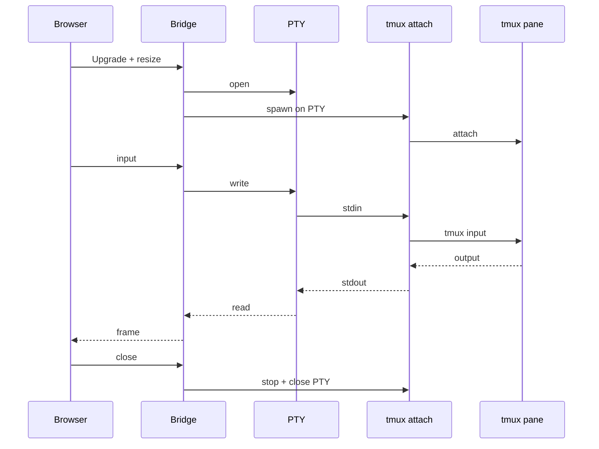

# YOLOmux

Lightweight, powerful browser workspace for managing AI work.

`yolomux.py` brings AI management, editing and viewing, collaboration, file and Git context, and observability into one interactive UI. It integrates with local tmux sessions through browser xterm.js terminals while keeping the workspace focused on directing, reviewing, and completing AI-assisted work. Two companion tools ship alongside it: `tools/auto_approve_tmux.py` (YOLO auto-approval without the UI) and `tools/tmux_wall.py` (a read-only snapshot wall).

Contributor and build instructions live in [`docs/DEVELOPMENT.md`](docs/DEVELOPMENT.md). AI-agent conventions live in [`AGENTS.md`](AGENTS.md), detailed product behavior lives under [`docs/specs/`](docs/specs/), and peer findings live in [`docs/RESEARCH.md`](docs/RESEARCH.md).

## Requirements

- Python 3.10+
- tmux
- `openssl` on `PATH` for the default self-signed HTTPS certificate (not needed with `--cert`/`--key` or `--http`)

## Quickstart

Recommended local run: HTTPS, login-gated, all tmux sessions visible, and YOLO-enabled for new Claude/Codex sessions created from the UI.

```bash
git clone https://github.com/keivenchang/yolomux.git
cd yolomux
make setup          # pip install -e ".[yoagent]" + build the bundle  (run `make help` for more)
tmux new-session -A -s project1     # optional: create one if you do not already have tmux sessions
python3 yolomux.py --dang   # or: make run
```

`make setup` checks for Python 3.10+ before doing any build work, then pip automatically installs every runtime dependency, including the native `watchfiles` filesystem-event backend. On an externally managed system Python (PEP 668), create and activate a virtualenv first (`python3 -m venv .venv && . .venv/bin/activate`), then `make setup`. The source and editable-install runtime serves the tracked xterm files under `static/vendor/`; npm is not needed to start YOLOmux. Contributors can run `make xterm` to install the pinned upstream packages and verify that their bytes still match the tracked files. The Python wheel does not currently package these static assets.

Contributors should use `make dev`. Its `dev` extra installs the complete Python gate toolchain: mypy, Pillow, pytest, pytest-timeout, pytest-xdist, and Selenium. Browser lanes additionally require Chrome or Chromium plus a compatible chromedriver; the xterm provenance check requires Node.js and npm. [`docs/DEVELOPMENT.md`](docs/DEVELOPMENT.md#gate-prerequisites) owns the complete gate and Linux host-capacity requirements.

Native filesystem watching is validated on macOS and Linux. Native events reduce invalidation latency but do not replace bounded reconciliation: the elected web owner still scans at most 1,000 visible names per watched root and retains at most 512 in each directory signature. If the `watchfiles` backend cannot start or loses events, YOLOmux uses the same bounded polling path as its correctness fallback.

Open `https://localhost:9998/`. The first launch shows a setup page — see [First launch](#first-launch) below. With no `--sessions` filter, YOLOmux discovers every tmux session from `tmux list-sessions`. By default YOLOmux creates and reuses a local HTTPS certificate under `~/.local/state/yolomux/tls/`; your browser will warn because it is not signed by a public CA. `--dang` is the short alias for `--dangerously-yolo`, which makes the UI's `+ Claude` and `+ Codex` buttons launch with their dangerous bypass flags.

## Runtime architecture

YOLOmux runs one lightweight `yolomux.py` web process per listening port. On one host, shared work moves to a small fixed set of local Unix RPC services under the same local `YOLOMUX_STATE_DIR`: one supervised `statsd`, one lazy `indexd`, one lazy `jobd` broker with bounded spawn-based worker slots, one lazy `statusd`, and zero or one `approvald` while YO targets are enabled. Do not point servers on different hosts at one shared state directory; the current owner, service, tmux-status, watch-root, and activity paths are not fully host-qualified. The current YO!stats architecture makes `statsd` the sole database writer and history-serving owner: it stores original observations, usage atoms, coverage epochs, and unavailable spans in a schema-versioned database, builds immutable resolution layers asynchronously, and serves exact cached snapshots/deltas while web processes only authenticate and forward. [`docs/specs/STATS_API.md`](docs/specs/STATS_API.md) owns the current schema/fence/path literals. A restarted `statsd` serves from a bounded aggregate ring persisted beside the originals rather than decoding retained history, and rebuilds the buckets an invalidation ledger records as owed, so cold cost follows ring capacity instead of store size. A listening socket is not readiness. `/readyz` requires authentication and fails closed until statsd can serve a correct snapshot, naming every failing condition rather than the first; `/livez` is public and answers only whether the statsd process is making progress, because a process supervisor polls it before any operator cookie exists. The detailed resource projection is on `/readyz` and is not exposed to unauthenticated callers. Both routes are implemented and not yet integrated: they exist on the branch that adds them and are absent from the current candidate tree, and no live HTTP request has been made against either one, so their routing is proven by construction rather than observed. `statusd` is the sole owner of the same-host public session/agent-status snapshot (lightweight tmux discovery, pane classification, encoded auto-approve bytes) and a private session-inventory contract that other daemon-owned products key work on; web processes only forward its bytes. Pane capture stays at the existing active cadence for sessions with activity in the last five minutes, then backs off by measured `tmux` session activity to approximately 10 seconds, 30 seconds, and 120 seconds for recent, quiet, and day-old sessions; new activity promotes a session on the next active reconciliation rather than waiting for its old deadline. `jobd` is a bounded CPU broker for stateless registered tasks and typed materialized products (`transcript_view`, `session_files_view`, `tabber_activity_view`, `metadata_warm_view`) that serve last-known-good bytes while a newer generation builds. Each lane has independently replaceable one-worker slots: after a deadline backstop, a kernel-stuck slot is quarantined, late results are generation-fenced, and at most two unreaped predecessors exist across the broker. A normal stats + Quick Open session has four Python processes (`yolomux.py`, `statsd`, `indexd`, `statusd`); a CPU job burst adds `jobd` plus its executor processes, and active YO auto-approval adds `approvald`. Extra YOLOmux ports on that host add only another web process and reuse the same state-directory services.

The broker gives terminal candidate probes and base file reads a bounded foreground point path ahead of freshness and maintenance work. File bytes do not wait for optional Git history/capability enrichment. Its runtime rows name the accepting instance and state root, queue/phase, active task, broker and worker memory, journal bytes, and file-backed artifact bytes. A malformed queued-operation journal is preserved, reported once, and circuit-broken for that physical source generation instead of retrying it forever.

“Lightweight” describes this process topology, not a guarantee that every browser-visible handler is asynchronous. The current release line still runs a forced full session-metadata build on the HTTP request thread. The legacy `/api/activity-summary` path is disabled across HTTP, browser demand, watch publication, and statusd, and returns a typed terminal `503 feature_disabled` response without starting summary work. It must not be re-enabled until an asynchronous and more efficient API and backend replacement is implemented and accepted. The `Route.normal_session_local_service` flag is only the inventory marker used by the authenticated route test; runtime dispatch does not read it or use it to offload work.

Every terminal HTTP response checks whether the request body was fully consumed before committing headers. If bytes remain, YOLOmux sends `Connection: close` and ends the connection after that response, so leftover POST bytes cannot be parsed as another request line.


```mermaid
flowchart TB
  browser["Browser UI"]

  subgraph server["One yolomux.py web process per port"]
    direction TB
    http["HTTPS/auth/SSE\nrequest threads"]
    app["TmuxWebtermApp\ncoordination only"]
    bridge["WebSocket PTY bridge\none request thread"]
    control["Control RPC\nSTATE_DIR/control/yolomux-<pid>-<token>.sock\nmode 0600"]

    subgraph schedulers["Small in-process schedulers"]
      direction LR
      events["SSE/event fanout"]
      metrics["elected YO!stats metric workers\nCPU 1s · Agent 10s · GPU 10s\nMemory 60s · Tokens 10s/60s"]
      native["watchfiles or bounded poll"]
      signals["tmux control watcher"]
      owner["background-owner election"]
      caches["Tabber/session cache refresh"]
    end
  end

  subgraph services["Same-host local services per YOLOMUX_STATE_DIR"]
    direction TB
    statsd["statsd\nversioned state socket\nsole SQLite writer\nasync four-layer materializer\nexact snapshot/delta cache"]
    indexd["indexd\nSTATE_DIR/hosts/<host-id>/search_index/indexer.sock\nowns per-root SQLite WAL\n60s idle after leases"]
    jobd["jobd broker\nSTATE_DIR/services/jobd.sock\ninteractive/freshness/maintenance queues\nlast-known-good product store\n60s idle when queue empty"]
    execs["jobd executors\nspawn ProcessPoolExecutor\n1-2 workers by CPU count"]
    statusd["statusd\nSTATE_DIR/services/statusd.sock\nshared session/agent-status snapshot\nprivate session-inventory contract\n60s idle after leases"]
    approvald["approvald\nSTATE_DIR/services/approvald.sock\ntarget AutoApproveWorker threads\n60s idle after targets stop"]
    jobd --> execs
  end

  subgraph tmuxsys["OS / tmux children"]
    direction LR
    attach["tmux attach-session\nPTY child"]
    tmuxctl["tmux -C attach-session\ncontrol-mode child"]
    tmuxd["tmux server"]
    pane["tmux pane"]
    fs["OS events"]
  end

  subgraph durable["Durable state"]
    direction TB
    statsdb["versioned stats database\noriginals + usage + coverage\nschema/min-writer fence"]
    indexdb["STATE_DIR/hosts/<host-id>/search_index/<digest>.sqlite3\nindexd is sole writer"]
    locks["STATE_DIR/background-owner/*\nSTATE_DIR/services/*.service.json\nSTATE_DIR/locks/auto-approve-*.lock"]
    caches_state["STATE_DIR/session-files-cache\nSTATE_DIR/activity-cache\nSTATE_DIR/watch-index.json"]
  end

  browser --> http
  browser <--> bridge
  http --> app
  app --> events
  app --> metrics
  metrics --> events
  metrics --> statsd
  app --> native
  app --> signals
  app --> owner
  app --> caches
  app <--> control
  app <--> statsd
  app <--> indexd
  app <--> jobd
  app <--> statusd
  app <--> approvald
  statsd <--> statsdb
  indexd --> indexdb
  app --> locks
  app --> caches_state
  bridge <--> attach
  attach <--> tmuxd
  signals <--> tmuxctl
  tmuxctl <--> tmuxd
  tmuxd <--> pane
  native <--> fs

  classDef client fill:#0e7490,stroke:#67e8f9,color:#ecfeff
  classDef core fill:#1d4ed8,stroke:#93c5fd,color:#eff6ff
  classDef worker fill:#6d28d9,stroke:#c4b5fd,color:#faf5ff
  classDef request fill:#0f766e,stroke:#99f6e4,color:#f0fdfa
  classDef child fill:#b45309,stroke:#fcd34d,color:#fffbeb
  classDef local fill:#166534,stroke:#86efac,color:#f0fdf4
  classDef database fill:#7e22ce,stroke:#d8b4fe,color:#faf5ff
  class browser client
  class http,app core
  class events,native,signals,owner,caches worker
  class bridge request
  class attach,tmuxctl,tmuxd,pane,fs child
  class control,statsd,indexd,jobd,execs,statusd,approvald local
  class statsdb,indexdb,locks,caches_state database
```

The web process accepts browser traffic, forwards tmux bytes, coordinates auth/settings/SSE, and serves cached or worker-encoded bytes. It does not own the YO!stats database, Quick Open database, CPU job executor, or YO auto-approval target workers. If a compatible service is missing, stale, or in crash backoff, the request path returns last-known-good data, pending/unavailable status, or a bounded error; it does not run the retired heavy implementation in the web PID. A newer stats schema/protocol is different: the old client receives `upgrade_required`, stops retrying, and never replaces or mutates the newer owner/database.


```mermaid
sequenceDiagram
  participant B as Browser
  participant W as Bridge
  participant P as PTY
  participant T as tmux attach
  participant A as tmux pane

  B->>W: Upgrade + resize
  W->>P: open
  W->>T: spawn on PTY
  T->>A: attach
  B->>W: input
  W->>P: write
  P->>T: stdin
  T->>A: tmux input
  A-->>T: output
  T-->>P: stdout
  P-->>W: read
  W-->>B: frame
  B->>W: close
  W->>T: stop + close PTY
```


```mermaid
flowchart TB
  subgraph p1["yolomux.py :8880"]
    app1["web app"]
    sock1["control sock\nSTATE_DIR/control/yolomux-<pid>-*.sock"]
  end
  subgraph p2["yolomux.py :7770"]
    app2["web app"]
    sock2["control sock\nSTATE_DIR/control/yolomux-<pid>-*.sock"]
  end

  subgraph state["One host's local state directory"]
    ownerlock["background-owner/owner.lock"]
    ownerjson["background-owner/owner.json\ngenerations/*.json"]
    records["services/*.service.json\nservices/*.service.lock"]
    statsdb["versioned stats database\noriginals + usage + coverage\nschema/min-writer fence"]
    indexes["search_index/<digest>.sqlite3\none indexd writer"]
    caches["session-files-cache\nactivity-cache\nwatch-index.json"]
  end
  subgraph svc["Same-host service PIDs"]
    statsd2["statsd\nversioned state socket\nsole writer + materializer\nexact cache"]
    indexer["indexd\nsearch_index/indexer.sock\n60s idle"]
    jobd2["jobd\nservices/jobd.sock\n60s empty-queue idle"]
    statusd3["statusd\nservices/statusd.sock\nshared status snapshot\n60s idle"]
    approvald2["approvald\nservices/approvald.sock\nexits when no targets"]
  end

  app1 <--> sock1
  app2 <--> sock2
  app2 -.-> sock1
  app1 -.-> sock2
  app1 <--> ownerlock
  app1 <--> ownerjson
  app2 <--> ownerlock
  app2 <--> ownerjson
  app1 --> records
  app2 --> records
  app1 --> statsd2
  app2 --> statsd2
  app1 --> indexer
  app2 --> indexer
  app1 --> jobd2
  app2 --> jobd2
  app1 --> statusd3
  app2 --> statusd3
  app1 --> approvald2
  app2 --> approvald2
  statsd2 <--> statsdb
  indexer --> indexes
  app1 <--> caches
  app2 <--> caches

  classDef process fill:#1d4ed8,stroke:#93c5fd,color:#eff6ff
  classDef socket fill:#166534,stroke:#86efac,color:#f0fdf4
  classDef durable fill:#6d28d9,stroke:#c4b5fd,color:#faf5ff
  classDef localChild fill:#b45309,stroke:#fcd34d,color:#fffbeb
  class app1,app2 process
  class sock1,sock2 socket
  class ownerlock,ownerjson,records,statsdb,indexes,caches durable
  class statsd2,indexer,jobd2,statusd3,approvald2 localChild
```

| Communication path | Used for | Transport |
| --- | --- | --- |
| Browser ↔ server | API requests, SSE notifications, terminal I/O | HTTPS JSON, SSE, WebSocket frames |
| WebSocket bridge ↔ tmux | One interactive terminal attachment per browser session | PTY plus a `tmux attach-session` child; that tmux client connects to the tmux server over tmux’s Unix socket |
| tmux signal watcher ↔ tmux | Pane/window/client lifecycle changes | Long-lived `tmux -C attach-session` control-mode child over stdin/stdout; its tmux client uses the tmux Unix socket |
| Server ↔ server | Owner refresh requests, status, runtime profiling, release/takeover | Local Unix-domain socket; versioned length-framed JSON with legacy newline compatibility, mode `0600` |
| Server ↔ server election | One owner for expensive cross-process work | `flock` plus atomic JSON generation records under the state directory |
| Elected server → `statsd` | Independently scheduled YO!stats CPU/status/GPU/memory/token original observations | Current local Unix RPC; statsd appends/deduplicates originals as the sole SQLite writer and rejects stale writer protocols before mutation |
| Server ↔ `statsd` exact stats | Exact Range/Resolution snapshots, live deltas, and bounded diagnostics | Current binary local Unix RPC; statsd serves pre-encoded immutable cache generations, while the web process never opens or aggregates the stats database |
| Server ↔ `indexd` | Quick Open enqueue/search/unindex and index diagnostics | Local Unix RPC; `indexd` writes `STATE_DIR/hosts/<stable-host-id>/search_index/<digest>.sqlite3` row deltas, servers read committed snapshots |
| Server ↔ `jobd` | Stateless bounded CPU tasks such as `transcript_view` and indexed-repository discovery | Local Unix RPC to the broker; broker supervises 1-2 spawned executors and bounded queues. The web process consumes the last completed repository snapshot and never recursively walks configured index roots. |
| Server ↔ `approvald` | YO auto-approval start/status/stop/pending-prompt checks | Local Unix RPC; `approvald` owns target locks and target-keyed `AutoApproveWorker` threads |
| Server ↔ durable caches | Activity, session-file, watch-root, chat, and ownership state | Atomic JSON/files, SQLite stores, and `flock` locks under the state directory |
| Native watcher ↔ OS | Filesystem changes for watched client roots | `watchfiles` backend plus bounded directory-signature reconciliation; macOS/Linux native events validated, polling remains active and is also the failure fallback |

### Concrete transports

| Flow | Concrete mechanism |
| --- | --- |
| Browser → YOLOmux | HTTPS API/SSE and RFC 6455 WebSocket on the configured listener—`:7770` in the standard Linux launch, `:8880` in the standard macOS launch, or the port passed to `yolomux.py` (the setup example uses `:9998`). |
| Terminal WebSocket → tmux | The handler opens a PTY, then spawns `tmux attach-session [-r] [-f ignore-size] -t <session>:` with that PTY as stdin/stdout/stderr. Terminal bytes move over the PTY; tmux’s client then talks to its tmux server over tmux’s Unix socket, not a TCP port. `YOLOMUX_TMUX_SOCKET` adds `tmux -S <socket>` when a non-default tmux socket is required. |
| Signal watcher → tmux | A long-lived child runs `tmux -C attach-session -f read-only,ignore-size -t <session>:`. YOLOmux reads/writes tmux control-mode records on the child’s stdin/stdout; the child uses the same tmux Unix socket. |
| Server → elected server | Versioned length-framed JSON request/response over a mode-`0600` Unix socket, with legacy newline reads only for rolling compatibility. Normally: `$YOLOMUX_STATE_DIR/control/yolomux-<pid>-<token>.sock`; a deterministic `/tmp/ycs-…/` path is used if the Unix socket pathname would be too long. RPC actions include `background_refresh`, `background_status`, `background_ping`, `background_client_event`, `runtime_profile`, and release/disable operations. Token-consumer demand uses a family-specific refresh that wakes only the elected token sampler. |
| Server → local services | Versioned length-framed Unix RPC over mode-`0600` sockets. Each service owns a state-directory socket; the current stats socket name is version-scoped with the stats protocol and schema, while the indexer, job, and approval services use their service-local paths. `safe_socket_path()` moves only the socket pathname to deterministic `/tmp/yolomux-…` storage when a platform path limit requires it. Common actions include `ping`, `status`, `profile`, `lease`, `release`, `shutdown`, and `shutdown_if_idle`; service-specific actions include current stats observation writes/exact snapshots, index enqueue/search/unindex, job submit/result/cancel, and approval target start/status/stop. Stats snapshot bodies are encoded and cached by statsd, then forwarded without web-process database access or re-aggregation. |
| Markdown → visual preview | Browser-local rendering; there is no SVG server or preview port. A changed Markdown content generation replaces its derived DOM, reruns Mermaid to a sanitized SVG/blob image, recreates inline media nodes, and rejects any late render from an older generation. |

The owner role is deliberately narrow: every server still accepts browser traffic and owns its own WebSocket/PTy children, while the elected process coordinates shared refresh demand and service leases. A configured preferred port has higher election priority than later-started followers, while followers still take over if it dies. Lower-priority processes cannot force the preferred live owner to release its lock. Service startup is serialized by `services/<name>.service.lock`; stale records are cleaned only after PID checks, an older incompatible peer may be replaced only by a compatible current caller, and a newer peer makes the caller stop with `upgrade_required`. Repeated spawn failures back off from 0.25 seconds up to 8 seconds. Singleton service locks and one-writer SQLite ownership prevent split writers; idle shutdown only happens after leases and queued work drain.

## First launch

On first run YOLOmux creates `~/.config/yolomux/auth.yaml` with every account commented out. No login works until you uncomment one:

```bash
# edit the file — nano, vim, whatever you prefer
nano ~/.config/yolomux/auth.yaml
```

Uncomment the admin entry (it uses your login username and a random generated password):

```yaml
users:
  - username: "yourname"
    password: "generated-password-shown-in-file"
    role: "admin"
```

Save the file. The setup page polls and reloads automatically — no server restart needed. Then log in.

To add a read-only guest account, uncomment (or add) a `readonly` entry:

```yaml
  - username: "guest"
    password: "guest"
    role: "readonly"
```

## Two machines sharing a home

YOLOmux is not a shared-state cluster. The safe current shape is one independent YOLOmux deployment per machine, with each machine using local configuration, state, cache, tmux, sockets, databases, and writable worktrees. A mounted home may supply read-only source or transcript files, but two hosts must not use one shared `YOLOMUX_STATE_DIR`, one writable worktree, or concurrently writable configuration files.

### Safe launch shape

Set these before starting YOLOmux on each machine. Replace the example roots with paths on that machine's local filesystem, not paths from the shared home or an NFS/CIFS/FUSE/9p mount.

Every configured product path must be absolute and cannot be `/`, the home directory itself, or a path inside the shared checkout; YOLOmux refuses a relative `HOME` or path before it writes state or stops an existing listener. Use the normal defaults under `~/.config/yolomux`, `~/.local/state/yolomux`, and `~/.cache/yolomux`, or choose explicit child directories rather than pointing a root at `$HOME`.

```bash
export YOLOMUX_CONFIG_DIR=/local/path/yolomux-config
export YOLOMUX_STATE_DIR=/local/path/yolomux-state
export YOLOMUX_CACHE_DIR=/local/path/yolomux-cache
python3 yolomux.py --dang
```

| Variable | Current behavior | Multi-host rule |
| --- | --- | --- |
| `YOLOMUX_HOST_ID` | Optional stable host-ID override; otherwise YOLOmux reads `/etc/machine-id`. The value is fixed on first use and a late change fails closed. | Set a unique stable value before startup for containers or cloned machine images. Hostname is display-only and is not a durable key. |
| `YOLOMUX_CONFIG_DIR` | Owns `auth.yaml`, `settings.yaml`, `state.json`, YOLO rules, and user skill/context files. | Use a local directory today. A shared read-only directory or one designated writer is possible, but concurrent cross-host writes are not supported. |
| `YOLOMUX_STATE_DIR` | Owns same-host services, sockets, locks, activity/status files, histories, and host-partitioned database paths. | Must resolve to a local filesystem and must be distinct per host. Partition subdirectories do not make the remaining unqualified runtime files safe to share. |
| `YOLOMUX_CACHE_DIR` | Owns reconstructible caches such as model pricing. | Must resolve to a local filesystem and must be distinct per host. |
| `YOLOMUX_ALLOW_NETWORK_FILESYSTEM_MUTABLE_ROOTS=1` | Changes a WAL/socket preflight refusal into a warning. | Emergency escape hatch only. It does not make SQLite WAL or Unix sockets safe on a network filesystem and is not the supported shared-home setup. |

### Current support matrix

| Family | Current status | What is safe on two machines |
| --- | --- | --- |
| Stable host/process identity | Implemented: stable host ID, display hostname, boot ID, PID start identity/ticks, and process nonce are available, and a late `YOLOMUX_HOST_ID` change is rejected. | Give cloned/containerized hosts different overrides before startup. Do not use hostname, PID, port, or an absolute path alone as identity. |
| Local services, leases, owners, sockets | Partial: records carry host/process identity and several destructive paths fail closed, but the principal two-host owner/lease/service-root gate is still a strict expected failure. | Use a different local `YOLOMUX_STATE_DIR` on each host. Sharing one state directory across hosts is not supported. |
| Login throttle, YO!stats, Quick Open, model-pricing databases | Their default helpers select a `hosts/<stable-host-id>/` partition, and each WAL opener rejects network or undetermined filesystems before creating the database unless the escape hatch is set. | Keep the containing state/cache roots local. A host-ID subdirectory on NFS prevents filename collision but does not make WAL-on-NFS supported. |
| YO!chat | Not multi-host safe in this build: the partitioned helper exists, but the production web app still opens the legacy unpartitioned `YOLOMUX_STATE_DIR/yochat.sqlite3`. The product decision on whether conversations should roam remains open. | Run chat only inside one host's local state root. Do not share its database or journal between hosts and do not infer global-chat support. |
| Shared preferences and authentication | Production settings and state mutations now use the POSIX record-lock parent; auth and YO rules use its complete-document writer and can reject stale revisions. Same-host tests cover exclusion, crash release, key-level merge, concurrent settings updates, and stale auth/rules refusal, but the exporter-local versus NFS-client acceptance run has not happened. | Use local configuration on each host, mount shared configuration read-only, or designate exactly one writer. Do not claim cross-host lock safety from the same-host tests. |
| Transcript reads | Incremental scans tolerate partial final JSONL records and inode replacement. Cached read failures preserve the last-known-good result with typed reasons; an initial ENOENT remains a deletion. The shared-root reader polls active remote files every five seconds for appended bytes while local roots wait for native invalidation, and logical identity is `(shared_root_id, relative_path)`. | The reader contracts are implemented and fixture-tested, but shared-root discovery/path mapping is not wired into operator configuration. Treat mounted transcript trees as read-only and do not assume multi-host transcript federation is available. |
| Tmux identities, attention acknowledgements, `tmux-AI-status`, watch-root interest, activity rows | Alerts, errors, and notifications are host-local. The contract requires every record and acknowledgement to use the stable host ID: acknowledging an alert on `lin1` must not clear an identically named pane on `lin2`. When multiple hosts are visible, the UI displays the source hostname without using it as the durable key. The implementation remains strict expected failure: these isolation and attribution contracts are not built. | Keep each host's state and UI separate. Cross-host tmux display and acknowledgement isolation are not supported yet. |
| Cross-host database views and snapshots | Not implemented. The current immutable YO!stats caches are same-host service outputs, not a cross-host snapshot publication protocol. | Never open another host's live database. Use each host's UI independently; there is no supported aggregate view yet. |
| Shared physical Git worktree | No cross-host writer fence is implemented. | Use separate worktrees or declare one host the only writer. Do not run edits, Git mutations, builds, tests, uploads, or generated-asset writes from two hosts against one physical worktree. |

### Why the local roots are required

SQLite's own WAL documentation states that all processes using a WAL database must be on the same host and that WAL does not work over a network filesystem: <https://www.sqlite.org/wal.html#overview>. SQLite's network-filesystem guidance also warns that network locking and sync behavior vary and can corrupt data: <https://www.sqlite.org/useovernet.html>. YOLOmux refuses live WAL databases and Unix sockets on `nfs`, `nfs4`, `cifs`, `smb`, `smbfs`, `9p`, and `fuse*` mounts, and it also fails closed when the filesystem cannot be determined.

The `hosts/<stable-host-id>/` database partition prevents two hosts from choosing the same filename. It does not change the filesystem underneath that file, so a partition located on NFS is still an unsupported live WAL database.

### Legacy database migration

Upgrading does not move or delete legacy unpartitioned databases. For the database families that are wired to host partitions, new data starts in the current host's partition and old history stays at the legacy path. Automatic adoption would have to guess which machine produced a shared legacy file; on a shared home, that guess can silently assign one host's history to another.

Use this procedure only during a deliberate maintenance window:

1. Stop every old and new YOLOmux process or local service that can write the source or target database. Do not copy a live `-wal` or `-shm` file independently.
2. Resolve the destination host ID with `python3 -c 'from yolomux_lib.infra.host_identity import current_host_identity; print(current_host_identity().stable_host_id)'` in the same environment that will launch YOLOmux.
3. Record the legacy database path and preserve the original database plus any sidecars. Never delete, rename, or overwrite the legacy copy as part of adoption.
4. Verify the source before adoption with `sqlite3 -readonly "$legacy_db" 'PRAGMA quick_check;'`. Stop if the result is not exactly `ok`.
5. Create a consistent SQLite backup and validate it before touching the empty destination: `sqlite3 "$legacy_db" ".backup '$backup_db'"`, then `sqlite3 -readonly "$backup_db" 'PRAGMA integrity_check;'`.
6. Confirm the intended `hosts/<stable-host-id>/` target does not already contain newer data. Create its parent, then use SQLite's backup command to populate it from the validated backup. Do not overwrite a nonempty target or merge two databases by copying pages/files.
7. Start only the chosen host, verify the expected history and current writes, and retain the legacy file and validated backup for rollback. To roll back, stop the new build and restart the old build against the untouched legacy path; the partition remains beside it.

Adoption choices differ by store:

| Store | Legacy data guidance |
| --- | --- |
| YO!stats | Adopt only the confirmed source host's `stats-v6.sqlite3` into that host's empty partition with the SQLite backup procedure. Do not merge histories from two hosts. |
| Login throttle | Starting fresh is usually safer. If counters must be retained, adopt the validated database and its matching `login-throttle.key` together before first start. |
| Quick Open and model pricing | Rebuild these reconstructible caches instead of adopting them. Preserve the old files until the new host is verified. |
| YO!chat | Do not perform a multi-host partition migration in this build: the production app still opens the legacy path and the roaming semantics remain undecided. Preserve the database and `yochat-history/` journal unchanged. |

Implementation details, exact unresolved gates, and developer-facing path owners are documented in [Multi-host shared-home implementation status](docs/DEVELOPMENT.md#multi-host-shared-home-implementation-status).

## Concepts

YOLOmux follows terminal-app terminology (iTerm2-style):

- **Pane** — a visible split region that holds one or more tabs and shows one at a time. Ordinary **Generic Panes** tile via draggable splits. Optional outermost **Side Panes** are narrow left/right specializations for Finder/Differ/Tabber and Side-created YO!* tabs; their role is explicit and cannot be exchanged with a Generic Pane.
- **Tab** — the thing shown inside a pane. Tab types: **tmux session** (terminal), **Finder** (file browser), **Differ** (changed files), **Tabber** (recent tabs/windows), **Git history** (`Diff repo`), **File** (text editor, preview, diff, or image viewer), **Preferences**, **YO!agent**, and **YO!chat**.

When a Tab is a tmux session, that session has its own internal hierarchy — tmux sub-windows (`Ctrl-b n/p`) and tmux panes (`Ctrl-b %/"`) — which belong to tmux, not YOLOmux. Watch the overloaded word **pane**: a YOLOmux Pane is a browser layout split, a tmux pane is a split inside a tmux sub-window.

YOLOmux addresses tmux sessions with the exact target `=<session>:`. The leading `=` prevents tmux from falling back to a prefix or pattern match when a named session is absent; destructive and mutating actions therefore cannot select a similarly named sibling session.

## Daily use

Open YOLOmux after setup. Existing tmux sessions appear as tabs. (The detailed pane/tab/Finder/Differ behavior contract lives in [`docs/specs/GUI.md`](docs/specs/GUI.md); this list is the daily-driver essentials.)

- Click a tab to show it in that pane. Use the `Tabs` menu to activate minimized or inactive tabs.
- Tab and tmux sub-window navigation acknowledges immediately even when the server is slow: cold tabs show a connecting/unavailable Retry state over the chosen pane, window switches feel as instant as native tmux — a brief opaque `Loading <index:name>…` mask bridges only the click-to-confirmation race and lifts as soon as the switch command succeeds and the repainted screen crosses a paint frame, typically well under half a second (only a genuinely hung switch degrades to an explicit `Still loading…` state with Retry/Cancel instead of flashing the previous window), and repeated network failures surface one compact topbar retry indicator instead of making local controls appear frozen.
- With a mouse, trackpad, or Pencil, hover a tab for details; right-click, Control-click, or press the keyboard Menu key/Shift-F10 for actions without switching to that tab. On pure-touch screens, long-press a tab for the same bottom action sheet; drag instead to cancel it. Split actions place that tab on the named side and retain a useful `Drop a tab here` peer pane. `Expand pane` temporarily fills the workspace and restores the exact prior layout when used again.
- Press `?` for the responsive Keyboard Shortcuts and Legends dialog, including the green play, yellow pause, and red stop status glyph meanings.
- Drag a tab between same-role pane tab bars, drop near a Generic Pane edge to split it, or drop on the outer root edge for a full-span pane. A generic tab moved to the far right creates another Generic Pane, not a Side Pane. No tab can move or swap between Side and Generic roles. Pane roles, edges, splits, and percentages encode into the shareable page URL. Pinned tabs stay in their pane, are never minimized or auto-evicted, and a full pane with no evictable unpinned/clean tab refuses incoming tabs with a visible status message instead of silently exceeding the per-pane tab cap.
- Drag a Finder or Differ file row into a pane to open that file there; dropping near a pane edge opens it in a new split.
- Right-click a file path printed in a terminal to open its menu immediately. The menu shows a disabled loading row while YOLOmux confirms an uncached path, then replaces that row with **Open file** and **Copy path**. A missing path simply removes the loading row. Opening a confirmed file creates its file tab before optional Git details finish, so slow history or Blame/Diff enrichment does not hold back the document. Reopening an already-open file, including through a resolved alias, keeps that tab's current Edit, Preview, or Diff mode; only an explicit mode action changes it. Wrap remains a global editor preference.
- Markdown previews load local images through the authenticated file API, which authorizes one descriptor-bounded direct response instead of creating a background-job artifact. A missing login, missing path, or over-limit file produces a distinct message with Open and Download actions instead of a generic broken-image label. Numbered task labels such as `- [x] 2. Verify it` keep the checkbox, number, and text on one line without rewriting the Markdown; genuine nested multi-item lists remain indented, and clicking the checkbox still updates its source line.
- Upload or paste files with drag-drop, clipboard paste, or the `+` button. Dropping a file on a terminal offers actions suited to an AI or shell pane. Uploads are transient artifacts stored at `/tmp/yolomux.<login-user>/uploads/<session>/`, where the login user is the authenticated YOLOmux username rather than the Unix account. Each user tree is private (`0700`), files are removed lazily after seven days by default, and `uploads.retention_days` in `~/.config/yolomux/settings.yaml` accepts 1–365 days. Markdown editor image paste inserts the absolute temporary path, so embedded images are no longer document-relative and may disappear after retention or reboot.
- Use the pane Info Bar to switch tmux sub-windows (`0:bash`, `1:codex`, ...), cycle among a session's repositories with `< N/M >` or pick one from the `N/M` menu, open transcripts (`Tx`), request an AI summary (`AI`), or inspect the event log (`Log`). A transient tmux-signal patch with no matching window rows retains the populated transcript window strip; only a non-empty signal inventory replaces it, and rejected render records produce typed diagnostics rather than a placeholder.
- File -> `Search & Runs` opens a data pane that searches captured session events and summaries, then lists compact run history rows with prompt, cwd, agent, timing, final state, PR, and latest summary.
- File -> `YO!info` opens a grouped relationship tree over `TmuxSession`, `TmuxWindow`, `TmuxPane`, `RuntimeActor`, observed paths, Git worktrees, local/hosted repositories, branches, pull requests, and Linear work. One worktree and branch inventory is shared by all observed paths and actors that use it; search accepts combinations such as a tmux target plus a branch or PR. A tab with exactly one focused PR shows that PR; when several focused PRs apply it shows an explicit count instead of choosing one arbitrarily.
- File -> `YO!stats` retains the established polished `Graphs`, `Cost`, `API/SSE`, `Daemons`, and `Logs` subtabs in that order: the range slider, Resolution picker, AUTO/S/M/L/MAX sizing, twelve named chart toggles, chart-specific cards/units/legends, per-card X controls, and the original Daemons/Logs layouts remain unchanged while the current backend supplies their data. The Graphs chart row puts `Cost` immediately after `Model tokens` and leaves that chart off by default. The Daemons load chart keeps one line per daemon and offers `Avg`, `Max`, and `Min` modes in its heading; daemon load is sampled every second so every future 10s/60s/300s bucket can persist real extrema, fresh 60s/300s CPU views select the real bucket maximum while finer views select average, and average-only legacy buckets dim and disable unavailable extrema instead of fabricating them. The Cost subtab renders the exact cost and token-usage series from the same persisted Range/Resolution selection, shows one compact server-precomputed Cost Summary, and opens full model/agent/dimension/pricing attribution only from the explicit `More Info` button in an internally scrollable modal with outside-click, Escape, and X dismissal. The old standalone YO!cost tab is removed; legacy `cost`, `yocost`, `yo!cost`, `yo-cost`, and `__yocost__` layout or URL references migrate to YO!stats with Cost selected. Agent rows keep a stable server identity and privacy-safe display label, so separate Codex/Claude windows never collapse into one total; background labels stay compact and narrow tables scroll without clipping their trailing costs. Independent collectors preserve their real cadences: CPU and service load every second, Agent Status and GPU every 10 seconds while watched or every minute while idle, system memory every minute, and tokens every 10 seconds while watched or every minute while idle. Claude token collection covers recent independent and background sessions in each demanded project even when the pane-attributed transcript is idle; background Agent-token series use a stable project/session identity instead of borrowing the pane label. statsd persists each original independently, derives plot-ready values, a complete range cost report, and per-family no-data spans. Browser latency, API/SSE rate, bandwidth, and disconnected time are shared privacy-safe series: each bucket first folds each browser's samples, then averages those client values so a high-volume client cannot dominate. One conflicting usage atom is quarantined without blocking clean atoms or coverage; an unreadable retired database is preserved as an `unsupported-*` artifact while YO!stats starts with empty history instead of crash-looping. The System sampler card warns only when transcripts are durably advancing while accepted usage atoms are stale, then clears when recording resumes. `Daemons` and `Logs` fetch their bounded status only while their subview is visible, provide an explicit Refresh action, and preserve their internal scroll position. Cost rendering, age ticks, and pricing-status polling likewise stop while another subtab is active. The first exact request shows one loading state; changing Range/Resolution atomically replaces the accepted generation, while pending or unavailable service state backs off without paging or a legacy fallback. A terminal startup error shows the server reason and selected range without a contradictory waiting label; Retry clears the daemon latch and repairs both snapshot and stream without reloading the page. Detailed behavior lives in [`docs/specs/GUI.md`](docs/specs/GUI.md), and the storage/wire contract lives in [`docs/specs/STATS_API.md`](docs/specs/STATS_API.md).
- The current-only YO!stats contract supports only `1s`, `10s`, `60s`, and `300s` plus AUTO through the server-owned matrix. Every range change selects AUTO: 5m resolves to 1s, 15m resolves to 10s, and every longer range resolves to its coarsest supported resolution so the first view requests less data. The browser opens one `/api/stats-stream` SSE request for history and live updates: the connection returns `ack`, one full or several size-derived snapshot frames, `ready`, then live deltas or ready heartbeats. Snapshot frames target about 1 MiB, stay below the 4 MiB transport ceiling, and follow encoded data size rather than one frame per hour, while the complete exact view still contains one uniform duration with at most 600 buckets. Snapshot chunks remain private assembly state: the accepted chart and its scroll position stay unchanged until matching `ready` atomically publishes one complete generation, so no half-snapshot can squish or clear the chart. After readiness, each delta deletes or replaces only the bucket identities it names; retained buckets stay in the browser's established graph store and are not cleared or replayed at the ten-second boundary. Delivery and presentation are resolution-driven rather than range-driven: the exact stream cadence is one second for `1s`, ten seconds for `10s`, and one minute for `60s`/`300s`. Slower or sparse Agent/Model token, cost, GPU, status, and memory series are not repeated into fake fine-resolution values; their existing points drift left with the live time domain until another real observation arrives. A hidden document and a fixed historical zoom each do no live delivery and no repaint work; a hidden panel (page visible, YO!stats/YO!cost tab inactive) instead stops its poll loop and repaint while keeping the document-scoped live stream open. Selection, reconnect, missed generation, or document-visibility restoration replaces that connection with one exact snapshot-and-live stream.
- Under that contract, sleep, restart, owner changes, and unreconstructable migrated spans are explicit bounded per-family no-data. Prefix, suffix, middle, multiple, and empty gaps render as no-data instead of errors or silent zeros. Token hover reports the returned bucket span, tokens/min, source timestamp, and sample count; gaps say `No token samples`. Agent and Model token dimensions and YO!cost derive from the same identity-deduplicated usage atoms and reconcile exactly; unavailable attribution remains unavailable instead of zero. Resolution choices come from server capabilities, and an invalid saved choice normalizes visibly to AUTO before a request.

- YO!cost separates estimated marginal cost from the API-list-price counterfactual. Preferences can stamp new OpenAI or Anthropic CLI usage as subscription-covered, making its marginal cost `$0` while retaining the token volume, reviewed pricing evidence, and API-list comparison; direct API and Images usage remains API-priced. The stamped profile is durable history and changing the Preference does not rewrite older usage.
- The current database is schema-versioned and fences writers before mutation. Startup performs a read-only schema/minimum-writer preflight before any write, and the atomic all-source migration activates the new file only after reconciliation succeeds. It refuses to guess if a loss marker overlaps exact coverage, repairs only exactly matched copied parent prefixes, and retains genuine child token deltas. An old runner cannot reach current data through the retired `stats-history.sqlite3` name; any client or writer that encounters a newer fence receives terminal `upgrade_required`, stops before mutation, and cannot replace the newer statsd. Successful migration removes retired storage/protocol state instead of keeping a dual-format period. [`docs/specs/STATS_API.md`](docs/specs/STATS_API.md) owns the current schema, protocol, build, filename, and socket details.
- The pane header pop-out button opens supported file previews, YO!info, and YO!stats in a detached browser window.
- File -> `Finder/Differ/Tabber` opens the three independent file-surface tabs. At 900px and wider they live in an explicit narrow left Side Pane; a missing one recreates that Side Pane, and Side tabs never enter Generic Panes. Below 900px there is no Side Pane and File opens only the selected surface in the sole full-width Generic Pane. Widening restores Finder/Differ/Tabber to the left while leaving YO!* tabs generic. Finder always annotates the live uncommitted working tree from `HEAD` to the current files, including staged, unstaged, deleted, renamed, and untracked changes; only Differ follows its selectable FROM/TO comparison, so changing those refs does not reload or alter Finder counts. Finder Sync remembers each session's root, expansion, selection, and every touched path; touched ancestors carry that session's `★`. Switching sessions paints the shared bounded cache immediately, then revalidates visible directories in the background. Filesystem permission failures are reported in Finder instead of terminating the request; credential-bearing, outside-root, or concurrently repointed children are omitted before their bytes or metadata can enter a listing, archive, search result, or Git view. Quick Search is `Mod+P`; it hides clean deleted file tabs, keeps dirty buffers reachable when their backing path is missing, and restores clean tabs when the file reappears.
- In Finder, right-click or long-press one listed Git directory and choose `ΔShow Diff` immediately; its normal Generic Pane tab opens and shows the shared animated `Loading...` state while bounded newest-first repository history loads. Expand one or more commits to read the full message and changed-file tree with status and `+N/-N` or binary metadata; selecting a file opens another instance of the current Editor/Preview/Diff tab with Diff selected for that commit's exact parent-to-commit refs, immutable Preview content, and read-only Edit. A file row instead offers `Edit in new tab`, `Preview in new tab`, and `ΔShow Diff`; all three activate one canonical working-tree Editor/Preview/Diff tab and select only its mode, so dirty content and pane placement remain intact.
- Quick Open indexes are bounded accelerators. The default keeps at most 100,000 entries per root and excludes common dependency/build directories. When the background owner starts, every configured indexed root gets a scheduler lease on the local `indexd` service, so it does not wait for the first Quick Open query: each root lists its own direct contents first (layer 1) and those direct files become searchable as soon as that one listing finishes, then deeper directories fill breadth-first, one directory at a time, without letting a deep or unusually wide subtree hold back shallower results. Previously indexed results stay searchable while a refresh runs, and Quick Open shows honest coverage — a warming or partially covered scope keeps its cached matches and shows an Indexing state instead of a false No matches. Concrete changes refresh fast: for a root that holds an indexer lease, a create or delete driven through the watcher or a YOLOmux file mutation is reflected in about two to three seconds (a two-second debounce plus one bounded repair) rather than waiting on the safety interval. `file_explorer.index_refresh_seconds` (default 1800 seconds; 0 to 3600, where 0 rebuilds only when a search asks) is retained only as a lowest-priority safety reconciliation that catches changes no stronger evidence covered; it is driven by the lease and is independent of whether anyone is searching. In Finder/File Explorer, right-click any directory and choose **Allow index** to add its root or **Disallow index** to remove it; Preferences -> Finder/File Explorer shows the same `file_explorer.indexed_dirs` list. That section also exposes **Quick Open exclusions** for descendants inside those roots. Add one rule per line: a plain absolute or home-relative subtree, `glob:<root-relative glob>` such as `glob:**/.uploads/**`, or `regex:<regular expression>` matched against a root-relative POSIX path such as `regex:(^|/)target(?:/|$)`. Advanced operators can also tune `file_explorer.index_max_files`, `index_refresh_seconds`, `index_persist`, `index_persist_max_files`, `index_persist_max_mb`, and `index_exclude_paths` in `~/.config/yolomux/settings.yaml`.
- Tabber lists open tabs and tmux sub-windows by recent activity. `Mod+B` hides Finder/Differ/Tabber or restores the default left Side Pane on wide layouts. The top-bar language picker changes the live UI language.
- YO!agent handles product questions, session watches, notifications, safe sends, wait-then-send jobs, and multi-agent handoffs. It can also watch an explicit roster until every agent is stably calm, then send one exact command to a separately named tmux session; it shows the roster, destination, blockers, and quiet window, and never sends twice across shared servers. Known phrasing is parsed locally; a configured AI backend may propose a flexible roster plan, but the server validates it and requires confirmation before that model-derived send. See [`docs/YOAGENT.md`](docs/YOAGENT.md) for setup, intents, and coordination rules.
- File -> `YO!chat`, immediately after `YO!stats`, opens one conversation shared by authenticated admin and readonly users whose servers use the same local `YOLOMUX_STATE_DIR` on one host; unauthenticated clients cannot access it. Human headers preserve the authenticated username's case, show the server-observed IP, use a stable per-person color from the shared theme, and show relative age for the first four hours before switching to an exact local timestamp; the composer border uses the same color as that user's sent messages. A non-persisted YO!agent introduction with one of several localized greetings remains first in the current timeline, named typing presence uses localized list formatting, history search stays absent until Cmd/Ctrl-F and its X hides it again, older messages load in bounded pages as you scroll upward, the composer grows with content only up to half the pane, and the keyboard/touch emoji picker lazy-loads its catalog. New content follows the bottom only while you are already viewing the tail; scrolling into older messages preserves that position and exposes New messages. `/yo <query>` stores the question, shares `YO!agent is typing…` through the normal typing lease without adding a fake history message, delegates to the existing YO!agent task/transcript/recommendation pipeline, renders the stored answer through the shared sanitized Markdown path, and shares it with every client. Searchable state lives in SQLite and exact messages are also journaled under `YOLOMUX_STATE_DIR/yochat-history/YYYY-MM-DD.jsonl` using UTC dates. Both are retained for seven days by default (`Preferences -> YO!chat` supports 1–365 days), the database is capped at 100,000 messages, and first load starts at the current tail. Cross-host chat semantics remain undecided and this build does not support sharing these files between hosts.
- Cross-pane notifications appear in one global toast rail and identify their target tab without changing your current focus. Attention remains until acknowledged; completion, chat, PR, and job notices are coalesced by target. Clicking a notice opens its target and clears it. Uploads and file/editor errors remain in the pane where that direct action occurred. Preferences independently control in-YOLOmux and system notifications.
- Tab attention badges surface agents waiting for input or approval even when automatic approval is off. YOLOmux tracks one canonical Claude/Codex identity per physical tmux pane, so short-lived searches or tests that mention an agent name cannot create duplicate status rows or finished notifications. Visible spinner/timer history is bounded and resets when it disappears, so a reused tmux pane cannot inherit stale working state. Unknown footer chrome does not cancel a visible Working row, while a real later completion, shell prompt, choice, or AskUserQuestion does; a current question also outranks a stale `Goal blocked` footer.
- The browser title, favicon badge, and topbar activity count report working Claude/Codex sub-windows, so two active agents inside one tmux session count as two everywhere.
- Touch/coarse-pointer terminals provide a movable fixed-size smart-key palette whose launcher shares inactive-tab paint. Opening it hides every launcher copy and shows the primary page; More swaps to a bounded second page without resizing or internal scrolling, the full-width top handle moves the palette and launcher together, and the top-right X closes it and restores every launcher at the remembered position. Esc and Ctrl/Shift/Alt sit left of the cursor pad, shared Ctrl-C stays bottom-right on both pages, and PgUp/PgDn retain wider targets. A plain terminal tap focuses xterm's native input and opens the device keyboard; text, composition/IME, Backspace, Return, and paste use the same terminal transport as desktop input. A vertical finger pan scrolls tmux history without opening the software keyboard, while alternate-screen apps with active mouse reporting receive line-accurate wheel input and other alternate-screen apps retain cursor-aware arrows.
- Phone layouts show the selected tab in one full-width pane while preserving the restored desktop split for wider viewports. Editor, Preview, and Diff actions use touch-sized versions of the existing controls; Markdown image paste/upload and pane switching stay on the same desktop action paths. Once a finger claims Preview scrolling, deferred render, zoom, split-reflection, and layout restoration work yields to that live position instead of snapping backward.
- For a real-device mobile diagnostic, open YOLOmux with `?debug=1`, reproduce the Preview or terminal input problem once, then open `YO!stats` -> `API/SSE` and press `Copy Events`. That debug-only action copies raw JSON containing the Preview touch/viewport/write owners and generations plus terminal tap/focus/input stages; normal sessions do not retain this mobile trace.

For exact UI behavior, edge cases, and coverage, see [`docs/specs/GUI.md`](docs/specs/GUI.md).

### Copying terminal text

- Select text and press `Cmd-C` (Mac) / `Ctrl-C` (PC) to copy it to your browser clipboard. While a full-screen app like Claude owns the mouse, a normal drag goes to the app instead of making a selection — hold `Option` (Mac) / `Shift` (PC) and drag to force a real terminal selection, or just select inside the app: its own copy (sent as an OSC 52 escape) is forwarded to your browser clipboard automatically (the status line shows `copied N chars`).
- `Cmd-C` with nothing selected does nothing — it is never delivered to the running program. Plain `Ctrl-C` with nothing selected still sends `SIGINT` to interrupt the program.
- To copy the tmux copy-mode selection (server-side, via tmux), press `Cmd-Option-C` (Mac) / `Ctrl-Alt-C` (PC), or right-click and choose `Copy tmux selection`.
- Right-click keeps the current selection highlighted and offers `Copy` / `Copy without indent`. When Claude owns the visible highlighted block and sends it through OSC 52, the right-click menu must preserve that app-side block; it must not re-read and copy only the small text under the cursor.
- Right-clicking a URL in a terminal pane or rendered markdown puts `Open URL in a new tab` first, then `Copy URL`; when the visible selected text differs from the actual href, the menu labels that path explicitly as `Copy selected text`.
- After a terminal copy/open action consumes selected text, YOLOmux clears stale browser/xterm selection. Explicit `Copy tmux selection` also exits tmux copy-mode after copying so selected rows do not stay painted as green blocks.

The `YO` button toggles YOLO auto-approval for a tmux session. See [Agent permissions & YOLO](#agent-permissions--yolo).

## Running options

All tmux sessions, default behavior:

```bash
python3 yolomux.py --dang
```

Custom port (default is `9998`, host defaults to `0.0.0.0`):

```bash
python3 yolomux.py --port 8080 --dang
```

Background server:

```bash
setsid nohup env TERM=xterm-256color PYTHONUNBUFFERED=1 MALLOC_ARENA_MAX=2 python3 yolomux.py --dang > /tmp/yolomux.log 2>&1 < /dev/null &
```

Specific tmux sessions only, optional filter:

```bash
python3 yolomux.py --sessions project1,project2 --dang
```

## HTTPS / TLS

```bash
python3 yolomux.py                         # default: auto-generated cert under ~/.local/state/yolomux/tls/
python3 yolomux.py --cert fullchain.pem --key privkey.pem   # bring your own
python3 yolomux.py --http                  # explicit plain-HTTP opt-out
```

HTTPS is the default. The compatibility flags `--self-signed` and `--https-self-signed` remain accepted but are redundant. Generating the default certificate requires `openssl` on `PATH`; if it is unavailable, YOLOmux emits a loud warning and falls back to HTTP so the server can still start. Install OpenSSL, provide `--cert` and `--key`, or deliberately select plain HTTP with `--http`. Browsers warn for the generated certificate because it is self-signed; run `tools/setup-tls.sh` once to issue a local-CA certificate, then import the printed CA once on each client that connects by LAN IP or hostname. Explicit `--state-dir`, `--ca-dir`, and `YOLOMUX_CA_DIR` values must be absolute and cannot be `/` or the home directory itself. `--http` cannot be combined with `--cert`/`--key`.

## Authentication & roles

| Role | Can do |
| --- | --- |
| `admin` | Type into tmux panes, create sessions, upload files, toggle `YO`, switch tmux sub-windows, run AI summaries. |
| `readonly` | View panes, transcripts, branch metadata, logs, and YOLO status. Terminals are read-only. |

Cookies have a 90-day sliding lifetime and survive server restarts. Cookies are scoped by port, so dev and production servers on the same host do not overwrite each other. Changing a user's password invalidates existing cookies for that user.

### Login rate limiting

Every password path (the browser login form and HTTP Basic auth) is throttled before the password is ever hashed, so brute force, credential stuffing, and password spraying are bounded and cannot burn the server's password-hash CPU. Two independent limits apply together: a per-username limit (5 failed attempts, then escalating waits of 30s, 1m, 2m, 5m, 10m, 30m, up to 1h, reset on a successful login, with a hard lock after 100 consecutive failures) and per-network limits keyed on the client address at several prefix widths (a single address, its /24 or /64 neighborhood, and its /16 or /48 provider block) plus one global emergency limit. When a limit is hit the response is a generic `429 Too Many Requests` that says only "wait a few minutes" or "wait a few hours" — it never reveals which limit fired, whether the username exists, how many attempts remain, or an exact retry time. Correct credentials for an account that is not itself locked always work. The limiter lives in one SQLite file under `YOLOMUX_STATE_DIR`, so the policy holds across every port that shares a state directory and survives restarts.

The client address is the socket peer. YOLOmux deliberately does not trust `X-Forwarded-For`/`Forwarded` headers (any client can forge them). Behind a reverse proxy or an SSH tunnel all clients therefore share the proxy/tunnel address and one network bucket — safe, but intentionally coarser; run YOLOmux with a trusted edge if you need per-client network limits from a real reverse proxy.

Defaults are tuned for a self-hosted server and rarely need changing. To override, create `~/.config/yolomux/login-rate-limit.json` (0600) with any of the policy keys — for example `{"username_initial_allowance": 3, "exact_bucket": {"capacity": 5, "refill_per_minute": 2}}`. Overrides are validated on load; a malformed or incoherent file is ignored and the safe defaults are kept. (Overrides live in their own file rather than `auth.yaml` because the auth-config parser only understands accounts and would drop unknown keys.)

**Recovery.** If a username reaches the hard 100-failure lock, changing that account's password in `auth.yaml` clears it. To reset all throttle state, stop every server on that host, make a validated backup, and move aside that host's `YOLOMUX_STATE_DIR/hosts/<stable-host-id>/login-throttle.sqlite3` plus its matching key instead of deleting them; accounts and cookies are unaffected. Leave another host's partition and the legacy unpartitioned file untouched. If the throttle database is ever unreadable, remote password attempts fail closed with the same generic message while local recovery stays possible; the degraded state is visible in the admin System diagnostics (`login_throttle.healthy`).

**Optional escalation (off by default).** Beyond the generic 429, YOLOmux can serve a harmless "type this phrase" decoy to high-confidence automation and can install expiring firewall DROP rules for volumetric single-address/prefix floods. Both are disabled by default and are defense-in-depth, not the core protection. The firewall integration is opt-in and platform-specific (`pf` on macOS, `nftables` on Linux), builds commands as argument lists (never a shell string), applies a strict per-rule TTL and a rule cap, never blocks a configured trusted address, and only ever reacts to a network/volumetric limit — never to a username lock, so it cannot be tricked into firewalling innocent addresses.

## Agent permissions & YOLO

**Launching agents.** Claude's auto permission mode:

```bash
claude --permission-mode auto        # auto-handles most decisions
claude --dangerously-skip-permissions  # full bypass
codex --ask-for-approval never       # no approval prompts, sandbox still active
codex --dangerously-bypass-approvals-and-sandbox  # command approval and sandbox bypass
codex --dangerously-bypass-hook-trust             # hook trust bypass
```

`claude --dangerously-skip-permissions` bypasses Claude Code permission prompts.

`codex --dangerously-bypass-approvals-and-sandbox` lets Codex run model-generated commands without approval prompts and without the Codex command sandbox. `codex --dangerously-bypass-hook-trust` is separate: it allows enabled Codex hooks to run without persisted hook trust. It does not remove the normal command sandbox by itself.

**`--dang` / `--dangerously-yolo` (server flag).** Makes `+ Claude` / `+ Codex` buttons launch with the dangerous bypass flags:

```bash
python3 yolomux.py --dang
```

With `--dang`, `+ Claude` launches `claude --dangerously-skip-permissions`, so permission prompts are bypassed for new Claude sessions (hooks and OAuth login are left intact — see the note above on why `--bare` is not used). `+ Codex` launches `codex --dangerously-bypass-approvals-and-sandbox --dangerously-bypass-hook-trust`, so both command approval/sandbox checks and hook trust checks are bypassed for new Codex sessions.

Without it, those buttons create plain `claude` / `codex` sessions. This flag does not change existing sessions.

**The `YO` toggle.** Per-session auto-approval for an existing tmux session. It watches the visible tmux screen and sends the approval key when the rule engine says the prompt is safe. Rules live in `~/.config/yolomux/yolo-rules.yaml`:

```yaml
default: ask
rules:
  - name: block destructive
    type: command
    match: [rm, rmdir, shred, dd, mkfs]
    action: block
    risk: delete
  - name: safe reads
    type: regex
    match: '^(ls|cat|grep|git (status|log|diff))\b'
    action: approve
    risk: read
```

The `tmux` menu has `Open rule file` and `Reload rules`. Set `yolo.dry_run: true` in Preferences to log what the rule engine would do without pressing a key.

The optional `risk:` field is a label shown in the YOLO event log. Keep it to the boring concrete set so the audit display stays consistent: `read`, `edit`, `network`, `process`, `delete`, `credential`, `unknown`. Any other string is accepted (the engine never rejects a rule for its risk label), it just won't be standardized.

## Remote access

YOLOmux binds `--host 0.0.0.0` (all interfaces) by default, on purpose: the product is built for reaching your sessions from a phone or another machine on a trusted LAN, and every request is gated by the login layer. If that's your setup, restrict the port to trusted IPs at the firewall:

```bash
sudo ufw allow from <client-ip> to any port 9998 proto tcp
```

To keep YOLOmux local-only instead, bind loopback and tunnel from your client:

```bash
python3 yolomux.py --host 127.0.0.1 --port 9998 --dang
autossh -M 0 -N -o ServerAliveInterval=30 -o ServerAliveCountMax=3 -L 9998:127.0.0.1:9998 user@server
```

## Companion: `tools/auto_approve_tmux.py`

Standalone YOLO auto-approval without the browser UI:

```bash
python3 tools/auto_approve_tmux.py --list                       # list tmux sessions
python3 tools/auto_approve_tmux.py --dry-run --once project1    # preview one visible prompt
python3 tools/auto_approve_tmux.py project1                     # watch one session
python3 tools/auto_approve_tmux.py "project*"                   # glob
```

Background:

```bash
setsid nohup env PYTHONUNBUFFERED=1 python3 tools/auto_approve_tmux.py --interval 0.5 "project*" > /tmp/auto_approve.log 2>&1 < /dev/null &
```

## Companion: `tools/tmux_wall.py`

Read-only snapshot wall — passive view of terminal panes with no login layer (refuses non-loopback by default):

```bash
python3 tools/tmux_wall.py --port 8765
python3 tools/tmux_wall.py --targets project1:0.0,project2:0.0 --slots 4
```

Set `YOLOMUX_CONTAINER_HELPER=/path/to/show_project_containers.py` if the wall should include container metadata from a helper outside `~/utils/container/show_project_containers.py`.

## License

YOLOmux is licensed under PolyForm Noncommercial 1.0.0. Noncommercial use is allowed under that license. Commercial use requires a separate commercial license from Keiven Chang.

Third-party code and generated dependency bundles keep their own upstream notices; see [`THIRD_PARTY_NOTICES.md`](THIRD_PARTY_NOTICES.md).
