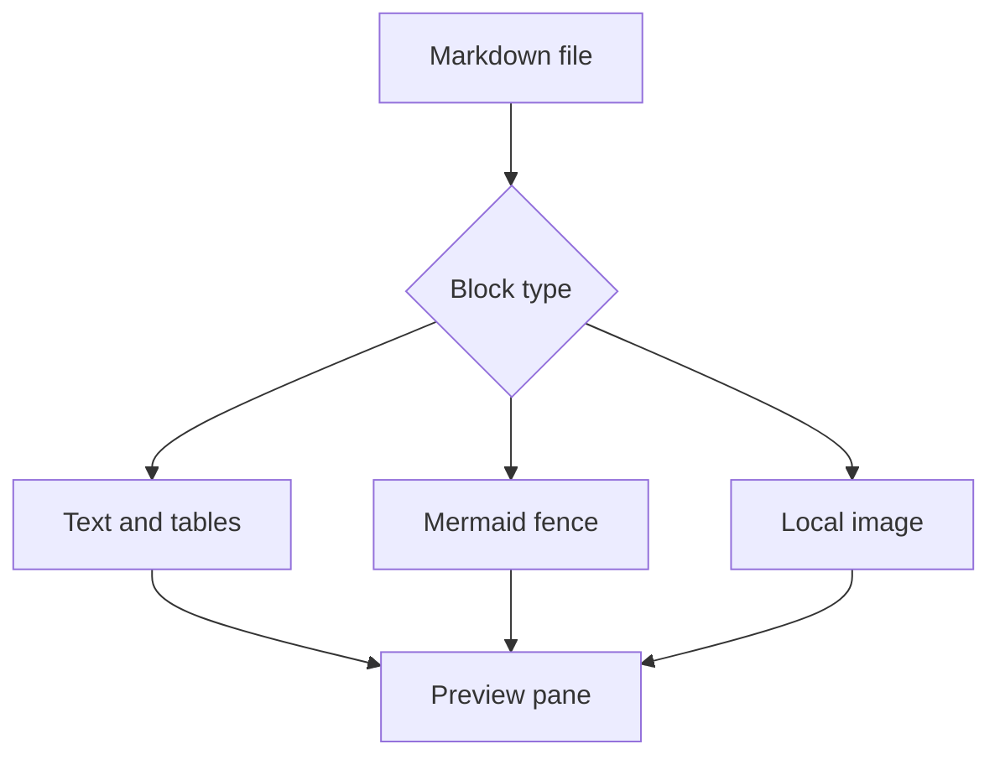

# Mixed Markdown Preview Sample

This file combines the previewer paths that tend to regress together.

## Local Images


## Tasks

- [ ] Toggle this task from Preview.
- [x] Already complete task.

## Table

| Input | Expected Preview |
|---|---|
| Local SVG | Rendered as an image through `/api/fs/raw` |
| Mermaid fence | Rendered by the local Mermaid bundle |
| Unsafe inline HTML | Blocked by the sanitizer |
| Missing image | Shows Open and Download fallback actions |

## Mermaid

Top-down hierarchy:



Left-to-right pipeline:


## Links

- Relative link with parentheses: [notes](./notes(2026).md)
- Safe external link: [Example](https://example.com/)
- Local image path with spaces is above.

## Code Fence

```js
const preview = "bounded and sanitized";
console.log(preview);
```

## Sanitizer Check

<script>alert("this should not run")</script>

<svg><script>alert("inline SVG should be removed")</script></svg>

## Missing Image Fallback


