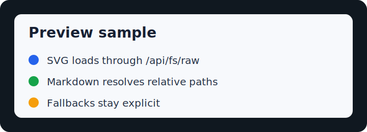
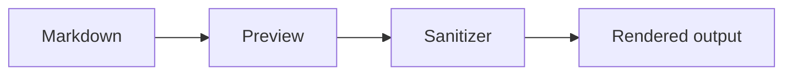

# Markdown Renderer Sample

This file exercises Markdown Preview itself.

| Feature | Expected behavior |
|---|---|
| Table | Rendered as a table |
| Task checkbox | Clickable for admin users |
| Local image | Routed through `/api/fs/raw` |
| Mermaid fence | Rendered by the Mermaid renderer |
| Unsafe HTML | Removed by sanitizer |

- [ ] Toggle from Preview.
- [x] Already checked.





```js
const sample = "markdown renderer";
console.log(sample);
```

Relative link: [notes](./notes(2026).md)

<script>alert("blocked")</script>

<svg><script>alert("blocked inline svg")</script></svg>
