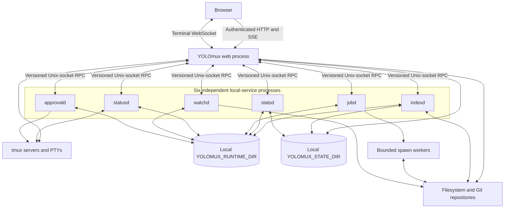

# Backend Architecture

This document describes the backend that YOLOmux runs now. It does not retain rejected process folds or migration proposals. See [`BACKEND_TEST_CONTRACT.md`](BACKEND_TEST_CONTRACT.md) for verification requirements, [`../DEVELOPMENT.md`](../DEVELOPMENT.md) for operator commands and detailed contracts, and [`../DONE/`](../DONE/README.md) for migration history.

## Runtime topology

The browser connects only to a web process. Local services are separate processes reached through versioned, length-prefixed Unix-socket RPC; they are not modules inside one consolidated daemon. `LocalServiceRegistry` owns client-side discovery, launch, process-identity validation, crash backoff, record publication, lease RPCs, stale-record recovery, and child reaping. Each service and the shared local-service runtime own that service's idle predicate and idle exit. Service sockets and transport locks are rooted under the selected local runtime directory. A registry record follows its configured service directory: most live with runtime services, while `indexd` keeps its record with its host-partitioned index state. Durable service data such as the Quick Open indexes and stats database is rooted under the selected state directory. Neither directory is exposed to the browser.

The web server is `TmuxWebtermHTTPServer`, a `ThreadingHTTPServer`. `http_routes.py` is the route catalog and declares method, path, authorization role, response protocol, body limit, and group. `Handler` owns request state and authentication. Composed adapters such as `FilesystemHttpAdapter` own transport-specific validation and framing, while `TmuxWebtermApp` composes application owners such as `WatchBridge`, `SessionFilesCoordinator`, `ActivityCache`, and `SystemStatusProjector` behind explicit forwarding methods.

Terminal bytes remain a direct browser-WebSocket-to-web-process-to-tmux path. Shared application and operation generations use authenticated HTTP and the `/api/client-events` SSE stream. Stats generations use `/api/stats-stream`, and development reload notifications use `/api/dev-reload`.

## Local services

`LOCAL_SERVICE_INVENTORY` is the single six-service roster. Each row below is an independently launched process.

| Service | Current owner |
| --- | --- |
| `indexd` | Quick Open indexes, per-root SQLite snapshots, manifests, tombstones, and the persisted breadth-first indexing frontier. |
| `statsd` | Original metric observations and usage atoms, retention, derived in-memory layers, and encoded snapshot/delta products. |
| `jobd` | Deferred or CPU-heavy typed work, bounded queues and spawn workers, coalescing, cancellation, and last-known-good materialized products. |
| `statusd` | Shared tmux session inventory, pane classification, immutable status generations, and encoded auto-approve status bytes. |
| `watchd` | Shallow native filesystem watch descriptors, whole-configuration polling fallback after native-backend failure/unavailability, revisions, and changed-path evidence used by browser refresh and index invalidation. Per-root local/network mount partitioning is not implemented yet. |
| `approvald` | Per-target auto-approval workers, target locks, lifecycle actions, and approved tmux input. |

Services may start on demand and retire after their lease/client/work idle condition is met. Expected demand-scoped absence is not itself a failure. The service's runtime row owns that distinction; health projection must not duplicate a second rule for it.

## Web-process coordination owners

The background owner is a role elected among web processes sharing one local `YOLOMUX_STATE_DIR`; it is not a seventh service. The elected process owns recurring refresh coordination, watch-root intent consumption, metric-family collectors, and warmer lifecycles. Followers serve ready or stale shared products and ask the owner to refresh rather than starting duplicate background work. Election uses a process lock plus heartbeat/generation records, while each local service retains its own service lock and writer rules.

`BackendHealthObserver` runs inside each web process. It samples the six-service roster on a bounded cadence without demand-starting absent services and writes retained per-port history through `BackendHealthStore`. The web process's own metrics remain explicitly unobserved by that service probe instead of being fabricated.

`/api/system-status` reads a pre-encoded immutable snapshot published by a background snapshot owner. The request thread never rebuilds the status document. Before the first snapshot or after its freshness deadline, the route returns a typed unavailable or stale result.

## Filesystem boundaries

`filesystem.list_directory()` is the shared listing owner. It validates the requested path through the current path policy and partial descriptor protections, filters secret or credential-blocked paths, stats direct children, applies the entry bound, sorts the result, and can omit repository enrichment. It does not yet pin every listed child generation from authorization through consumption; listing, recursive ZIP, diff, and indexed-search metadata remain in [`DOIT.p0.e5.filesystem-descriptor-authorization.md`](../../queues/backlog/DOIT.p0.e5.filesystem-descriptor-authorization.md). Search/index exclusion rules are separate from directory listing. A listing is one directory level; it does not recursively enumerate descendants.

| Surface | Execution path | Current use |
| --- | --- | --- |
| `GET /api/fs/fast/list?path=...` | `FilesystemHttpAdapter` calls `filesystem.list_directory(..., include_repo_info=False)` in the web process and returns the snapshot directly. It does not call `jobd`. | Every Finder directory LIST, including the root and remembered descendants. A successful call is HTTP 200 and contains only that directory's direct entries and base metadata. |
| `POST /api/fs/batch` | The web process submits a bounded typed batch to `jobd`; a cold product may return an operation receipt and complete through the shared client-event/operation path. | Deferred detailed work. Finder sends Git/repository `INFO` enrichment here after base rows exist and patches mounted rows when results arrive. |
| `GET /api/fs/list` | The compatibility single-operation path submits `list` through the existing filesystem-product owner. | Existing callers outside Finder; it is not the Finder first-paint route. |

Cold Finder Sync has no whole-tree render barrier. It awaits the fast root, paints it, and then fetches remembered descendant directories with bounded concurrency; each completed listing triggers another render. Git enrichment is independently scheduled after LIST publication, so a cold `jobd`, a queued product, or slow Git cannot delay names, types, sizes, or dates from the fast snapshot.

Quick Open indexing is separate from Finder listing. `indexd` persists a breadth-first, directory-at-a-time frontier. It publishes a complete depth before advancing `published_depth`, retains the previous readable generation while replacement work proceeds, and resumes the shallowest pending directory after restart. Finder visibility and concrete watch/mutation paths promote or repair work through the shared index invalidation owner; they do not start a second crawl.

## State and durability

`YOLOMUX_STATE_DIR` is local-host coordination and durable-state scope. Web processes that select the same state root share background-owner records, durable caches, and host-partitioned databases. `YOLOMUX_RUNTIME_DIR` separately scopes service sockets and transient runtime data; processes share local-service connectivity only when they select the same runtime root. Registry record placement follows the service owner and therefore may be runtime-rooted or state-rooted; selecting the same state root alone does not imply a shared service socket. Stateful families that must not cross hosts live below `STATE_DIR/hosts/<stable-host-id>/`. Live SQLite WAL files are not supported on a network filesystem.

The primary port uses the durable default state root. Non-primary development ports are isolated under an ephemeral per-port `/tmp` root, so their retained health, caches, and service state do not survive a reboot or `/tmp` cleanup. The UI reports retained history from the actual selected root rather than assuming that every port is durable.

## Extension rules

| Change | Extend this owner | Required proof |
| --- | --- | --- |
| Local-service action | Add one named handler to that service's `LocalServiceCommandRouter`; use shared daemon actions only when the response semantics are identical. | Preserve validation-before-dispatch, framing, error vocabulary, lease behavior, and the fixed action inventory. |
| Local-service runtime field | Add the field once to `LocalServiceRuntimeRow` and the shared projection; a service adapter supplies only its domain value. | Exercise runtime-row and backend-health projection tests and prove projection does not demand-start the service. |
| HTTP route | Register route metadata in `http_routes.py`, then put filesystem or response-framing work in the relevant adapter. | Compare the route catalog and verify auth, role, body limit, headers, framing, and typed error behavior. |
| Application domain behavior | Extend the composed domain owner that already owns its mutable state and teardown. | Characterize payload bytes, callbacks, lock order, replacement, stale completion, failure, and shutdown. |

New backend work follows explicit composition behind stable facades. Do not add a generic service locator, a parallel cache for the same product, or a second copy of service inventories, filesystem policy, runtime-row fields, or response semantics.
