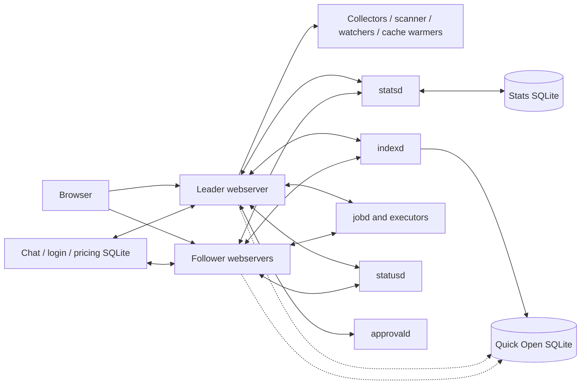
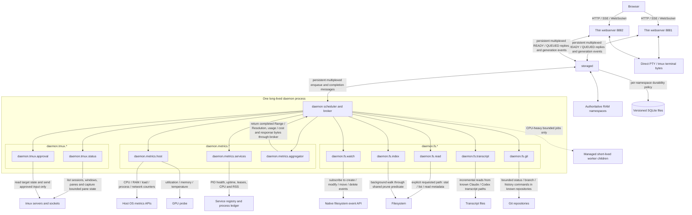
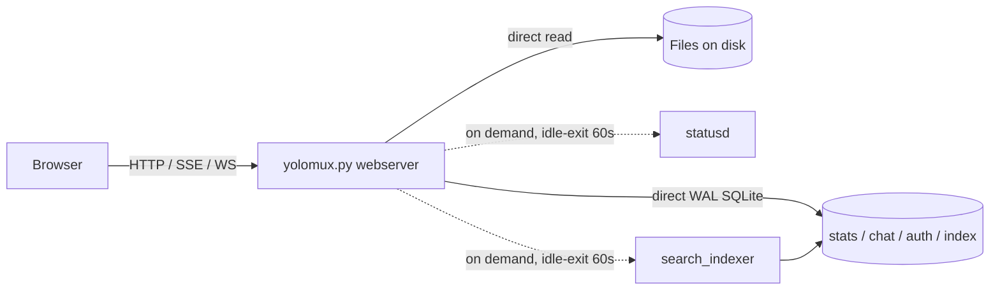
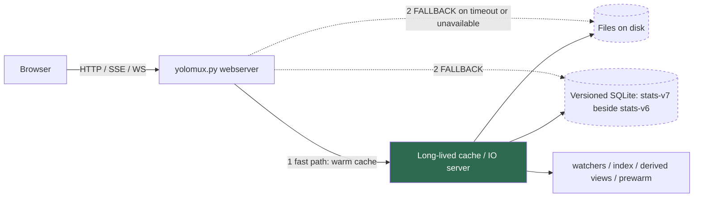

# Backend Architecture

Companion documents: [`BACKEND_TEST_CONTRACT.md`](BACKEND_TEST_CONTRACT.md) for how backend work is verified, [`../DEVELOPMENT.md`](../DEVELOPMENT.md) for owner inventory and runbooks, and [`../DONE/`](../DONE/README.md) for migration history.

> **ABANDONED (2026-08-09): the `storaged` / `daemon` two-daemon fold below was never built and is not the target architecture.** Everything from "Naming Decision" through "Non-Blocking Storaged Request Contract" describes a two-process consolidation (`yolomux-storaged` + `yolomux-daemon`) that this codebase does not implement and is not executing. It is retained as a rejected design proposal, not as current or planned behavior. The shipped backend keeps the six separately-launched local services (`indexd`, `statsd`, `jobd`, `statusd`, `watchd`, `approvald`), and the daemon-monitor queue's Rejected Shortcuts forbid reintroducing the `storaged`/`daemon`/`SUBSYSTEM_SPECS` names — a test pins their absence (`tests/test_gate_panels.py`). Reason it was abandoned: the fold added no observability the per-service model lacked, would have churned the entire launcher, registry, and process-ledger surface, and the actually-shipped work (real per-service metrics, the backend-health observer, the system-status snapshot owner) delivered the goal without consolidating processes. Read the next section for what exists; treat the rest as history.

## Shipped architecture (2026-08-09)

The backend that actually runs is six separately-launched local service processes, plus one in-web-process backend-health observer, plus one background system-status snapshot owner. There is no `storaged` and no consolidated `daemon` process.

### Six local services over Unix-socket RPC

- The service roster is exactly six, frozen in one owner: `LOCAL_SERVICE_INVENTORY = ("indexd", "statsd", "jobd", "statusd", "watchd", "approvald")` (`yolomux_lib/local_service_projection.py:82`), with the same set as `ESSENTIAL_LOCAL_SERVICES` (`yolomux_lib/app.py:593`). Each is an independently launched process, not a namespace inside a shared daemon.
- `LocalServiceRegistry` (`yolomux_lib/local_services/registry.py:740`) is the single owner of service lifecycle: launch, health, record publication, stale-record reclamation, and non-destructive recovery. Records carry the service's socket path and a verified `(pid, process-start)` identity before any signal, reap, or prune.
- Transport is per-service Unix-domain-socket RPC: `socket.socket(socket.AF_UNIX, socket.SOCK_STREAM)` (`yolomux_lib/local_services/rpc.py:705,785`), with each service reachable at a rooted socket path under `YOLOMUX_RUNTIME_DIR` validated by `validate_rooted_socket_paths` (`yolomux_lib/infra/common.py:119`). Web processes are structurally followers that connect to these sockets; browsers never connect to a service directly.

### The backend-health observer

- `BackendHealthObserver` (`yolomux_lib/backend_health/observer.py:754`) runs one sampling loop that probes the six services and records their state. It runs at `BACKEND_HEALTH_OBSERVE_SECONDS = 2.0` with a `BACKEND_HEALTH_PROBE_TIMEOUT_SECONDS = 0.5` per-probe bound (`observer.py:147-148`). It uses an injected clock and wake event, not sleeps, and starts zero demand-scoped services during a full observation cycle.
- It is started after the port lease and stopped before backend clients close, in `cli.start_backend_health_observer` (`yolomux_lib/cli.py:457-529`), and attached to the app via `attach_backend_health_observer` / `attach_backend_health_store` (`yolomux_lib/app.py:11202`). The observer runs *inside* the web process, which is why the web process's own process metrics are reported `web_process_not_observed` rather than fabricated.
- History is retained per leased web port by `BackendHealthStore` (`yolomux_lib/backend_health/store.py:633`), the one owner of `STATE_DIR/backend-health/<port>.json`, written under the port lease with an explicit schema version, observer epoch, monotonic revision, per-resource state, bounded cumulative counters, and at most 128 transition rows per resource. Non-default ports derive their state root under `/tmp`, so this history survives service and web restarts (measured advancing across a real restart) but not a reboot or tmp sweep — an accept-or-relocate decision tracked in the 0.7.2 queue (removed at land; see `docs/DONE/2026-08/`) F3.

### The system-status snapshot owner

- `/api/system-status` is served from a background-published immutable snapshot, not built on the request thread. The route reads pre-encoded bytes via `system_status_snapshot_response` (`yolomux_lib/app.py:11688`; route at `yolomux_lib/http_routes.py:685`, advanced variant at `:693`), and the background owner is started and stopped with the server through `start_system_status_snapshot_owner` / `stop_system_status_snapshot_owner` (`yolomux_lib/app.py:11656,11668`; wired in `yolomux_lib/server.py:3696,3705`). Before the first snapshot or past its freshness deadline the route returns a typed unavailable/stale result, never a synchronous rebuild. (This background owner landed in 0.7.2; `v0.7.1` still built the payload on the request thread — see [`../releases/v0.7.1-evidence.md`](../releases/v0.7.1-evidence.md).)

### Current extension paths

| Change | Extend this owner | Required proof |
| --- | --- | --- |
| Local-service action | Add one named handler to that service's `LocalServiceCommandRouter`; use `CommonDaemonActions` only when response semantics are identical. | Extend the service request matrix and `tests/test_local_service_command_router.py`; preserve validation-before-dispatch, binary framing, error vocabulary, lease/lock behavior, and the fixed action inventory. |
| Local-service runtime field | Add the field once to `LocalServiceRuntimeRow` and its shared projection in `yolomux_lib/local_service_projection.py`; a service adapter supplies only its domain value. | Run runtime-row and backend-health projection coverage plus the architecture budget; projection must never demand-start a service. |
| HTTP route or adapter method | Register route metadata in `yolomux_lib/http_routes.py`, then place filesystem or response-framing work in `FilesystemHttpAdapter` or `ApiResponseWriter`; keep only an exact-signature `Handler` forwarder while compatibility requires it. | Compare the full route catalog plus auth, role, body-limit, headers, framing, commit-before-write, and error behavior. |
| Application domain behavior | Extend `WatchBridge`, `SessionFilesCoordinator`, `ActivityCache`, or `SystemStatusProjector` when the behavior belongs there. A genuinely new domain receives one composed owner with its state, locks, worker teardown, and narrow callbacks, while `TmuxWebtermApp` retains explicit forwarding signatures. | Characterize payload bytes and callback/lock/side-effect order; test start, stop, replacement, stale completion, failure, and shutdown; negative-search parallel facade state. |

The accepted shape is explicit composition behind stable facades. Rejected alternatives are a big-bang app split, mixins, and a generic service locator: each hides ownership or moves methods without moving the mutable state and teardown that make the boundary real. The six processes remain separate; a consolidated `storaged`/`daemon` topology, an ORM, a second cache, and SQL in response projectors would replace visible bounded owners with larger hidden ones and are not current direction.

---

## Rejected design proposal — the two-daemon `storaged` / `daemon` fold (abandoned, see banner above)

The material below this line was extracted from the two-daemon migration queue on 2026-07-25. It was never implemented and is retained only as a record of the rejected consolidation. The "Historical Pre-Migration Architecture" mermaid remains an accurate picture of the pre-observer topology; the "Target Architecture" and "Non-Blocking Storaged Request Contract" sections describe software that does not exist.

### Naming Decision

- `statsd` is appropriately named for the current stats-only daemon, but it is the wrong name for the target service because the target also owns Quick Open, chat, login throttling, pricing, cached filesystem listings, and precomputed products. Rename the target service `storaged`.
- `indexd`, `jobd`, `statusd`, `approvald`, and the proposed `collectord` describe implementation fragments rather than durable boundaries. Fold them into one `daemon` service with explicit real-time, interactive, and maintenance lanes.
- Use responsibility names whose namespace identifies the source/domain or computed product, and always display matching prefixes together: `daemon.metrics.host`, `daemon.metrics.services`, `daemon.metrics.aggregator`; `daemon.tmux.status`, `daemon.tmux.approval`; and `daemon.fs.watch`, `daemon.fs.read`, `daemon.fs.index`, `daemon.fs.transcript`, `daemon.fs.git`. Do not reintroduce ambiguous bare owners such as `daemon.watch`, `daemon.status`, `daemon.files`, `daemon.index`, `daemon.git`, or `daemon.materialize`.
- Rename the user-facing `YO!stats` feature to `YO!metrics` so the product label matches `daemon.metrics.host` and `daemon.metrics.aggregator`. Apply the rename to visible menu/button/modal headings, translations, accessibility labels, help, and current documentation. Keep stable internal `stats` API routes, schema names, persisted settings, and DOM identifiers unless the architecture migration independently requires a versioned replacement; do not create compatibility churn solely for a label change.
- Do not retain misleading compatibility aliases after migration. Old clients receive `upgrade_required`; old daemons cannot open or mutate current storage.
- Namespaces are `storaged.*` and `daemon.*`, but OS process titles must stay greppable: launch the processes as `yolomux-storaged` and `yolomux-daemon` so `ps`/`pgrep` never have to match a bare, ambiguous `daemon`.


### Before And After Service Mapping

| Before | After |
| --- | --- |
| `statsd` | `storaged.stats` + `daemon.metrics.host` + `daemon.fs.transcript` + `daemon.metrics.aggregator` |
| statsd-internal snapshot reader (`Store.open_reader`, not a separate process) | `storaged.stats` + `daemon.metrics.aggregator` |
| `indexd` | `storaged.search_index` durable snapshots + `storaged.search` volatile READY/QUEUED state + `daemon.fs.index` |
| `jobd` | `storaged.products` + the specific `daemon.fs.read`, `daemon.fs.transcript`, `daemon.fs.git`, or `daemon.metrics.aggregator` owner for each product |
| `statusd` | `daemon.tmux.status` with completed bytes in `storaged.products` + `daemon.metrics.services` |
| `approvald` | `daemon.tmux.approval` with completed state in `storaged.products` |
| Webserver host/GPU collectors | `daemon.metrics.host` |
| Webserver Agent-token scanner | `daemon.fs.transcript` |
| Webserver filesystem watcher | `daemon.fs.watch` |
| Webserver tmux/session watcher | `daemon.tmux.status` |
| Webserver and follower SQLite access | Matching `storaged.*` namespace |
| YO!chat SQLite | `storaged.chat` |
| Login-rate-limit SQLite | `storaged.auth` |
| Pricing-catalog SQLite | `storaged.pricing` |

The left side names current processes or process-local responsibilities. The right side names logical namespaces inside only two runtime processes: `storaged` and `daemon`.


### Historical Pre-Migration Architecture



Historical problems resolved by the two-daemon migration:

- The elected webserver owns recurring CPU/GPU/memory/status/token work; the Agent-token pass runs every 10 seconds while watched (`stats_current/families.py` cadence), and the 2026-07-21 Mac measurement put one pass at about 0.60 seconds of CPU. That cost figure exists nowhere in code — re-baseline it on the implementation machine before migration.
- `jobd` already spawns `ProcessPoolExecutor` worker children (`infra/jobd.py`), so the current backend is more than five daemon processes; the five names undercount the real process tree.
- Stats has a real single database owner, but Quick Open followers still read SQLite snapshots directly, and chat/login/pricing retain separate process-local database access.
- Cross-webserver Quick Open visibility can wait for the two-second SQLite flush even though the data is reconstructible and already exists in an owner’s RAM.
- Five daemon names expose historical implementation splits to callers and operators, while webservers still contain background work that those daemons were meant to remove.


### Historical Browser-Facing Bottleneck Inventory - 2026-07-21

Before the migration, the webserver was stdlib `ThreadingHTTPServer` (`server.py:3047`, thread per connection, no pool), so slow handlers stalled other requests through shared locks and single-flight futures rather than a worker pool. This table records the historical offenders and their target owners; it is not a current route-owner inventory.

| Today | Blocks on | Worst case | Target owner |
| --- | --- | --- | --- |
| `/api/session-files`, `-batch` | Inline legacy product wait exists only for explicit opt-in callers; default requests return READY/QUEUED without tmux refresh, and session-files/Git coalesced callers no longer wait on peer futures; batch still loops sessions sequentially | 25 s (`SESSION_FILES_JOBD_WAIT_SECONDS`) on the explicit legacy wait path | `storaged.products` READY/QUEUED |
| `/api/session-metadata`, `/api/transcripts` with `force=1` | Inline full transcript + git rebuild | 60 s worker deadline | `daemon.fs.transcript` / `daemon.fs.git` via QUEUED |
| `/api/stats-*` | `ensure_started` spawns statsd inline under the registry lock plus a cross-process file lock, polling up to 5 s; 3 s RPC dispatch | ~5 s cold, and concurrent first-touchers serialize | Persistent `storaged` connection; no in-request spawn |
| `/api/fs/diff`, `/api/blame` | Chained git subprocesses on the request thread | ~4-13 s | `daemon.fs.git` via QUEUED |
| `/api/fs/search` | Live `os.walk` fallback (up to 20k dirs / 50k files) when the persistent index is not ready | seconds | `storaged.search` RAM index, stale-while-rebuild |
| `/api/fs/count` | Full subtree walk with no output until done | seconds | `daemon.fs.read`-owned QUEUED product |
| `/api/tmux`, `/api/context*` | tmux discovery + `capture-pane` subprocesses inline | ~3 s | tmux/session state: `daemon.tmux.status` generations retained in `storaged.products`; context views: `storaged.products` via `daemon.fs.transcript` |
| `/api/watched-prs` | GitHub network fetch inline in the handler | network latency x refs | Daemon-owned refresh product; handler serves last-known-good |
| `/api/search` | Event-log scan-on-query plus the tmux refresh prefix | bounded scan | Daemon-owned QUEUED product (locked in the jobd fold item) |
| Chat endpoints | Web-local SQLite with a 5 s busy timeout under write contention | 5 s | `storaged.chat` |

Acceptable synchronous work that stays request-scoped: login PBKDF2 hashing (deliberately expensive), upload writes, `/api/fs/list` (scandir capped at 1000 entries), and HTTP wrapper work around daemon-bounded `fs/read`, `fs/raw`, and `/api/fs/zip` payloads. `/api/fs/zip` now spools bounded archive bytes through `daemon.fs.read`'s binary mux path, so the webserver keeps only headers and download disposition. SSE/WebSocket endpoints are asynchronous by construction, but each open stream permanently parks one thread — the target delivers generation events over the existing client-events stream rather than adding more per-feature SSE endpoints.


### Target Architecture (ABANDONED — this two-daemon topology was never built; see the banner and "Shipped architecture" section at the top of this file)




### Process Boundaries

| Runtime unit | Process model |
| --- | --- |
| `storaged` | One independent, long-lived shared daemon process per `YOLOMUX_STATE_DIR` |
| `daemon` | One independent, long-lived shared daemon process per `YOLOMUX_STATE_DIR` |
| `daemon.metrics.host`, `daemon.metrics.services`, `daemon.metrics.aggregator`; `daemon.tmux.status`, `daemon.tmux.approval`; `daemon.fs.watch`, `daemon.fs.read`, `daemon.fs.index`, `daemon.fs.transcript`, `daemon.fs.git` | Prefix-grouped named modules, schedulers, queues, and ownership boundaries inside the single `daemon` process; none is an independently launched daemon |
| Managed worker children | Bounded, replaceable child processes spawned only for CPU-heavy or failure-prone jobs; they have no service socket, database ownership, durable identity, or independent lifecycle |
| Webserver 888x/777x | One independent thin webserver process per configured port; all share the same `storaged` and `daemon` |
| tmux servers | Existing external tmux server processes/sockets observed or controlled through the narrow `daemon.tmux.status` and `daemon.tmux.approval` modules; they are not owned by `daemon` |


### Non-Blocking Storaged Request Contract

Connections may remain persistent and bidirectional, but an individual request is never held open while data is fetched, collected, scanned, crawled, parsed, or converted into a derived view. Persistent transport avoids reconnect overhead; it does not permit synchronous long-running work.

Every normal read request has exactly one immediate terminal reply:

| Reply | Meaning |
| --- | --- |
| `READY(data, generation, freshness)` | The authoritative RAM value, prebuilt response bytes, or a bounded indexed storage result already exists. Return it immediately. A last-known-good value may be returned with honest freshness metadata while a newer generation is queued independently. |
| `QUEUED(ticket, key)` | No usable value is immediately available. `storaged` coalesces or creates the work ticket, returns `QUEUED` without waiting for `daemon` acknowledgement or completion, and publishes the result later. |

Protocol, authorization, overload, and version failures remain immediate typed errors such as `unavailable` or `upgrade_required`; they are not a third successful read outcome. Commands and durable mutations likewise receive one immediate bounded acknowledgement and never wait for unrelated background work.

The queued lifecycle is asynchronous:

1. A browser sends a bounded HTTP request to its webserver; browsers never connect directly to `storaged`.
2. The webserver sends `GET(key, generation)` over its persistent multiplexed `storaged` connection, with a strict upstream deadline shorter than the browser request deadline.
3. `storaged` immediately returns `READY` or `QUEUED`. The webserver immediately maps that to `READY(data, generation, freshness)` or `QUEUED(ticket, key)` for the browser and ends the HTTP request. Neither layer replies with “hold on” and later completes the original request.
4. For a miss, `storaged` coalesces the key and dispatches an enqueue message to `daemon` independently of the completed client request. `daemon` performs the work without holding any `storaged` request open.
5. `daemon` sends `COMPLETE(ticket, source_generation, result)` back over the persistent bidirectional connection. `storaged` rejects stale completion, accepts the current generation into RAM/durability policy, and builds or records the ready response bytes.
6. `storaged` pushes `GENERATION_READY(ticket, key, generation)` to interested webservers over their persistent connections. Each webserver forwards the update through its already-open browser SSE stream as a notification, and the browser performs one immediate `GET` for the bytes. Do not carry payload bytes in the event: the browser event hop coalesces by resource and drops the oldest event under backpressure, so a dropped notification is recoverable by re-reading while dropped payload bytes are not (see Progressive Delivery below).
7. Connection loss cannot lose authoritative data: webservers reconnect with their last seen generations and repair gaps from `storaged`; repeated requests for the same missing key coalesce onto one ticket.

Requests and events carry correlation IDs, bounded payloads, per-message deadlines, cancellation/disconnect state, and priority-aware multiplexing so a large response or slow client cannot head-of-line block unrelated `READY`, `QUEUED`, completion, or generation messages.

The browser-facing rule is the same: “get it now” is synchronous and “you will get it soon” is asynchronous. A browser request must never remain pending while `storaged`, `daemon`, Git, tmux, the filesystem, a transcript parser, or a derived-view builder works. The browser tracks the returned ticket/key, receives `GENERATION_READY` through SSE, and then renders event-carried bytes or performs a fresh immediate `GET`. SSE loss falls back to generation-based reconnect repair or explicit ticket/key refetch; it must not create an infinite loading state, rapid retry loop, blank panel, or repeated “Loading…” flashes.

Cold interactive reads — the first Finder listing of a directory, a cold Quick Open query — are two-phase by design, and the GUI-unchanged rule is explicitly amended to permit that: keep prior content or last-known-good on screen until `READY`, render a placeholder only when nothing exists yet, and never replace existing content with a spinner while a fast completion is in flight. Do not add a bounded server-side wait to hide the miss; the non-blocking contract stays pure, and the SSE completion for a bounded interactive read is expected within tens of milliseconds.

### Progressive Delivery: One Or More Callback Responses

The contract above describes one request answered by one completion. Some products cannot usefully answer that way: a directory hierarchy is useful before its subchildren are known, and a long collection keeps changing after it is first read. Those products answer with **one or more** callback responses. This section defines that extension; it does not replace the immediate-reply rule, which is absolute.

Two invariants govern every request, and they fail differently. **(I) Every request gets an immediate reply** — data, a typed refusal, or `QUEUED`. Holding a request open while work proceeds is a *hang*, and no amount of daemon load justifies it. **(II) Every `QUEUED` is a promise, and every promise is discharged by exactly one terminal** — the data is ready, or a typed error. A promise that cannot be kept becomes a terminal error the moment that is known. A hang is visible, because someone notices a slow request. An undischarged promise is invisible: the server answered fast and correctly, the client waits politely, and nothing ever arrives. The second class is the more dangerous one and needs its own test, described below.

Frames on a stream are `ack {stream, epoch, seq: 0, state: "open", freshness, lkg?}`, then zero or more `part {stream, epoch, seq: n, state: "open", kind: "chunk" | "delta"}`, then exactly one `terminal {stream, epoch, seq: n, state: "done" | "error", reason?}`. The stream identity is the **storage key**, never the ticket, because `storaged` fans completions out by key (a client waiting on its own ticket misses the completion whenever its request was superseded by a newer generation, while a client subscribed to the key is notified correctly). A client cursor is the pair `(epoch, seq)`, never `seq` alone: supersession restarts a part sequence under the same key, so a client holding `seq=3` from one generation would otherwise accept `seq=4` from the next and splice two different results together. Frames from an older epoch are dropped; a newer epoch invalidates accumulated state rather than appending to it.

A `part` frame announces that a sequence position is available; it does not carry the body. The client then reads the range since **its own** cursor. This is not an extra round trip to be optimized away — the browser event hop coalesces by resource and drops the oldest event when a subscriber queue is full, so dropping a *notification* is recoverable (the client re-reads) while dropping a *payload* would be unrecoverable loss on exactly the hop designed to shed load. The stats pipeline is the working reference: `stats_generation_ready` carries only a generation, and the browser then reads `/api/stats-delta` with an explicit `after_cache_generation` + `after_revision` cursor, surfacing an unservable cursor as `delta_gap`. Because each client carries its own cursor, two clients at different positions each read exactly what they individually missed from one shared stored generation, and no per-client frame buffering is needed anywhere.

`kind` distinguishes two retention models that share a frame shape but not a storage structure, and they must not be forced into one. **Chunk** is a one-shot large result where the client holds no prior state — a path hierarchy, then its subchildren. There is no keyframe until the terminal arrives, because the complete result does not yet exist, so chunk parts are retained in full until `terminal` plus a bounded window and are bounded **by bytes**. **Delta** is a long-lived subscribed collection where prior state exists — stats buckets, roster, file tree. Its keyframe is the current snapshot and always exists, so delta parts may ring-buffer **by count** and a client that falls behind repairs with a keyframe. Accumulated part bytes are budgeted per stream and globally, counted in diagnostics, and exceeding the budget is a typed `terminal(error, reason: "part_budget_exceeded")` — never a silent truncation.

Progressive delivery is justified per product by measurement, not applied generically. It pays only where partial results are independently useful **and** the producer can genuinely emit incrementally. A producer that computes atomically and returns a size-capped result gains nothing from being chunked; splitting it adds hops and delivers no earlier paint. Record the products where chunking was evaluated and rejected, so the question is not reopened by inspection.

Multiple clients requesting the same key share one worker. `storaged` coalesces on the qualified key, so a second request at the same source generation attaches to the existing ticket rather than dispatching duplicate work, and a request whose key has an older record receives last-known-good bytes plus the replacement ticket. Completions fan out to every subscribed client, whether those are two tabs on one webserver (one storaged event, fanned to both browsers by the event broker) or two browsers on separate webservers (one event per webserver, each fanned to its own tabs). Work is shared; delivery is per-client and pull-based by cursor.

Backpressure is bounded at every hop, and a bounded queue that discards must leave a trace the client can act on. Discarding a notification without recording a repair marker converts backpressure into an undischarged promise, which is the invisible failure above. The corresponding test is a ledger: instrument every issued `QUEUED` as an outstanding promise with its key, epoch, and issue time, and assert the outstanding set is empty at teardown. Any test that ends holding a live promise has found a defect. The same outstanding count and oldest-promise age belong in diagnostics so the condition is observable in a running system, not only under test.

Head-of-line fairness is a scheduling property, not a transport one. Lanes (`realtime`, `interactive`, `maintenance`) separate priority classes so background maintenance cannot delay an interactive read, but work within a lane is serial. The rule is therefore that no product of unbounded duration runs as a lane thread on an interactive lane; long producers are classified as spawned workers. Widening lane concurrency is the wrong remedy, because it converts a fairness problem into a resource-exhaustion problem.

“Materialize” was database terminology for precomputing a derived view before a user asks for it. In this architecture it specifically meant CPU-heavy calculation and summarization that converts raw timestamped host/token observations already owned by `storaged` into exact Range/Resolution series, usage/cost summaries, and serialized response bytes. The term is retired; `daemon.metrics.aggregator` now names that calculator/summarizer and has no direct OS, tmux, filesystem, transcript, Git, or SQLite access.

`daemon.*` names are deliberately narrow responsibility owners inside the one shared `daemon` process:

| Responsibility | May read or control | Publishes to `storaged` | Must not access |
| --- | --- | --- | --- |
| `daemon.metrics.host` | Host CPU, RAM, load, process, network, and platform-specific GPU probes | Raw timestamped metric observations and unavailable reasons | tmux panes, transcripts, recursive filesystem trees, SQLite |
| `daemon.metrics.services` | Service registry, process ledger, PID health, leases, uptime, and per-service CPU/RSS probes | Complete timestamped service-health and service-resource observations | tmux pane content, transcripts, repository walks, SQLite |
| `daemon.metrics.aggregator` | Immutable metric/usage source generations supplied by `storaged`; no direct source access | Exact `1s/10s/60s/300s` Range/Resolution series, usage/cost summaries, and prebuilt response bytes | OS/GPU probes, tmux, filesystem, transcripts, Git, SQLite |
| `daemon.tmux.status` | All configured tmux servers/sockets: session/window/pane inventory and bounded pane captures needed for agent-state detection | Complete tmux session/window/pane and agent-state generations | transcripts, repository walks, host metrics, SQLite |
| `daemon.tmux.approval` | Only configured target panes across the applicable tmux servers/sockets, plus the existing approval locks/rules | Approval state, action result, and bounded diagnostics | arbitrary files, transcripts, host metrics, SQLite |
| `daemon.fs.watch` | Native filesystem event API for registered roots and exact watched paths | Path invalidations with event/source generations | file contents, Git commands, tmux, transcripts, SQLite |
| `daemon.fs.read` | A validated explicit path requested by Finder or another interactive operation | Directory/file metadata snapshot for that exact request | recursive background discovery, tmux, transcripts, SQLite |
| `daemon.fs.index` | Registered roots through the shared prune predicate; file names and metadata required by Quick Open | Per-root index snapshot/deltas, tombstones, and coverage | excluded subtree contents during background walks, tmux, transcripts, SQLite |
| `daemon.fs.transcript` | Known Claude/Codex transcript files using stored offsets/receipts supplied by `storaged` | Parsed usage atoms, new offsets, receipts, and parse failures | tmux, unrelated filesystem trees, Git, SQLite |
| `daemon.fs.git` | Known repository roots through bounded Git commands | Branch, status, history, blame/diff, and repository-generation products | transcripts, tmux, arbitrary filesystem crawling, SQLite |


### Implementation Design: Shared Domain Parents Through Composition

The namespace hierarchy must be real in the implementation, not merely a label. Every `daemon.X.Y` module belongs to one `daemon.X` domain aggregate that owns the shared contracts, policies, caches, diagnostics, and adapters for that domain. Child modules reuse those objects; they do not copy equivalent Maps, dataclasses, retry logic, path validation, generation checks, or metrics counters.

Do not implement this as a deep inheritance tree or let subclasses inherit mutable dictionaries. The clean split is:

- A small daemon kernel owns lifecycle, the persistent multiplexed connection, task registration, lanes, deadlines, coalescing, cancellation, bounded worker children, and common diagnostics.
- A domain aggregate such as `MetricsDomain`, `FilesystemDomain`, or `TmuxDomain` owns shared domain state and constructs its child handlers.
- Child handlers satisfy small structural `Protocol` interfaces and receive narrow dependencies by composition. Inheritance is allowed only for a shallow stateless template whose invariants genuinely apply to every implementation; shared mutable state stays in an explicitly owned context/cache object.
- Internal messages use frozen slotted dataclasses and enums. JSON dictionaries exist only at RPC/HTTP serialization edges.

The generic daemon kernel should expose one task model rather than one bespoke framework per domain:

```python
@dataclass(frozen=True, slots=True)
class TaskKey:
    namespace: str
    operation: str
    subject: str

@dataclass(frozen=True, slots=True)
class TaskSpec:
    name: str
    lane: Lane
    max_payload_bytes: int
    max_result_bytes: int
    default_deadline_seconds: float
    execution: ExecutionKind

@dataclass(frozen=True, slots=True)
class WorkRequest(Generic[RequestT]):
    ticket: str
    key: TaskKey
    source_generation: int
    deadline_at: float
    payload: RequestT

@dataclass(frozen=True, slots=True)
class WorkResult(Generic[ResultT]):
    ticket: str
    key: TaskKey
    source_generation: int
    completed_at: float
    payload: ResultT

class TaskHandler(Protocol[RequestT, ResultT]):
    spec: TaskSpec

    def key(self, request: RequestT) -> TaskKey: ...
    def execute(self, request: WorkRequest[RequestT]) -> WorkResult[ResultT]: ...
```

`TaskSpec` is data, not subclass behavior. The shared task registry validates unique names, payload/result bounds, lane, deadlines, and execution kind once. The broker owns `TaskKey` coalescing and source-generation supersession once. A handler owns only domain work. This extends the useful pieces already present in `LocalRpcEnvelope`, `LocalServiceClient`, `run_local_rpc_service()`, `CollectorJob`/`CollectorAttempt`/`CollectorStatus`, and `PersistentJobBroker`; it must not create parallel envelope, scheduler, lease, watchdog, or worker-pool implementations.


### `daemon.metrics.*`

`MetricsDomain` composes three handlers around one family catalog, scheduler/attempt model, observation publisher, clock, and diagnostic registry:

| Child | Shared from `daemon.metrics` | Exclusive capability |
| --- | --- | --- |
| `daemon.metrics.host` | `MetricFamilySpec`, `MetricObservation`, `CoverageEpoch`, `MetricBatch`, cadence/attempt/status types, generation validation, publisher, diagnostics | Host OS and platform GPU probes |
| `daemon.metrics.services` | The same metric contracts, scheduler, publisher, source identity, and diagnostics | Service registry/process-ledger snapshot and per-service CPU/RSS sampler |
| `daemon.metrics.aggregator` | The same family catalog, generation types, resolution policy, diagnostic registry, and result envelope | Immutable metric/usage input snapshot supplied by `storaged`; fold/cost/serialization strategies only |

The current `FamilySpec` catalog, `CollectorAttempt`, `CollectorJob`, `CollectorStatus`, `CollectorFacts`, `Observation`, `CoverageEpoch`, `UsageAtom`, and `Generation`/`Layer`/`Bucket` types are the starting parents. Move storage-neutral records out of modules named `storage.py` or `materializer.py` into neutral metrics contracts so `daemon` does not import a database owner. Keep `storaged` persistence records separate even when they serialize the same observation fields.

`daemon.fs.transcript` also emits metric usage observations, but it remains in `FilesystemDomain` because its source is incremental filesystem reading. It implements the shared `MetricBatchPublisher` protocol rather than inheriting from a metrics collector class. This is cross-domain composition without giving transcript code access to host probes or aggregation state.


### `daemon.fs.*`

`FilesystemDomain` owns one canonical `PathPolicy`, filesystem adapter, error normalizer, canonical-path/file-identity types, bounded-I/O limits, event-generation type, and domain diagnostics. These should grow from the existing `yolomux_lib/filesystem/paths.py`, `errors.py`, `listing.py`, and `io_ops.py` owners instead of being copied into daemon handlers.

Each child receives only additional capabilities it needs:

| Child | Shared from `daemon.fs` | Exclusive capability |
| --- | --- | --- |
| `daemon.fs.watch` | Canonical paths, registered-root identities, path safety, event generations | Native filesystem event adapter; it emits invalidations and never reads contents |
| `daemon.fs.read` | Canonical paths, path safety, identity/stat metadata, bounded I/O, normalized errors | Exact-path stat/list/read strategy; no recursive walker or index-prune policy |
| `daemon.fs.index` | Canonical paths, path safety, identity metadata, normalized errors | Recursive walker, `IndexPrunePolicy`, index-delta builder, coverage/limit accounting |
| `daemon.fs.transcript` | Canonical paths, path safety, bounded reads, identity/stat metadata | Allowed transcript-root catalog, incremental offset/checkpoint state, Claude/Codex parsers, `MetricBatchPublisher` |
| `daemon.fs.git` | Canonical paths, path safety, identity metadata, normalized errors | Bounded `GitRunner`, repository-root cache, Git fact/result types |

`PathPolicy` and `IndexPrunePolicy` must remain different composed objects. Explicit `fs.read` access to `.git`, caches, or another excluded-but-safe path must work; only `fs.index` receives pruning. The shared parent should expose canonicalization and security, not a boolean such as `for_index=True` that silently changes behavior. Likewise, one domain-owned identity/stat cache may be shared where generations prove validity, but index rows, directory snapshots, transcript offsets, and Git results remain separate typed caches because they have different keys and invalidation rules. `IndexPrunePolicy` is a new composed object, not an existing type; its current sources are `index_directory_name_is_excluded()` / `index_path_has_excluded_directory()` and `MANDATORY_INDEX_EXCLUDE_POLICY_SIGNATURE` in `yolomux_lib/workspace/settings.py`, relocated rather than copied.

The current filesystem package already contains the right beginning—central path validation in `filesystem/paths.py` and split operation modules—but `filesystem/__init__.py` still re-exports private helpers and synchronizes mutable package-level overrides into child modules. Retire that compatibility facade during migration; inject a `FilesystemDomain` built from explicit policy/config objects so tests override dependencies without mutating globals.


### `daemon.tmux.*`

`TmuxDomain` owns one typed tmux-server/socket catalog, `TmuxTarget`, session/window/pane identities, command runner, inventory generation, bounded pane-capture cache, agent-state classifier, and diagnostics. Reuse the existing typed `AgentTuiTarget`, `AgentTuiCapture`, `AgentPaneState`, and tmux session helpers rather than creating daemon-local dict equivalents.

- `daemon.tmux.status` receives a read-only `TmuxReadPort`: list servers/sessions/windows/panes and perform bounded captures. It cannot send keys or mutate tmux.
- `daemon.tmux.approval` receives a narrower `TmuxApprovalPort`: read only its configured target state and send an already policy-approved action while holding the existing target lock. It does not receive arbitrary inventory, filesystem, transcript, or shell capabilities.
- Both consume the same target parser, identities, capture format, server catalog, and generation rules, so a target cannot be interpreted differently by status and approval.


### State Ownership Rules

- One mutable owner per state map. The daemon kernel owns tickets/queues/workers; `MetricsDomain` owns metric scheduler status; `FilesystemDomain` owns path identities and filesystem invalidation generations; `TmuxDomain` owns tmux inventory/capture generations. Child handlers receive references to the owner or narrow methods, never mirrored Maps.
- Immutable values cross component boundaries. Use frozen slotted dataclasses for requests, observations, snapshots, deltas, completions, and diagnostics; use `Mapping`/tuples at read boundaries rather than exposing mutable dict/list internals.
- Every cache key includes all inputs that determine its output, including source/config generation and policy signature. Cache invalidation is an explicit method on the owning domain, not a module-global side effect.
- Domain result types carry source generation. The daemon kernel rejects stale work generically before a domain result reaches `storaged`; `storaged` independently checks it again before publication.
- Capabilities enforce the architecture. A child cannot accidentally call SQLite, tmux mutation, Git, recursive walk, or host probes if that adapter was not injected.
- Diagnostics share one `TaskDiagnostics` shape—queued/running/completed/failed/timed-out/coalesced/superseded, runtime/queue delay, last success/failure, source/published generation—but each domain may add a typed details object. Do not create ten slightly different counter dictionaries.


### Suggested Package Shape

```text
yolomux_lib/daemon/
  contracts.py          # TaskKey/Spec, WorkRequest/Result, READY/QUEUED, generations
  runtime.py            # one process lifecycle and persistent connection
  scheduler.py          # lanes, deadlines, coalescing, cancellation
  workers.py            # bounded spawn children
  diagnostics.py        # shared task/process diagnostic records
  metrics/
    domain.py            # MetricsDomain and shared context
    contracts.py         # family/observation/batch/snapshot/result types
    host.py
    services.py
    aggregator.py
  fs/
    domain.py            # FilesystemDomain and shared safe capabilities
    contracts.py         # canonical path, identity, event, snapshot/delta types
    policy.py            # PathPolicy and separate IndexPrunePolicy
    watch.py
    read.py
    index.py
    transcript.py
    git.py
  tmux/
    domain.py            # TmuxDomain, server catalog, identities, capture cache
    contracts.py
    status.py
    approval.py
```

The package tree mirrors the runtime names but does not imply more processes. `daemon.metrics.*`, `daemon.fs.*`, and `daemon.tmux.*` are composed handlers registered in one daemon runtime.


### Locked Ownership Rules

- Exactly one compatible `storaged` process and one compatible `daemon` process exist per `YOLOMUX_STATE_DIR`, regardless of the number of webserver ports. Managed worker children are not independently addressable services and do not weaken this ownership rule.
- Webservers connect only to `storaged` for application data. They authenticate and validate requests, forward one bounded command/query, receive an immediate `READY` or `QUEUED` reply, subscribe to later generation events, and forward ready bytes through SSE. They never keep a request pending for background work, open SQLite, crawl directories, scan transcripts, run Git, poll tmux status, collect metrics, or own durable caches.
- A browser request handler never spawns, restarts, or waits for daemon startup: `ensure_started` and its spawn-poll locks leave the request path entirely. Webservers establish and repair their persistent `storaged` connection on a background loop; a request that arrives while disconnected receives an immediate typed `unavailable`, never a spawn wait.
- Generation events reach the browser through one consolidated SSE stream per client (grow the existing client-events stream); do not multiply per-feature SSE endpoints, because each open stream permanently parks one `ThreadingHTTPServer` thread.
- The terminal PTY/WebSocket stream remains webserver-local because it is high-rate, session-bound, and not database state. Explicit upload writes and terminal input also remain request-scoped; their metadata/invalidation is published to `storaged`.
- `storaged` is the only runtime process allowed to open any YOLOmux SQLite file, including read-only snapshots. It owns schemas, migrations, transactions, RAM namespaces, source/published/flushed generations, subscriptions, last-known-good values, response-byte caches, and per-namespace flush deadlines.
- `storaged` is also the only runtime process allowed to open `~/.config/yolomux/state.json`. It imports the legacy recovery record before publishing `storaged.shared_state`; webservers and daemon/status workers use that local-services namespace and retain typed last-known-good reads while the owner restarts.
- `storaged` performs only RAM/prebuilt-byte lookup and strictly bounded indexed storage work in a read handler. It performs no recursive crawl, transcript parsing, Git command, tmux discovery, GPU subprocess, approval action, large temporal fold, queue wait, retry sleep, or other unbounded work in that path. A miss returns `QUEUED` immediately; dispatch, computation, completion, generation publication, and SSE delivery happen after the original request has ended.
- `daemon` owns every non-request background activity behind three priority lanes. Lightweight schedulers/watchers stay in its broker process; CPU-heavy or failure-prone tasks run in its CPU-sized spawn pool. A maintenance job cannot starve real-time metrics/status or an interactive directory request.
- `daemon` and its worker children never open YOLOmux databases. They read only the permitted OS/tmux/filesystem/Git/transcript sources assigned above and return observations, complete snapshots, index deltas, or materialized products to `storaged` with source generations. `storaged` rejects stale completions.
- Background index exclusions use one shared predicate. Explicit Finder or exact-path Quick Open navigation—including `.git`, caches, backups, and other excluded trees—still lists the requested path because pruning applies only to background discovery/indexing.
- Except for the explicit `YO!stats` to `YO!metrics` label change and the two-phase cold-miss render defined in the request contract, the established YO!metrics, YO!cost, Finder, Quick Open, System, Logs, login, chat, and terminal UI must remain visually and functionally unchanged.


### Upgrade, Takeover, And Outage Windows

- The default `YOLOMUX_STATE_DIR` (`~/.local/state/yolomux`, `infra/common.py:58`) is shared by every port and worktree on a machine, so build skew between webservers and the shared daemons is an everyday dev event, not an edge case.
- Takeover when a newer-build client meets an incompatible `storaged`: the newer build requests retirement through the existing registry fence path (`_retire_incompatible_service`, minimum-writer records); the old `storaged` stops accepting writes, flushes every namespace to its durability contract, releases its socket and service records, and exits; the new build starts and recovers each namespace before republishing generations. Older-build webservers receive `upgrade_required` and present a degraded upgrade notice until restarted; they never fall back to direct database access.
- The same retirement procedure applies to an incompatible `daemon`; last-known-good products survive inside `storaged` across the swap.
- `storaged` is deliberately a single point of failure for login (fail closed), chat acknowledgement, and every other data namespace; webservers were previously self-sufficient through shared WAL files. Gates must exercise login and chat during a `storaged` restart window, not only after recovery.


### RAM And Disk Policies

| Namespace | RAM behavior | Disk behavior |
| --- | --- | --- |
| Stats originals, usage atoms, coverage, and scanner receipts | Accepted generation becomes visible to every webserver through `storaged` | Commit immediately or within the durability deadline measured and recorded by the inventory item — no numeric deadline constant exists in code today; preserve schema/minimum-writer fences |
| Stats Range/Resolution snapshots, deltas, and cost reports | Immutable last-known-good generations and prebuilt bytes | Reconstructible; checkpoint only if measurement proves it useful |
| Quick Open index and Finder directory listings | Shared RAM generation is immediately visible to all webservers; watched directory entries remain valid until invalidated/replaced | Quick Open row deltas may retain a two-second durability debounce; Finder listings need no disk persistence |
| Chat messages/cursors | Shared tail/search/page cache | Commit before acknowledging an exact message or cursor mutation |
| Login rate limits | Shared counters across all ports | Commit security mutations before password verification continues; fail closed if `storaged` is unavailable |
| Pricing catalog/revision | Shared validated revision | Persist accepted revisions atomically; reconstructible downloads may refresh asynchronously |
| Background products and live status | Last-known-good product/status generation | Optional bounded checkpoint only where restart value exceeds complexity; live tmux state is RAM-only |


### Gotchas

- Keep two processes because one process cannot both remain a low-latency database/RAM manager and safely perform Python crawling, transcript parsing, Git, tmux, GPU probes, and approval work. More than two shared daemons recreates the ownership complexity this queue is removing.
- Do not build a god `BaseDaemonTask` or use inheritance to share mutable state. Prefer small `Protocol` contracts and injected domain capabilities; use inheritance only for a shallow stateless template with identical invariants at every child.
- Do not give every handler a full application context. Inject least-privilege ports: `fs.read` never receives pruning, `fs.watch` never receives content reads, `tmux.status` never receives mutation, `metrics.aggregator` never receives OS/filesystem access, and no daemon handler receives SQLite.
- Do not hide distinct behavior behind mode booleans such as `for_index`, `can_write_tmux`, or `aggregate=True`. Compose the specific policy/adapter at construction so forbidden paths are structurally unavailable.
- Do not merge unrelated schemas merely to claim one database. `storaged` is one connection owner for multiple versioned files and policies.
- Do not let a browser, webserver, or `storaged` request synchronously wait for `daemon` work. Return `READY` or `QUEUED`, end that request, and publish completion later by ticket/key/generation.
- Persistent bidirectional transport is desirable, but a persistent transport must never become a persistent request. Multiplex messages and isolate backpressure so one slow response/client cannot stall unrelated work.
- Do not let maintenance tasks starve real-time or interactive work. Lane isolation and CPU-based worker limits are part of the architecture, not optional tuning.
- Do not use disk flush as cross-webserver synchronization. RAM generation publication happens first; persistence is durability.
- Do not persist Finder listings. They are shared RAM accelerators updated by native events and rebuilt on demand after restart.
- Do not make index exclusions block explicit path access. Pruning is only for background discovery/indexing.
- Do not retain old daemon aliases, dual writers, direct read-only database followers, or web fallbacks after a namespace cuts over.
- Every migration item lands its retirements in the same change and reports its net LOC delta; the ~20 new modules are acceptable only against the deletions of the five daemon lifecycles, the background-owner election, the filesystem facade, and the follower snapshot readers.
- Preserve the established GUI (subject only to the rename and the two-phase cold-miss render) and preserve unrelated user-owned changes in the dirty worktree.


### Done Criteria

- The normal shared backend consists of exactly one `storaged` daemon process and one shared `daemon` broker process; extra webserver ports add only webserver/PTY processes, while CPU-heavy work may add bounded managed worker children.
- `storaged` is the sole runtime opener of every YOLOmux SQLite database and the sole publisher of authoritative application-data generations.
- `daemon` owns all recurring collection, watchers, indexing, transcript/Git work, status building, approvals, and bounded spawned computation without opening a YOLOmux database; every `daemon.*` owner runs inside that process.
- Every `daemon.X.Y` handler is registered through the one daemon kernel and constructed by one `daemon.X` domain aggregate; prefix siblings share canonical contracts, policies, caches, generation rules, and diagnostics without inheriting mutable containers or receiving unrelated capabilities.
- Webservers contain no database access or background crawler/scanner/collector/status ownership and use one persistent multiplexed `storaged` protocol for immediate `READY`/`QUEUED` replies and later generation events.
- Browser HTTP requests never hang on backend work: each ends promptly with data or a queued ticket, no handler spawns or waits for daemon startup, endpoint deadlines hold while daemons are down or saturated, and asynchronous completion reaches the browser through SSE with reconnect/refetch recovery.
- Every webserver sees accepted RAM changes immediately; durability follows the namespace table; Finder listings update through filesystem events with the current 3-second poll fallback removed.
- Agent tokens, Model tokens, and Cost stay synchronized, and their recurring work produces no periodic CPU spike in a web PID.
- Existing UI/API behavior remains unchanged except the rename and the two-phase cold-miss render; focused ownership/migration/crash/cache/security/browser tests and the canonical niced CPU gate (`tools/check.py`, 100% on Linux / 50% on macOS by default) pass.
- A guarded 7772 restart plus 15-minute multi-port observation shows one healthy `storaged` process, one healthy shared `daemon` process, no runaway workers, responsive data RPC/SSE, and no retired daemon process.
- Documentation and `docs/DONE/` describe the shipped architecture, and this drained queue is removed.

---

## Appendix: Phase-2 Optional Shared Cache And Direct Fallback

This is the document that occupied this path between `e219a7ca4` and the restore of the graphs above. It describes the phase-2 cache/fallback plan the 0.7.0 webserver follows today; the target architecture above remains the design the daemon/storaged lineage implements.

### Backend Architecture — optional shared cache and direct fallback

This document defines the intended backend direction and the contracts that survive the discarded two-daemon migration. The cache/IO boundary is an optimization, never the sole route to a file or durable state. Companion documents: [`BACKEND_TEST_CONTRACT.md`](BACKEND_TEST_CONTRACT.md) defines verification, [`../DEVELOPMENT.md`](../DEVELOPMENT.md) defines current runbooks, and [`../DONE/`](../DONE/README.md) records shipped work.

The diagrams describe a target reached one measured boundary at a time. They do not claim that the target is shipped, and they do not decide whether the cache/IO server is long-lived or on-demand; F8 measurements decide that lifetime.

### Current Architecture

`v0.6.10` keeps interactive work in the webserver and uses optional on-demand sidecars. Sidecars idle-exit, so they do not create a mandatory lifetime dependency.



### Intended Architecture

The target adds one shared warm path while preserving a direct fallback. The dashed routes are required behavior, not an outage-only implementation detail.



### Required Properties

| Failed migration choice | Concrete consequence | Required property |
| --- | --- | --- |
| The boundary became the sole route to a file. | A 0.1-second deadline against a 198 ms handler turned file open into 503 or a false “File not found.” | The cache/IO server is never the only path. Tests kill it mid-suite and prove the direct route still serves the request. |
| Client and producer copied different deadlines, then added a third constant. | Healthy work expired every time. | One boundary, one deadline owner, and one readiness handshake. A second copy is a defect. |
| Two processes had inferred pairing and lifetime ownership. | Orphans survived, active owners lost backends, and deployment fingerprinting wedged a live server. | Declare the lifetime explicitly or retain the on-demand idle-exit model. Never infer ownership from adoption or `PPid == 1`. |
| Transport failure was rendered as process failure. | The UI said a service was down while the process had been alive since boot. | Every boundary carries gate M3 and preserves transport, process, protocol, and product failures as distinct typed reasons. |
| A big-bang migration changed 99 files and five sidecars at once. | The change could not be backed out. | Move one measured boundary at a time, with a stated one-commit backout. |
| State was migrated in place. | A new build could wedge the live build or destroy its only state. | Every build coexists with the prior build through new versioned artifacts beside the old ones. |

The single-sentence rule is: **a cache is an optimization, and an optimization that cannot be bypassed is a dependency.**

### Boundary Rules

- Nothing moves out of process without a trunk measurement under the representative workload. An architecture diagram is not evidence.
- One boundary lands at a time. It has one socket/transport owner, one deadline policy, one readiness handshake, one source identity, and one backout commit.
- The webserver tries the warm cache path first and uses the direct filesystem or versioned-database path when that boundary is unavailable or misses its bounded deadline. A cache timeout must not become a false not-found result.
- `storaged` is not reintroduced. Durable namespaces use the existing WAL SQLite owner pattern through versioned artifacts; no socket becomes the sole storage route.
- Transport failure is reported as a transport reason. It must never be collapsed into “process down,” an empty successful payload, or a product-level not-found.
- Lifetime is declared and testable. If measurement does not justify a long-lived server, keep the on-demand idle-exit model.
- The terminal PTY/WebSocket path remains request-local and high-rate. A cache/IO boundary must not become a proxy for terminal bytes.
- Every boundary has a fixture-owned co-tenant test that exercises the old and new routes together without touching live ports, sockets, databases, tmux state, or operator home state.

### Immediate Reply And Promise Discharge

An individual request is never held open while data is fetched, scanned, crawled, parsed, or converted into a derived view. Persistent transport may avoid connection setup, but it never permits a persistent request.

Every normal read receives one bounded immediate reply:

| Reply | Meaning |
| --- | --- |
| `READY(data, generation, freshness)` | Usable data exists now. It may be a last-known-good value with honest freshness while newer work proceeds. |
| `QUEUED(key, epoch)` | No usable value exists yet. Work for the qualified storage key is accepted or coalesced, and the original request ends immediately. |
| Typed error | The request cannot proceed because of a transport, protocol, authorization, overload, version, or product failure. An error is not a successful empty value. |

Every `QUEUED` is a promise and every promise is discharged by exactly one terminal outcome: ready data or a typed error. A producer failure, cancellation, supersession, or empty invalid payload becomes a terminal error as soon as it is known. `QUEUED` forever is a failure even though the initial request answered quickly.

One acceptance ledger records every issued promise by qualified key, epoch, and issue time. Teardown requires an empty outstanding set. Runtime diagnostics expose the outstanding count and oldest-promise age without exposing payloads or secrets.

### Progressive Delivery

Progressive products use this frame sequence:

```text
ack {stream, epoch, seq: 0, state: "open", freshness, lkg?}
part {stream, epoch, seq: n, state: "open", kind: "chunk" | "delta"}
terminal {stream, epoch, seq: n, state: "done" | "error", reason?}
```

The stream identity is the qualified storage key, never a caller-local ticket, because coalesced work completes for every subscriber to the key. A client cursor is `(epoch, seq)`, never `seq` alone. Frames from an older epoch are dropped; a newer epoch replaces accumulated state before its sequence is accepted, so parts from different results can never splice together.

A `part` announces that a position is available; the client reads the body from its own cursor. Notification delivery may coalesce or drop under pressure, while payload bytes remain retained by the owning store. A client that detects a gap repairs from its cursor or a current keyframe.

Chunk and delta retention stay distinct. Chunk streams retain one-shot result parts by byte budget until terminal plus a bounded repair window. Delta streams retain a current keyframe and ring-buffer parts by count. Exceeding either budget produces `terminal(error, reason: "part_budget_exceeded")`; it never silently truncates.

### Backpressure And Lane Fairness

Backpressure is bounded at every hop. A queue that discards or coalesces a notification must write an actionable repair marker containing the affected key and epoch. Dropping a notification without a repair marker creates an invisible undischarged promise and is forbidden.

Priority lanes separate `realtime`, `interactive`, and `maintenance` work so background maintenance cannot delay an interactive read. Work inside a lane remains serial. A producer with unbounded or measured-long duration runs as a bounded worker rather than on an interactive lane thread; widening lane concurrency is not a fairness fix.

Multiple clients requesting the same qualified key and source generation share one worker. Completion is fanned out per subscriber, and each subscriber repairs or reads from its own cursor. A second worker for the same key requires an explicit superseding epoch, never an accidental duplicate submission.

### Coexistence And Durability

- A new build creates new versioned files, tables, sockets, and locks beside old artifacts. It never wipes, migrates in place, repurposes, or write-locks the prior build's artifact.
- Direct fallback opens only the current build's versioned artifact. It must not adopt or upgrade an older artifact merely because the warm server is unavailable.
- WAL, SHM, lock, service-record, cache, and socket names are part of the versioned ownership contract, not implementation details.
- Tests receive every config/state/cache/service path from a fixture-owned root. They never use `Path.home()`, `expanduser()`, operator tmux state, or ports 7770–7773/8880–8883.
- Coexistence acceptance starts both builds at once, exercises the new warm path and direct fallback, and proves the old build still serves unchanged afterward.

### Migration Gate

Before one boundary lands, record:

1. The trunk measurement that justifies moving it.
2. The existing direct owner and the proposed warm owner.
3. The one deadline/readiness/source-identity owner and a negative search for copies.
4. The exact immediate reply and terminal-discharge action counts.
5. The `(epoch, seq)` and repair-marker behavior if delivery is progressive.
6. The lane and worker classification with a held-maintenance-versus-interactive test.
7. The versioned artifacts and a two-build coexistence manifest.
8. The transport-failure-versus-process-failure test.
9. The cache-killed-mid-suite fallback test.
10. The one-commit backout.

### Done Criteria

- The warm cache/IO path improves a measured workload and no browser request depends on it for correctness.
- Killing or withholding the cache/IO server mid-suite leaves direct file and versioned-database operations working with typed, honest results.
- Every request receives one bounded immediate reply; every `QUEUED` reaches exactly one terminal; the outstanding-promise ledger is empty after every test.
- Progressive streams use qualified storage keys and `(epoch, seq)` cursors, and every dropped/coalesced notification leaves a repair marker.
- Real-time, interactive, and maintenance lanes preserve interactive delivery under held maintenance work without retries, sleeps, or widened concurrency.
- Old and new builds run side by side without sharing writable artifacts, and the old build still serves after the new path and fallback are exercised.
- Every boundary distinguishes transport, process, protocol, and product errors and can be removed in one commit.
- Focused co-tenant tests and the canonical gate pass against the exact generated bundle and fixture-owned runtime manifest.
