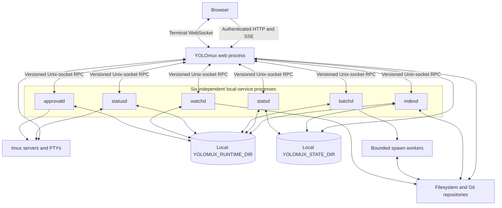
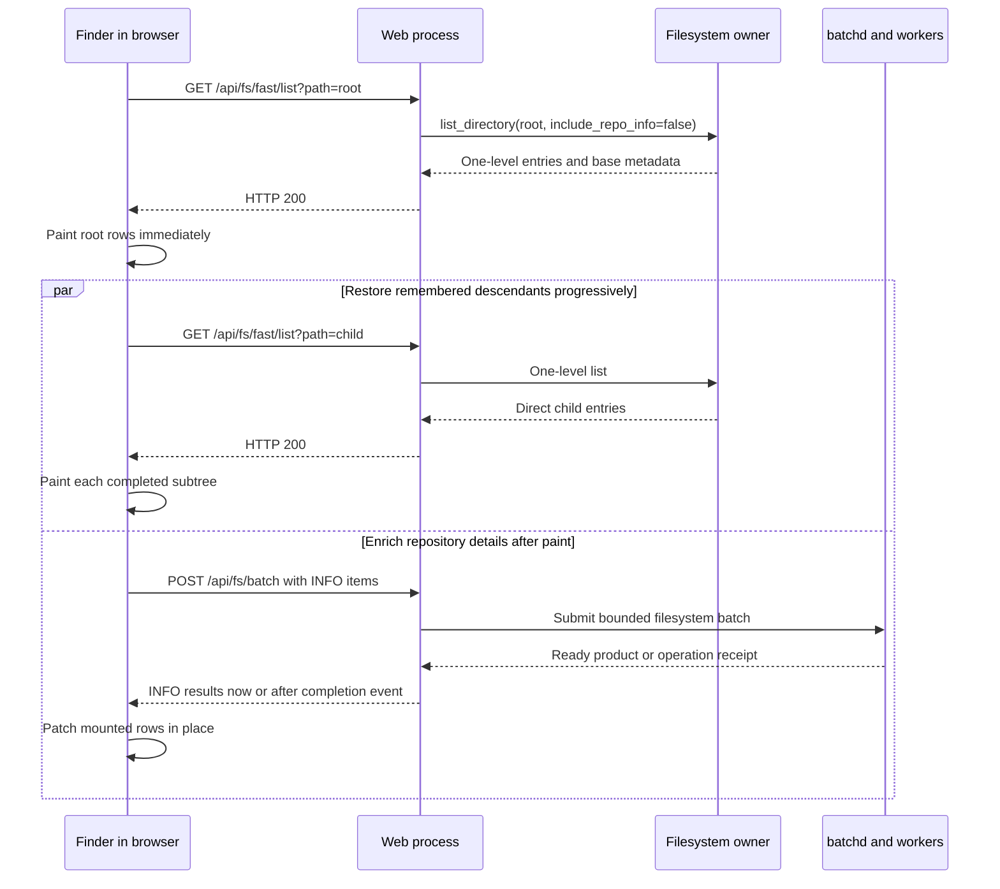

# Backend Architecture

This document describes the backend that YOLOmux runs now. It does not retain rejected process folds or migration proposals. See [`BACKEND_TEST_CONTRACT.md`](BACKEND_TEST_CONTRACT.md) for verification requirements, [`../DEVELOPMENT.md`](../DEVELOPMENT.md) for operator commands and detailed contracts, and [`../DONE/`](../DONE/README.md) for migration history.

## Runtime topology

The browser connects only to a web process. Local services are separate processes reached through versioned, length-prefixed Unix-socket RPC; they are not modules inside one consolidated daemon. `LocalServiceRegistry` owns client-side discovery, launch, process-identity validation, crash backoff, record publication, lease RPCs, stale-record recovery, and child reaping. Each service and the shared local-service runtime own that service's idle predicate and idle exit. Service sockets and transport locks are rooted under the selected local runtime directory. A registry record follows its configured service directory: most live with runtime services, while `indexd` keeps its record with its host-partitioned index state. Durable service data such as the Quick Open indexes and stats database is rooted under the selected state directory. Neither directory is exposed to the browser.

The web server is `TmuxWebtermHTTPServer`, a `ThreadingHTTPServer`. `http_routes.py` is the route catalog and declares method, path, authorization role, response protocol, body limit, and group. `Handler` owns request state and authentication. Composed adapters such as `FilesystemHttpAdapter` own transport-specific validation and framing, while `TmuxWebtermApp` composes application owners such as `WatchBridge`, `SessionFilesCoordinator`, `ActivityCache`, and `SystemStatusProjector` behind explicit forwarding methods.

Terminal bytes remain a direct browser-WebSocket-to-web-process-to-tmux path. Shared application and operation generations use authenticated HTTP and the `/api/client-events` SSE stream. Stats generations use `/api/stats-stream`, and development reload notifications use `/api/dev-reload`.

## Local services

`LOCAL_SERVICE_INVENTORY` is the single six-service roster. Each row below is an independently launched process.

| Service | Current owner |
| --- | --- |
| `indexd` | Quick Open indexes, per-root SQLite snapshots, manifests, tombstones, and the persisted breadth-first indexing frontier. |
| `statsd` | Original metric observations and usage atoms, retention, derived in-memory layers, and encoded snapshot/delta products. |
| `batchd` | Deferred or CPU-heavy typed work, bounded queues and spawn workers, coalescing, cancellation, and last-known-good materialized products. |
| `statusd` | Shared tmux session inventory, pane classification, immutable status generations, and encoded auto-approve status bytes. |
| `watchd` | Shallow native filesystem watch descriptors, whole-configuration polling fallback after native-backend failure/unavailability, revisions, and changed-path evidence used by browser refresh and index invalidation. Per-root local/network mount partitioning is not implemented yet. |
| `approvald` | Per-target auto-approval workers, target locks, lifecycle actions, and approved tmux input. |

Services may start on demand and retire after their lease/client/work idle condition is met. Expected demand-scoped absence is not itself a failure. The service's runtime row owns that distinction; health projection must not duplicate a second rule for it.

## Lifetime ownership and root-coordination authority matrix

Every backend/sidecar process and every coordination caller that can elect, reuse, signal, unlink, reclaim, or adopt appears in the table below exactly once. Each row carries seven facets, because a destructive action that is missing any one of them is a guess: the **root decision** (`caller-shared-root-retain`, where coordination is legitimate because the socket/port/record it guards must have exactly one owner even when a caller points two processes at the same root, or `private-root-remove`, where the root is auto-derived and private so no other caller could ever collide and no cross-root election, reuse, signal, unlink, reclaim, or adoption is performed at all); the **service record** that is the only authority to act on a process the acting owner did not just spawn; the **lock** that makes "exactly one owner" true rather than hoped for; the **claim** that survives the death of the process holding it; the **surviving supervisor** that answers "who is keeping this alive" by name rather than by silence; the **shutdown/reap owner**; and the exact **destructive dimensions** that must all still prove out before any signal or unlink. A row with no record and no claim has no authority and may only report.

Two rules are structural rather than per-row. First, a *future* event is never authority: "the next launcher start will clean it up" makes a survivor of a launcher that never returns permanently unresolvable, so no row may cite a future start. Second, there is one destructive owner — `local_services/lifetime.py` — holding one authorization function (`authorize_service_destruction`) and one bounded escalation (`terminate_authorized_process`, SIGTERM → grace → SIGKILL → force, re-proving the same identity on every poll). Rows below name what they bind, not their own copy of the algorithm.

| Process/caller | Lifetime owner | Root decision | Service record | Lock | Claim | Surviving supervisor | Shutdown/reap owner | Destructive dimensions bound |
| --- | --- | --- | --- | --- | --- | --- | --- | --- |
| `watchd` | `LocalServiceRegistry` (spawn/adopt) + `run_local_rpc_service`'s `ServiceLifetimeOwner` (retirement) | `caller-shared-root-retain` | `<socket>.service.json` written by `_publish_record` from a proven `status`, carrying `service`, `namespace`, `spawn_generation`, `supervisor`, `claim_id`, `root_sharing` | Service flock in `run_local_rpc_service` | `local-service:watchd` claim under `STATE_DIR/<host>/` published at spawn | `<socket>.lifetime.json`, republished on every transition | Self-bounded exit through `ServiceLifetimeOwner`; supervisor-side stop through `lifetime.terminate_authorized_process` | `host+boot` + `pid`/`process_start_identity` (zombie-excluded) + namespace + service kind + live spawn generation + claim |
| `batchd` | Same, plus `PersistentJobBroker._idle_should_stop()` | `caller-shared-root-retain` | Same owner | Service flock | `local-service:batchd` | Same | Same, plus `LOCAL_SERVICE_BATCHD_DRAIN_GRACE_SECONDS` while the batch retirement state reports `draining` | Same |
| `statusd` | Same, plus `PersistentStatusService.idle_due()` | `caller-shared-root-retain` | Same owner | Service flock | `local-service:statusd` | Same | Same | Same |
| `approvald` | Same, plus the `idle_due` predicate in `ApprovalDaemon` | `caller-shared-root-retain` | Same owner | Service flock + per-target locks | `local-service:approvald` | Same | Same | Same |
| `indexd` (`search_indexer.py`) | Same, plus its `idle_due` predicate | `caller-shared-root-retain` | Same owner | Service flock + per-root SQLite | `local-service:indexd` | Same | Same | Same |
| `statsd` (`stats_current/service.py`) | Same, plus `StatsCurrentService._idle()` | `caller-shared-root-retain` | Same owner | Service flock + SQLite | `local-service:statsd` | Same | Same | Same |
| `ServiceLifetimeOwner` (`local_services/lifetime.py`, inside every daemon) | Itself, armed from the one accept loop | Inherits its service's row | Reads none; publishes `<socket>.lifetime.json` | None (it acts only on its own process) | None (it IS the claimed process) | Publishes it — `retained_by_supervisor` with the launching supervisor's full identity, `orphaned`, or `supervisor_identity_unproven` | Itself: `stop_event` → grace → self SIGTERM → force → self SIGKILL, every signal re-checked against `os.getpid()` | Its own captured PID, re-compared at each signal so a forked child can never signal the parent's recycled PID |
| `LocalServiceRegistry` spawn/adopt/retire path (all six services) | Registry itself | `caller-shared-root-retain` under the shared runtime directory; `private-root-remove` under `YOLOMUX_ROOT`, where `adopt_unsupervised` refuses outright because no successor can exist | Reads and writes `<socket>.service.json` as a compare-and-swap: a record naming a different, provably live PID is refused, and `supervisor`/`launcher_pid`/`launcher_port`/`spawn_generation`/`claim_id` are first-writer-wins and change ONLY through an adoption | Service flock, taken re-entrantly through the one `_record_lock()` owner; no entry point may take it when its directory is absent, because `file_lock` mkdirs and chmods that directory | Publishes on spawn, adopts on transfer, releases on retirement | Read from the record's `supervisor` and reported through `status()["supervisor"] = {"pid", "transferred"}` | `lifetime.terminate_authorized_process` | `host+boot` + `pid`/`process_start_identity` (zombie-excluded) + namespace + service kind + live spawn generation + claim |
| `shutdown_owned_local_services` (launcher exit) | The exiting web process | `caller-shared-root-retain` | The tracked group's records for this port and this launcher PID | None (the launcher owns its own exit) | Reads claim rows through `claims_reader`; a claim whose supervisor is alive is reported under `retained` and never signalled | The claim row's `surviving_supervisor` | `lifetime.terminate_authorized_process`; returns `signalled`/`terminated`/`unconfirmed`/`retained` so a target that survived both signals is distinguishable from one that exited | `host+boot` + `pid`/`process_start_identity` (zombie-excluded) + namespace + service kind + live spawn generation |
| `repair_verified_orphans` (`local_services/registry.py`) | The repairing web process | `caller-shared-root-retain`; refuses under a managed-private root by way of the ledger's own sharing mode | Not used as authority — the persisted CLAIM is | None | Required. Absent claim means zero signals and one typed row | Named in the refusal row when the supervisor is alive | `lifetime.terminate_authorized_process`; the claim is unlinked in the same step so an already-cashed proof cannot authorize a second signal | Claim + `host+boot` + `pid`/`process_start_identity` (zombie-excluded) + kind + namespace + STRICTLY older generation + supervisor provably gone + a complete (`require_complete=True`) process table |
| `verified_orphan_diagnostics` (`local_services/registry.py`) | None — reporting only | N/A | None (its candidates have no usable record; that is the definition) | None | None | Not applicable | None. It may never signal or unlink | None. Its candidates come from command text, which is a rejected authority, so no dimension it could bind would make a signal legitimate |
| `acquire_server_port_lease` (`yolomux_lib/server_lease.py`) | The lease file, fenced by `HostIdentity` | `caller-shared-root-retain` (one TCP port is OS-shared even under a private root) | `server-leases/<host>/<port>.lock` | The lease file itself | None | The lease record's own identity | Released by the owning web process | `host+boot` + `pid`/`process_start_identity` (zombie-excluded) |
| `GroupOverloadWatchdog` (`local_services/watchdog.py`) | `lifetime.terminate_authorized_processes` under `SCOPE_TRACKED_PROCESS_GROUP` | `caller-shared-root-retain` | Reads the tracked group's service records and the port lease; never writes | None (read-only over records) | `watchdog_armed_tracked_group`, and `require_claim=True`, so an unnamed claim produces zero signals | The service record's `supervisor`, re-read from the record and vetoed on: a tracked service whose supervisor is not PROVABLY gone is `retained` — zero signals, zero unlinks, one row carrying `surviving_supervisor` | The shared owner: every leader SIGTERMed, ONE `GROUP_TERMINATION_GRACE_SECONDS` window, then SIGKILL to survivors within `GROUP_TERMINATION_FORCE_SECONDS` | `host+boot` + `pid`/`process_start_identity` (zombie-excluded) + namespace + group-authority kind + live process group + surviving supervisor (tracked services only) + claim. Spawn generation is reported `not_applicable_group_scoped`, not waived: the group is required in its place |
| `preflight_port` (`local_services/preflight.py`, from `boot.sh`) | `lifetime.terminate_authorized_processes` under `SCOPE_TRACKED_PROCESS_GROUP` | `caller-shared-root-retain`, scoped to the exact tracked group of the port being started; never a broad sweep | Port lease record + the dead owner's service records | Port lease | `preflight_dead_owner_port_lease`, and `require_claim=True` | The dead owner's lease identity | The shared owner, on the same two budgets as the watchdog | `host+boot` + `pid`/`process_start_identity` (zombie-excluded) + namespace + group-authority kind + live process group + claim. Same generation substitution |
| Web-process background-owner election (`infra/background_owner.py`) | `BackgroundOwnerRegistry`, or `DisabledBackgroundOwner` | `private-root-remove` for a managed instance (election skipped entirely); `caller-shared-root-retain` for an explicit caller-set `YOLOMUX_ROOT` | Owner record + generation index, fenced by `process_fence` | `file_lock` on the generation index | None | The owner record itself | `stop()` unlinks its own record only when identity, generation id, and instance nonce all match; every index-write and unlink failure is published as `maintenance_failures` in `status_payload` | `host+boot` + `pid`/`process_start_identity` (zombie-excluded) + generation id + instance nonce |
| tmux control client (`tmux/tmux_signals.py`) | The spawning web process through its live `Popen`, plus `PR_SET_PDEATHSIG` on Linux | `caller-shared-root-retain` | None | Claim file per client | `tmux-control-client` claim carrying host, boot, PID, process-start identity, kind, namespace, generation (session), supervisor, and root sharing | `surviving_supervisor` on the retained claim row | Own `Popen` teardown; a stranded client is reaped by `reap_unsupervised_tmux_control_clients` only when the claim's supervisor is provably gone | `host+boot` + `pid`/`process_start_identity` (zombie-excluded) + kind + namespace + supervisor |
| Codex app-server session (`agent_comms/codex_app_server.py`) | The requesting thread; `send()` closes it in `finally` | `private-root-remove` (stdio pipe, no shared root) | **None** — a stdio child with no persisted record | The caller's `RLock` | None | The requesting thread, in-process | `close()` in the request's `finally`; the process is a direct child and dies with the server | None claimed, and none needed: no cross-restart authority is ever exercised |
| batchd spawn workers (`infra/batchd.py`) | `PersistentJobBroker` through its `ProcessPoolExecutor` | `caller-shared-root-retain` (inherits batchd's row) | **None** — pool children covered by batchd's record and process group | The broker's lane executor | Inherits batchd's claim through the process group | batchd itself | Synchronous `terminate()` → 2 s join → `kill()` → 1 s join per worker | The live executor handle |
| `terminate_process_group` (`infra/common.py`) | The `Popen` carrying the recorded `ProcessGroupIdentity` | `caller-shared-root-retain` | In-memory `ProcessGroupIdentity`: deployment id, leader pid, pgid, leader start identity | The live `Popen` handle | None | The owning `Popen` | SIGTERM → 2 s wait → SIGKILL | Deployment id + live pgid + leader birth identity, each `killpg` refused with a typed reason otherwise |
| `YolomuxControlServer` socket (`yolomux_lib/control.py`) | The web process that created it | `caller-shared-root-retain` — a same-PID successor must be able to reclaim a predecessor's leftover | `<socket>.owner.json` carrying the full process record | None | None | The owner record | `stop()` unlinks its own socket and record; `reclaim_stale_control_sockets` removes a predecessor's pair only when the owner record proves that process is gone | `host+boot` + `pid`/`process_start_identity` (zombie-excluded) |

Root provenance (`managed` vs. an explicit caller-set root) is carried by `InstanceIdentity` in `tools/instance_isolation.py`; the derived boolean `infra.common.MANAGED_PRIVATE_ROOT` is what the claim ledger and the registry read, so the sharing mode is resolved once beside the roots rather than re-derived from a path shape at each call site.

**One escalation, two scopes, three dispositions.** `GroupOverloadWatchdog` and `preflight_port` used to hold their own TERM→grace→KILL loops on their own clocks (3.0s in the watchdog, 2.0s in preflight, no force budget in either), because their targets are members of a *web server's* process group and structurally carry no service kind and no spawn generation. Both now route through `lifetime.terminate_authorized_processes`, the one owner, and the answer to the missing dimension is a typed scope rather than a waiver. `SCOPE_TRACKED_PROCESS_GROUP` reports `spawn_generation` as `not_applicable_group_scoped` and REQUIRES `process_group` in its place: the record must name the group its leader was proven in, the caller must demand that same group, and `registry.live_process_group` must re-read it off the running PID and agree. Absent, unreadable, or changed each produce zero signals and one typed row. The group-authority kind (`web-server-port-group`, `dead-web-owner-port-group`, or the service name) names which resolver proved the group, so a record from one resolver can never be acted on as if it came from another, and both paths set `require_claim=True`.

The escalation is expressed as a batch (`terminate_authorized_processes`) with a one-target wrapper (`terminate_authorized_process`) rather than the reverse, because containing a runaway *group* is not N independent terminations run back to back: every leader must be signalled before any of them is force-killed, or the last leader is still burning CPU while the first one's grace window is being paid for. `GROUP_TERMINATION_GRACE_SECONDS` / `GROUP_TERMINATION_FORCE_SECONDS` and `LOCAL_SERVICE_RETIRE_GRACE_SECONDS` / `LOCAL_SERVICE_RETIRE_FORCE_SECONDS` are all defined once in `lifetime.py`; `registry` re-exports the retirement pair, so the four budgets that used to drift are two owned pairs.

**The third disposition.** A record published before spawn generations existed carries none. Demanding one makes that daemon permanently unretirable — the deadlock being that retiring it is what would give it a generation — and waiving the demand signals a process on a proof nobody wrote. `authorize_service_destruction` therefore answers `authorized`, `refused`, or `retained`: a generation-less service-scoped record takes a typed NON-destructive path with one row naming the absent dimension, no signal and no unlink, and no retry that would change it. Every record that DOES carry a generation must re-prove it live and refuses on mismatch, with no `require_generation` escape hatch left anywhere. Two supporting corrections make that dimension able to vary at all: `shutdown_owned_local_services` now reads the recorded generation out of the group's record instead of re-reading it off the live process on both sides of the comparison, and `_authorization_record` no longer synthesizes one from the target's own environment — it falls back only to `spawn_ownership.generation_marker`, this registry's independent memory of what it spawned. A leader whose authority is unproven (`retained` or `refused`) retains its whole group, because a member's group-scoped authority is derived from the leader's record and half-tearing a group is worse than either whole answer.

**The surviving supervisor is now a destructive dimension, not a note.** Several YOLOmux servers share one per-user runtime directory, so `GroupOverloadWatchdog` can see — and used to contain — services another live server owns; `tools/yostats_active_browser_window.py` arms the same watchdog from a process that supervises nothing at all. A tracked service record names the supervisor that spawned it, so `authorize_service_destruction` takes `require_supervisor_gone` and a `supervisor_diagnostic` from the same fence every other dimension uses, and answers `retained` — zero signals, zero unlinks — for anything short of proof that the supervisor died. "Proof" is `LocalProcessDiagnostic.may_remove_stale_record`, the same property `registry._supervisor_is_gone` and the claim ledger already use, so there is one answer to "is the supervisor gone" rather than two. A supervisor that is still current is retained under `supervisor_alive` with its proven identity carried on the row as `surviving_supervisor` (the ledger's existing spelling, not a second one); a supervisor field that is missing, unreadable, or attached to a rotated record is retained under `missing_supervisor_record`; a supervisor whose death cannot be proven — another host, a previous boot, an unreadable start identity — is retained under the fence's own reason. The web server's port lease names no supervisor because it is the top of the supervision tree, so the web group does not demand the dimension rather than failing an unprovable one.

Still not bound, and stated rather than implied: the watchdog's shared-service veto (`_other_web_ports_active`) is still command-text matching that can only ever REDUCE what gets stopped.

### Bounded host-local repair path for ambiguous survivors

Two producers, with deliberately different authority, because their INPUTS have different authority.

`verified_orphan_diagnostics` composes `tracked_local_service_groups` and `untracked_local_service_processes` into one typed row per process that looks like a local service (a `yolomux_lib.` `-m` module plus a `--socket` under the shared services directory) but carries no usable ledger record. Its candidates come from command text, and a process is not yours because its argv resembles yours, so it may only ever report: `attempted_action` is `"none"` and `result` is `"reported_only"` for every row, and that is honest for this input rather than a placeholder. `reason` is the field that carries information — `untracked_no_ledger_record`, `unreadable_service_record` (a record exists for that socket but could not be parsed, which hides an owner rather than proving there is none), `superseded_by_recorded_generation`, or `identity_<reason>` carrying the central fence's own `LocalProcessReason`. Retained `age_seconds` comes from `OrphanObservationLedger`, one process-wide owner keyed by service directory, read by both `statusd.orphan_diagnostics` and `app.runtime_process_ledger`.

`repair_verified_orphans` is the half that can act, and it takes a different input: a claim the spawning supervisor persisted while it still had direct proof of what it created. Before any signal it re-proves the claim's existence, host and boot, the PID's recorded process-start identity, that the PID is not an unreaped corpse, the kind, the namespace, that the generation is STRICTLY older than the caller's current one, and that the supervisor is provably gone by the full identity fence rather than by `pid_is_alive` on a bare integer — and it requires a complete process table, because an incomplete one cannot tell a dead survivor from an unreadable one and the difference is a kill. A survivor whose supervisor is alive is retained and the row names that surviving supervisor. `attempted_action`, `result`, `failure_reason`, and `age_seconds` are all measured from what executed; `ORPHAN_RESULT_REPAIRED` is reported only after the identity is re-proved gone, and the spent claim is unlinked in the same step.

### Zombies are not alive, and the fence now says so

An exited-but-unreaped process keeps its PID, its PGID, and its `/proc/<pid>/stat` start ticks, so `os.kill(pid, 0)` succeeds and a raw start-identity read still matches. `is_current_local_process` therefore reported a corpse as `current_local_process`, and every caller that reached it raw inherited that: `ProcessClaimLedger` read a dead supervisor as alive and retained its helper forever, and read a dead target as live and reported `signalled` for a signal that landed on nothing. The state check lives inside the fence (`host_identity.process_state`, one owner, reused by `registry.process_state`), so the rule is expressed once. Callers reading from `bounded_process_table`, which already drops `Z`, pass a reader that returns the empty string so the same proof is not paid for twice.

The same divergence drove the retirement miss. `_retire_incompatible_service` held two liveness predicates: its authority gates used the zombie-aware `process_record_diagnostic`, while its wait loops used a private `pid_is_alive` + start-identity comparison. Measured, every daemon exits on SIGTERM in 0.11-0.14s, yet the loop reported the process as still current for the whole 0.5s grace AND the whole 2.0s force budget whenever the target was this process's own unreaped child — same exit, different parentage, different answer. Retirement then returned a bare `False`. `registry.pid_is_serving` is the single predicate both halves now use, and `registry.process_group_has_serving_member` is its group form.

### Reap authority for helper processes: `ProcessClaimLedger`

A helper supervised only through a live in-process handle becomes unreapable the moment that handle dies with a hard-killed server. `yolomux_lib/infra/process_claims.py` is the one owner that makes reaping such a survivor a decision instead of a guess. A claim is a small atomic JSON file binding the host/boot/pid/process-start identity that `is_current_local_process` fences, the helper **kind**, the directory **namespace**, the spawn **generation**, the **supervisor** that created it, and the **root sharing mode** it lives under.

The supervisor field is what makes retention truthful. `reap_unsupervised` returns exactly one typed row per claim and never a bare pid list: a claim whose supervisor is still the current local process is deliberately retained and the row names that surviving supervisor under `surviving_supervisor`; a claim that cannot be read, or whose target identity cannot be re-proved, is reported and never acted on; only a claim whose supervisor is provably gone and whose target still re-proves its recorded birth identity is signalled, and the claim file is deleted in the same step so an already-cashed proof can never authorize a second signal against a recycled pid.

A dead supervisor does not always mean a dead helper, and this is where the root's sharing mode decides. Under a **caller-shared** root another live server may legitimately still be using the survivor, so it may be inherited; under a **managed-private** root there is exactly one possible launcher, so no successor exists and zero election, reuse, signal, unlink, reclaim, or adoption crosses that root's boundary. `adopt_unsupervised` refuses outright on a managed-private root and says so by name (`managed_private_root`).

Adoption is a transaction, not a flag, because two successors racing the same dead launcher must not both believe they own the helper. The transfer is fenced by an adoption marker created with `O_CREAT|O_EXCL` carrying the successor's own identity: exactly one successor can create it, the loser is told `adoption_in_progress`, and a successor that dies mid-transfer leaves a marker whose recorded holder a later pass fences and clears (`stale_adoption_marker_cleared`) rather than a claim two owners both think they hold. The winner rewrites the claim with itself as `supervisor`, keeps the previous one under `adopted_from`, and only then removes the marker. A naive claim sweep would have terminated exactly the daemons this exists to preserve, so on the local-service path adoption is attempted BEFORE any reclaim decision and a contended or unresolved transfer means zero signals.

The tmux control client is the original consumer. Linux closes the leak at the source with `PR_SET_PDEATHSIG`; macOS has no equivalent, and the previous sweep decided what to kill from a `ps` scrape keyed on `PPID == 1` plus argv substrings. PPID, PGID, hostname, and command text prove nothing about who created a process, so that sweep could terminate an unrelated user's read-only tmux monitor. It is gone, and with it the Darwin platform gate.

### Demand, self-claims, and the daemon's own exit

Demand is a *claim*, and a claim must name a live external client. A daemon may never lease itself: the self-connection exclusion was closed at the connection level (`run_local_rpc_service` compares `peer_pid` to `os.getpid()` before calling `on_client`) and was wide open at the lease level, where `acquire_client_lease` trusted a caller-supplied `client_pid` verbatim — one self-issued lease pinned the idle deadline forever and no correctness in `claim_gated_idle_due` could undo it. That request is now refused with `diagnostic.reason == "self_connection"`.

`bool(self.leases)` is a different question from "is any client still alive". A hard-killed client cannot release its lease, so `live_client_claim` is the one predicate that reaps first and then answers; `approvald` and `indexd` alone lacked that reap and could be pinned indefinitely by one crashed caller. `batchd` additionally held two definitions of idle — `shutdown_if_idle` gated on leases alone while `_idle_should_stop` also honoured `_has_active_work()` — so a caller could stop the broker out from under queued work simply by asking through the other path. There is now one definition.

When the last valid external claim disappears, `stop_event` is a request the listener may never honour: a stuck handler, a blocking shutdown hook, or a non-daemon thread at interpreter exit all leave the daemon up, and the only thing that used to force it was a future launcher start. `ServiceLifetimeOwner` bounds that exit inside the daemon itself, and publishes `<socket>.lifetime.json` beside the socket rather than behind the status RPC — because the moment "who retains this, and has it already been asked to stop?" matters most is exactly when the daemon is too wedged to answer an RPC.

## Web-process coordination owners

The background owner is a role elected among web processes sharing one local `YOLOMUX_STATE_DIR`; it is not a seventh service. The elected process owns recurring refresh coordination, watch-root intent consumption, metric-family collectors, and warmer lifecycles. Followers serve ready or stale shared products and ask the owner to refresh rather than starting duplicate background work. Election uses a process lock plus heartbeat/generation records, while each local service retains its own service lock and writer rules.

`BackendHealthObserver` runs inside each web process. It samples the six-service roster on a bounded cadence without demand-starting absent services and writes retained per-port history through `BackendHealthStore`. The web process's own metrics remain explicitly unobserved by that service probe instead of being fabricated.

`/api/system-status` reads a pre-encoded immutable snapshot published by a background snapshot owner. The request thread never rebuilds the status document. Before the first snapshot or after its freshness deadline, the route returns a typed unavailable or stale result.

## Filesystem boundaries

`filesystem.list_directory()` is the shared listing owner. It validates the requested path through the one descriptor-bound authorization owner in `filesystem/paths.py`, filters secret or credential-blocked paths before child metadata is read, applies the entry bound, sorts the result, and can omit repository enrichment. Every listed child is authorized and opened relative to the pinned parent descriptor through `paths.safe_child()`; a blocked child, a symlink outside the allowed roots, or a child repointed to either is omitted with no metadata row. Recursive ZIP/count/search/index walks carry the requested and resolved roots beside the pinned directory descriptor, authorize each descendant before stat/open, and consume each accepted child through `safe_child()` rather than reopening an absolute path. Human-interactive bounded reads stay under `/api/fs/...` and return directly; recursive or input-sized work is submitted through `/api/batch/...` and may return an operation receipt.

Git-backed filesystem consumers enter `git_ops.pinned_git_scope_from_handle()` from the already-authorized file, directory, or parent handle. The scope pins the repository marker, linked-worktree Git directory, common directory, and object directory; builds a bounded private view of config, HEAD, refs, packed refs, objects, and the index; passes only that view to `_run_pinned_git()`; and revalidates the live namespace when the consumer retires. Read metadata, path info, Finder repository enrichment, diff, and blame use this same scope. A tracked rename rewrites the old index entries to their new paths in the private index without reopening worktree content, performs the descriptor-relative filesystem rename, then publishes the private index through the pinned Git-directory descriptor and its owned `index.lock`. If the repository, object store, real index, or lock changes, the operation returns `fs.error.gitRepositoryChanged` and never runs against the replacement. Finder may defer optional repository badges when the bounded view exceeds its enrichment budget; the directory row remains usable.

| Surface | Execution path | Current use |
| --- | --- | --- |
| `GET /api/fs/fast/list?path=...` | `FilesystemHttpAdapter` calls `filesystem.list_directory(..., include_repo_info=False)` in the web process and returns the snapshot directly. It does not call `batchd`. | Every Finder directory LIST, including the root and remembered descendants. A successful call is HTTP 200 and contains only that directory's direct entries and base metadata. |
| `POST /api/fs/batch` | The web process submits a bounded typed batch to `batchd`; a cold product may return an operation receipt and complete through the shared client-event/operation path. | Deferred detailed work. Finder sends Git/repository `INFO` enrichment here after base rows exist and patches mounted rows when results arrive. |
| `GET /api/fs/search` | The accepting web process performs a direct one-level search for interactive Quick Open path prefixes. | Immediate database-independent directory results. |
| `GET /api/batch/search` | The web process submits recursive search and cursor-delta work to `batchd`; a cold product returns an operation receipt. | Slow recursive `find`-style discovery and indexed progress. |
| `GET /api/fs/list` | The compatibility single-operation path submits `list` through the existing filesystem-product owner. | Existing callers outside Finder; it is not the Finder first-paint route. |

Cold Finder Sync has no whole-tree render barrier. It awaits the fast root, paints it, and then fetches remembered descendant directories with bounded concurrency; each completed listing triggers another render. Git enrichment is independently scheduled after LIST publication, so a cold `batchd`, a queued product, or slow Git cannot delay names, types, sizes, or dates from the fast snapshot.

Quick Open indexing is separate from Finder listing. `indexd` persists a breadth-first, directory-at-a-time frontier. It publishes a complete depth before advancing `published_depth`, retains the previous readable generation while replacement work proceeds, and resumes the shallowest pending directory after restart. Finder visibility and concrete watch/mutation paths promote or repair work through the shared index invalidation owner; they do not start a second crawl.

## State and durability

`YOLOMUX_STATE_DIR` is local-host coordination and durable-state scope. Web processes that select the same state root share background-owner records, durable caches, and host-partitioned databases. `YOLOMUX_RUNTIME_DIR` separately scopes service sockets and transient runtime data; processes share local-service connectivity only when they select the same runtime root. Registry record placement follows the service owner and therefore may be runtime-rooted or state-rooted; selecting the same state root alone does not imply a shared service socket. Stateful families that must not cross hosts live below `STATE_DIR/hosts/<stable-host-id>/`. Live SQLite WAL files are not supported on a network filesystem.

The primary port uses the durable default state root. Non-primary development ports are isolated under an ephemeral per-port `/tmp` root, so their retained health, caches, and service state do not survive a reboot or `/tmp` cleanup. The UI reports retained history from the actual selected root rather than assuming that every port is durable.

## Extension rules

| Change | Extend this owner | Required proof |
| --- | --- | --- |
| Local-service action | Add one named handler to that service's `LocalServiceCommandRouter`; use shared daemon actions only when the response semantics are identical. | Preserve validation-before-dispatch, framing, error vocabulary, lease behavior, and the fixed action inventory. |
| Local-service runtime field | Add the field once to `LocalServiceRuntimeRow` and the shared projection; a service adapter supplies only its domain value. | Exercise runtime-row and backend-health projection tests and prove projection does not demand-start the service. |
| HTTP route | Register route metadata in `http_routes.py`, then put filesystem or response-framing work in the relevant adapter. | Compare the route catalog and verify auth, role, body limit, headers, framing, and typed error behavior. |
| Application domain behavior | Extend the composed domain owner that already owns its mutable state and teardown. | Characterize payload bytes, callbacks, lock order, replacement, stale completion, failure, and shutdown. |

New backend work follows explicit composition behind stable facades. Do not add a generic service locator, a parallel cache for the same product, or a second copy of service inventories, filesystem policy, runtime-row fields, or response semantics.
