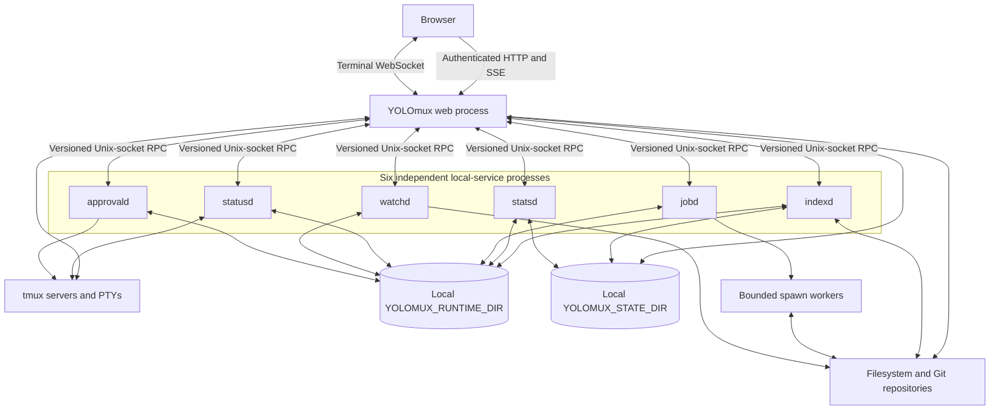

# Backend Architecture

This document describes the backend that YOLOmux runs now. It does not retain rejected process folds or migration proposals. See [`BACKEND_TEST_CONTRACT.md`](BACKEND_TEST_CONTRACT.md) for verification requirements, [`../DEVELOPMENT.md`](../DEVELOPMENT.md) for operator commands and detailed contracts, and [`../DONE/`](../DONE/README.md) for migration history.

## Runtime topology

The browser connects only to a web process. Local services are separate processes reached through versioned, length-prefixed Unix-socket RPC; they are not modules inside one consolidated daemon. `LocalServiceRegistry` owns client-side discovery, launch, process-identity validation, crash backoff, record publication, lease RPCs, stale-record recovery, and child reaping. Each service and the shared local-service runtime own that service's idle predicate and idle exit. Service sockets and transport locks are rooted under the selected local runtime directory. A registry record follows its configured service directory: most live with runtime services, while `indexd` keeps its record with its host-partitioned index state. Durable service data such as the Quick Open indexes and stats database is rooted under the selected state directory. Neither directory is exposed to the browser.

The web server is `TmuxWebtermHTTPServer`, a `ThreadingHTTPServer`. `http_routes.py` is the route catalog and declares method, path, authorization role, response protocol, body limit, and group. `Handler` owns request state and authentication. Composed adapters such as `FilesystemHttpAdapter` own transport-specific validation and framing, while `TmuxWebtermApp` composes application owners such as `WatchBridge`, `SessionFilesCoordinator`, `ActivityCache`, and `SystemStatusProjector` behind explicit forwarding methods.

Terminal bytes remain a direct browser-WebSocket-to-web-process-to-tmux path. Shared application and operation generations use authenticated HTTP and the `/api/client-events` SSE stream. Stats generations use `/api/stats-stream`, and development reload notifications use `/api/dev-reload`.

## Local services

`LOCAL_SERVICE_INVENTORY` is the single six-service roster. Each row below is an independently launched process.

| Service | Current owner |
| --- | --- |
| `indexd` | Quick Open indexes, per-root SQLite snapshots, manifests, tombstones, and the persisted breadth-first indexing frontier. |
| `statsd` | Original metric observations and usage atoms, retention, derived in-memory layers, and encoded snapshot/delta products. |
| `jobd` | Deferred or CPU-heavy typed work, bounded queues and spawn workers, coalescing, cancellation, and last-known-good materialized products. |
| `statusd` | Shared tmux session inventory, pane classification, immutable status generations, and encoded auto-approve status bytes. |
| `watchd` | Shallow native filesystem watch descriptors, whole-configuration polling fallback after native-backend failure/unavailability, revisions, and changed-path evidence used by browser refresh and index invalidation. Per-root local/network mount partitioning is not implemented yet. |
| `approvald` | Per-target auto-approval workers, target locks, lifecycle actions, and approved tmux input. |

Services may start on demand and retire after their lease/client/work idle condition is met. Expected demand-scoped absence is not itself a failure. The service's runtime row owns that distinction; health projection must not duplicate a second rule for it.

## Lifetime ownership and root-coordination authority matrix

Every backend/sidecar process and every background-election/reuse/signal/unlink/reclaim/adoption caller has exactly one row below, one lifetime owner, and one root-coordination classification: `caller-shared-root-retain` (coordination is legitimate because the socket/port/record it guards must have exactly one owner even when a caller deliberately points two processes at the same root) or `private-root-remove` (coordination is disabled outright because the root is auto-derived and private, so no other caller could ever collide with it).

Three facets decide every destructive action and are therefore carried per row, not assumed: the **persisted record** that is the only authority to act on a process the acting owner did not just spawn; the **lock** that makes "exactly one owner" true rather than hoped for; and the **shutdown reap** that says who ends the process and how. A row with no record has no authority and may only report.

| Process/caller | Lifetime owner | Demand signal (what keeps it alive) | Service record / authority | Lock | Shutdown reap | Root-coordination classification |
| --- | --- | --- | --- | --- | --- | --- |
| `watchd` | `LocalServiceRegistry` (spawn/reclaim) + `PersistentWatchService.idle_due()` (retirement) | Lease/descriptor claims only: `self.leases` transitioning to/from empty, stamped in `_handle_lease`, `_release_locked`, `_reap_locked`. A `status`/`ping`/`snapshot` RPC never counts, whether same-process or external (fixed 2026-08-22). | `<socket>.service.json` written once by `LocalServiceRegistry._publish_record` from a proven `status` | Service flock in `run_local_rpc_service` | Self-exit on idle; registry `_retire_existing` SIGTERM → `LOCAL_SERVICE_RETIRE_GRACE_SECONDS` → SIGKILL → `LOCAL_SERVICE_RETIRE_FORCE_SECONDS` | `caller-shared-root-retain` |
| `jobd` | `LocalServiceRegistry` + `PersistentJobBroker._idle_should_stop()` | `not self.leases and not self._has_active_work() and idle_seconds elapsed`; queued/running jobs count as demand independent of any lease. | Same `<socket>.service.json` owner | Service flock | Same registry retire path, plus `LOCAL_SERVICE_JOBD_DRAIN_GRACE_SECONDS` when `jobd_retirement_state` reports `draining` | `caller-shared-root-retain` |
| `statusd` | `LocalServiceRegistry` + `PersistentStatusService.idle_due()` | `not self.leases and idle_seconds elapsed`; `handle()` no longer restamps the clock on every RPC (fixed 2026-08-22, same defect class as watchd). | Same `<socket>.service.json` owner | Service flock | Same registry retire path | `caller-shared-root-retain` |
| `approvald` | `LocalServiceRegistry` + inline `on_idle` predicate in `run()` | `not self.leases and not self.records and idle_seconds elapsed`; `handle()` no longer restamps the clock on every RPC (fixed 2026-08-22, same defect class as watchd). | Same `<socket>.service.json` owner | Service flock + per-target locks | Same registry retire path | `caller-shared-root-retain` |
| `indexd` (`search_indexer.py`) | `LocalServiceRegistry` + inline idle predicate | `not self.leases and idle_seconds elapsed`. No handler-level restamp bug found (`on_client` is the sole clock writer already). | Same `<socket>.service.json` owner | Service flock + per-root SQLite | Same registry retire path | `caller-shared-root-retain` |
| `statsd` (`stats_current/service.py`) | `LocalServiceRegistry` + `StatsCurrentService._idle()` via the shared `claim_gated_idle_due` owner | `bool(self.leases) or self._building or pending-materializer-work`, routed through `claim_gated_idle_due` (fixed 2026-08-22 — `_idle` previously reimplemented the transition/deadline algorithm inline and let `_on_client` restamp the shutdown clock on every RPC, the same defect class already fixed in the other five services). `last_rpc_at` (stamped by `_on_client`) is a distinct field used only to gate deferred SQLite vacuum quiescence; it never feeds the shutdown decision. | Same `<socket>.service.json` owner | Service flock + SQLite | Same registry retire path | `caller-shared-root-retain` |
| `LocalServiceRegistry` spawn/reclaim/retire path (all six services) | Registry itself, fenced by `HostIdentity`/`process_record_diagnostic` | N/A (infrastructure, not a service) | Reads and writes `<socket>.service.json`; `_remove_stale_record` is the only unlink | Service flock | N/A | `caller-shared-root-retain` — flock election in `run_local_rpc_service`, `_can_reclaim_dead_launcher_service`, and `_retire_incompatible_service` always require an exact host/boot-id/PID-start-identity/generation match before any signal or unlink; a private root never has a second caller to collide with, so the coordination is inert there rather than unsafe. |
| `acquire_server_port_lease` (`yolomux_lib/server_lease.py`) | Same lease file, fenced by `HostIdentity` | N/A (one TCP port is inherently OS-shared even under a private root) | `server-leases/<host>/<port>.lock` | The lease file itself | Released by the owning web process | `caller-shared-root-retain` |
| `GroupOverloadWatchdog` (`yolomux_lib/local_services/watchdog.py`) | Watchdog itself, fenced by `process_record_diagnostic` per signal | N/A (self-containment of one port's own tracked group) | Reads the tracked group's service records; never writes | None (read-only over records) | Signals only members of this port's own tracked group | `caller-shared-root-retain` |
| `preflight_port` (`yolomux_lib/local_services/preflight.py`), invoked from `boot.sh` startup | Preflight itself, fenced by `process_record_diagnostic`/lease-record identity before any signal | N/A (boot-time reap of a dead-owner's orphaned tracked group for one port, not a running service) | Port lease record + service records of the dead owner | Port lease | SIGTERM → `PREFLIGHT_REAP_GRACE_SECONDS` → SIGKILL, re-verifying identity before the force step | `caller-shared-root-retain` — scoped to the exact tracked group of the port being started; never a broad sweep. |
| Web-process background-owner election (`yolomux_lib/infra/background_owner.py`) | `BackgroundOwnerRegistry` (real election) or `DisabledBackgroundOwner` (no-op) | Election among web processes sharing one `YOLOMUX_STATE_DIR` | Owner record + generation index, fenced by `process_fence` | `file_lock` on the generation index | `stop()` unlinks its own record only when identity, generation id, and instance nonce all match | `private-root-remove` for a managed instance — `cli.py` passes `managed_instance=is_managed_instance_port(args.port)` into `app.py:start_background_owner`, which installs `DisabledBackgroundOwner` and skips election entirely. `caller-shared-root-retain` for an explicit caller-set `YOLOMUX_ROOT`, where the real `BackgroundOwnerRegistry` still applies. |
| tmux control client (`yolomux_lib/tmux/tmux_signals.py`, `TmuxSignalEventWatcher.run_control_client`) | The spawning web process through its live `Popen`, plus `PR_SET_PDEATHSIG` on Linux | One client per watcher thread while sessions exist; retried on `retry_seconds` | `ProcessClaimLedger` claim under `STATE_DIR/<host>/tmux-control-client/` carrying host, boot, pid, process-start identity, kind, namespace, generation (session), and the spawning supervisor's identity | Claim file per client (`*.claim.json`), written atomically | Own `Popen.terminate()`/`kill()` in `run_control_client`'s `finally`; a client stranded by a hard-killed server is reaped on the next server's `start()` by `reap_unsupervised_tmux_control_clients`, and only when the claim's supervisor is provably not the current local process | `caller-shared-root-retain` |
| Codex app-server session (`yolomux_lib/agent_comms/codex_app_server.py`, `CodexAppServerSession`) | The requesting thread; `send()` in `yolomux_lib/yoagent/transports.py` closes it in `finally` | One request; the session is per-send, never pooled | **None** — a stdio child with no persisted record | The caller's `RLock` on the session | `close()` on the request's `finally`; the process is a direct child, so it dies with the server. No cross-restart authority exists and none is claimed. | `private-root-remove` (stdio pipe, no shared root) |
| jobd spawn workers (`yolomux_lib/infra/jobd.py`, `_shutdown_lane_executor`) | `PersistentJobBroker` through its `ProcessPoolExecutor` | Queued/running jobs in that lane | **None** — pool children of jobd, covered by jobd's own service record and process group | The broker's lane executor | Synchronous `terminate()` → 2 s join → `kill()` → 1 s join per worker, so `atexit` never blocks with the socket already unlinked | `caller-shared-root-retain` (inherits jobd's row) |
| `terminate_process_group` (`yolomux_lib/infra/common.py`) → `signal_recorded_process_group` (`yolomux_lib/tmux/process_group_ownership.py`) | The `Popen` that carries the recorded `ProcessGroupIdentity` | N/A (teardown helper) | In-memory `ProcessGroupIdentity` on the `Popen`: deployment id, leader pid, pgid, leader start identity | The live `Popen` handle | SIGTERM → 2 s wait → SIGKILL, each `killpg` refused with a typed reason unless deployment id, live pgid, and leader birth identity all still match | `caller-shared-root-retain` |
| `YolomuxControlServer` socket (`yolomux_lib/control.py`) | The web process that created it | N/A (owned for the process lifetime) | **None** — the path is `yolomux-<pid>-<id(self)>.sock`, and its only fence is that the pid in the name is this process's own | None | `stop()` unlinks its own path | `private-root-remove` |

Root provenance (`managed` vs. an explicit caller-set root) is carried by `InstanceIdentity` in `tools/instance_isolation.py` and reaches exactly one consumer today (`app.py:start_background_owner`). `LocalServiceRegistry`, `server_lease.py`, and `watchdog.py` do not consult it, and should not: the resources they coordinate (one socket, one port, one signal target) need exactly-one-owner semantics under a shared root and are simply never exercised cross-instance under a private root, so gating them on `managed` would be redundant, not corrective. Threading `managed` further through those call sites was evaluated and deliberately deferred.

### Bounded host-local repair path for ambiguous survivors

`verified_orphan_diagnostics` (`yolomux_lib/local_services/registry.py`) composes `tracked_local_service_groups` and `untracked_local_service_processes` into one typed row per process that looks like a local service (a `yolomux_lib.` `-m` module plus a `--socket` under the shared services directory) but carries no usable ledger record proving its identity. Because identity can never be fully verified for such a process, every row is diagnostics-only: `attempted_action` is always `"none"` and `result` is always `"reported_only"`, and the doc states that plainly rather than implying a repair that does not exist — this function never signals or unlinks (Rejected Shortcuts: no signal without ledger-proven authority).

`reason` is the field that carries information, and it names which authority gap the survivor actually sits in: `untracked_no_ledger_record` (no record names its socket), `unreadable_service_record` (a record exists for that socket but could not be parsed, which hides an owner rather than proving there is none), `superseded_by_recorded_generation` (a record names that socket but a different pid, so the survivor is a superseded generation whose socket has been taken over), or `identity_<reason>` carrying the central fence's own `LocalProcessReason` when the record names this exact pid and the fence still rejected it. Retained `age_seconds` comes from `OrphanObservationLedger`, one process-wide owner keyed by service directory; it previously lived only inside statusd's `orphan_diagnostics`, which no product code calls, so the surface the System panel actually reads (`app.runtime_process_ledger`) reported no age at all. Both callers now read the same owner.

### Reap authority for helper processes: `ProcessClaimLedger`

A helper process supervised only through a live in-process handle becomes unreapable the moment that handle dies with a hard-killed server. `yolomux_lib/infra/process_claims.py` is the one owner that makes reaping such a survivor a decision instead of a guess. A claim is a small atomic JSON file binding five dimensions: the host/boot/pid/process-start identity that `infra/host_identity.py:is_current_local_process` already fences, the helper **kind**, the directory **namespace**, the spawn **generation**, and the **supervisor** — the identity of the process that spawned it.

The supervisor field is what makes retention truthful. `reap_unsupervised` returns exactly one typed row per claim and never a bare pid list: a claim whose supervisor is still the current local process is deliberately retained and the row names that surviving supervisor under `surviving_supervisor`; a claim that cannot be read, or whose target identity cannot be re-proved, is reported and never acted on; only a claim whose supervisor is provably gone and whose target still re-proves its recorded birth identity is signalled, and the claim file is deleted in the same step so an already-cashed proof can never authorize a second signal against a recycled pid.

The tmux control client is the first consumer. Linux closes the leak at the source with `PR_SET_PDEATHSIG`; macOS has no equivalent, and the previous sweep decided what to kill from a `ps` scrape keyed on `PPID == 1` plus argv substrings. PPID, PGID, hostname, and command text prove nothing about who created a process, so that sweep could terminate an unrelated user's read-only tmux monitor. It is gone, and with it the Darwin platform gate: a claim is provable on every host, so a Linux server whose `PR_SET_PDEATHSIG` was unavailable is covered too.

## Web-process coordination owners

The background owner is a role elected among web processes sharing one local `YOLOMUX_STATE_DIR`; it is not a seventh service. The elected process owns recurring refresh coordination, watch-root intent consumption, metric-family collectors, and warmer lifecycles. Followers serve ready or stale shared products and ask the owner to refresh rather than starting duplicate background work. Election uses a process lock plus heartbeat/generation records, while each local service retains its own service lock and writer rules.

`BackendHealthObserver` runs inside each web process. It samples the six-service roster on a bounded cadence without demand-starting absent services and writes retained per-port history through `BackendHealthStore`. The web process's own metrics remain explicitly unobserved by that service probe instead of being fabricated.

`/api/system-status` reads a pre-encoded immutable snapshot published by a background snapshot owner. The request thread never rebuilds the status document. Before the first snapshot or after its freshness deadline, the route returns a typed unavailable or stale result.

## Filesystem boundaries

`filesystem.list_directory()` is the shared listing owner. It validates the requested path through the one descriptor-bound authorization owner in `filesystem/paths.py`, filters secret or credential-blocked paths, stats direct children, applies the entry bound, sorts the result, and can omit repository enrichment. Every listed child is opened relative to the pinned parent descriptor through `paths.safe_child()`, and its metadata, symlink target, and repository enrichment are read from that pinned child generation rather than by reopening the child's name (`listing.py` child scan; regression `test_listing_symlink_metadata_stays_bound_to_the_authorized_target`). Recursive ZIP/count, Git diff, and indexed-search metadata consume the same pinned generations. Search/index exclusion rules are separate from directory listing. A listing is one directory level; it does not recursively enumerate descendants.

| Surface | Execution path | Current use |
| --- | --- | --- |
| `GET /api/fs/fast/list?path=...` | `FilesystemHttpAdapter` calls `filesystem.list_directory(..., include_repo_info=False)` in the web process and returns the snapshot directly. It does not call `jobd`. | Every Finder directory LIST, including the root and remembered descendants. A successful call is HTTP 200 and contains only that directory's direct entries and base metadata. |
| `POST /api/fs/batch` | The web process submits a bounded typed batch to `jobd`; a cold product may return an operation receipt and complete through the shared client-event/operation path. | Deferred detailed work. Finder sends Git/repository `INFO` enrichment here after base rows exist and patches mounted rows when results arrive. |
| `GET /api/fs/list` | The compatibility single-operation path submits `list` through the existing filesystem-product owner. | Existing callers outside Finder; it is not the Finder first-paint route. |

Cold Finder Sync has no whole-tree render barrier. It awaits the fast root, paints it, and then fetches remembered descendant directories with bounded concurrency; each completed listing triggers another render. Git enrichment is independently scheduled after LIST publication, so a cold `jobd`, a queued product, or slow Git cannot delay names, types, sizes, or dates from the fast snapshot.

Quick Open indexing is separate from Finder listing. `indexd` persists a breadth-first, directory-at-a-time frontier. It publishes a complete depth before advancing `published_depth`, retains the previous readable generation while replacement work proceeds, and resumes the shallowest pending directory after restart. Finder visibility and concrete watch/mutation paths promote or repair work through the shared index invalidation owner; they do not start a second crawl.

## State and durability

`YOLOMUX_STATE_DIR` is local-host coordination and durable-state scope. Web processes that select the same state root share background-owner records, durable caches, and host-partitioned databases. `YOLOMUX_RUNTIME_DIR` separately scopes service sockets and transient runtime data; processes share local-service connectivity only when they select the same runtime root. Registry record placement follows the service owner and therefore may be runtime-rooted or state-rooted; selecting the same state root alone does not imply a shared service socket. Stateful families that must not cross hosts live below `STATE_DIR/hosts/<stable-host-id>/`. Live SQLite WAL files are not supported on a network filesystem.

The primary port uses the durable default state root. Non-primary development ports are isolated under an ephemeral per-port `/tmp` root, so their retained health, caches, and service state do not survive a reboot or `/tmp` cleanup. The UI reports retained history from the actual selected root rather than assuming that every port is durable.

## Extension rules

| Change | Extend this owner | Required proof |
| --- | --- | --- |
| Local-service action | Add one named handler to that service's `LocalServiceCommandRouter`; use shared daemon actions only when the response semantics are identical. | Preserve validation-before-dispatch, framing, error vocabulary, lease behavior, and the fixed action inventory. |
| Local-service runtime field | Add the field once to `LocalServiceRuntimeRow` and the shared projection; a service adapter supplies only its domain value. | Exercise runtime-row and backend-health projection tests and prove projection does not demand-start the service. |
| HTTP route | Register route metadata in `http_routes.py`, then put filesystem or response-framing work in the relevant adapter. | Compare the route catalog and verify auth, role, body limit, headers, framing, and typed error behavior. |
| Application domain behavior | Extend the composed domain owner that already owns its mutable state and teardown. | Characterize payload bytes, callbacks, lock order, replacement, stale completion, failure, and shutdown. |

New backend work follows explicit composition behind stable facades. Do not add a generic service locator, a parallel cache for the same product, or a second copy of service inventories, filesystem policy, runtime-row fields, or response semantics.
