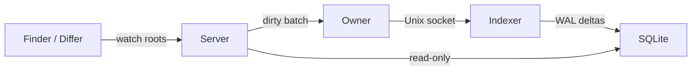
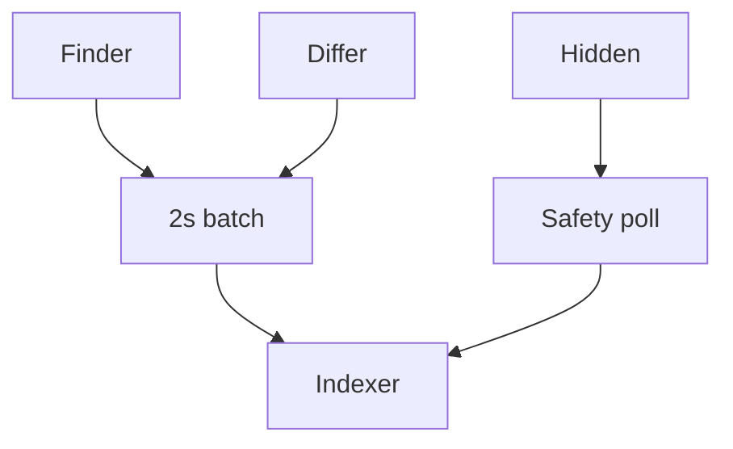

# Persistent Quick Open indexer

## Goal

Quick Open indexing is a durable local-database service, not request-server work. A YOLOmux HTTP/WebSocket server must never walk a large tree, sort a full index, or write the SQLite index after a filesystem event.

## Ownership



- The existing background-owner election chooses the server that supervises the indexer child.
- The child starts lazily on the first Quick Open/index invalidation request, then is long-lived and owns every SQLite write connection. An idle browser therefore has no indexer process at all.
- Any server can read the latest committed SQLite snapshot with a read-only connection.
- If ownership changes, the new owner starts/reuses one indexer; no HTTP server becomes a database writer.

## Visibility policy



- Only paths explicitly reported by a visible Finder or Differ receive native watch handling and the two-second refresh target.
- File editors, transcript/activity views, and hidden browser tabs retain their independent lightweight file/status policies; they do not make an entire Quick Open root hot.
- A root can still be initially indexed on an explicit Quick Open request. Hidden roots are otherwise reconciled on the long safety interval.

## SQLite model

`entries.path` is the primary key. The indexer applies one transaction per coalesced root batch:

```sql
INSERT INTO entries(path, name, relative_path, size, mtime)
VALUES (?, ?, ?, ?, ?)
ON CONFLICT(path) DO UPDATE SET
  name = excluded.name,
  relative_path = excluded.relative_path,
  size = excluded.size,
  mtime = excluded.mtime;

DELETE FROM entries WHERE path = ?;
DELETE FROM entries WHERE path = ? OR path LIKE ?;
```

File changes use one upsert/delete. Directory changes delete only that subtree, walk only that subtree, then insert its rows. A full-table delete and rewrite is permitted only for an initial build, an explicit full reindex, or a schema/policy migration.

## Rollout and verification

1. Add the indexer child and Unix-socket protocol; keep the old index as a fallback only until the child is healthy.
2. Route Quick Open build/dirty requests through it and make servers read
   SQLite snapshots.
3. Apply row-delta persistence and remove normal full-table rewrites.
4. Restrict high-frequency watch roots to visible Finder/Differ state.
5. Verify that a single file save causes one bounded indexer transaction, no
   `file-index-*` thread in the HTTP server, and no broad-root rewrite.
