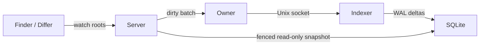
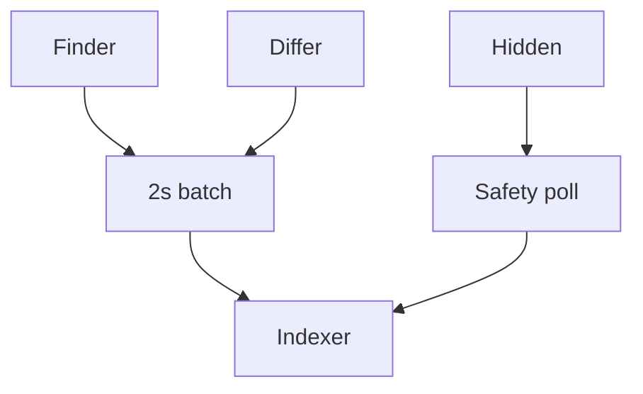

# Persistent Quick Open indexer

## Goal

Quick Open indexing is a durable local-database service, not request-server work. A YOLOmux HTTP/WebSocket server must never walk a large tree, sort a full index, or write the SQLite index after a filesystem event.

## Ownership


```mermaid
flowchart LR
  ui["Finder / Differ"] -->|"watch roots"| server["Server"]
  server -->|"dirty batch"| owner["Owner"]
  owner -->|"Unix socket"| indexer["Indexer"]
  indexer -->|"WAL deltas"| db["SQLite"]
  server -->|"fenced read-only snapshot"| db
```

- The existing background-owner election chooses the server that supervises the indexer child.
- When the owner is elected it leases `indexd` for every configured indexed root (`file_explorer.indexed_dirs`) and enqueues one `startup-depth-1` item per root, so a configured deployment starts indexing without waiting for a query. With no configured root the child still starts lazily on the first Quick Open/index invalidation request. Either way it is long-lived and owns every SQLite write connection; it exits after 60 seconds only when no lease, client, or queued work remains.
- `indexd` is the sole index writer. Servers may read a fenced committed SQLite snapshot directly, and use its RPC service for lifecycle and unavailable-state handling; no HTTP server becomes a writer.
- If ownership changes, the new owner starts/reuses one indexer and re-leases the configured roots on the new daemon; no HTTP server becomes a database writer.

Quick Open request modes are separate from index ownership. An empty Cmd-P query does not consult the index or filesystem; it lists the newest opened file paths from the bounded browser-memory history, newest first, with each row's last-opened date/time. An absolute or `~` query uses the authorized containing directory only, never recursive index search; the browser obtains one direct listing through `GET /api/fs/fast/list`, caches it, and filters names locally. A non-absolute query searches the configured indexed roots through the committed SQLite snapshots and may stream bounded result chunks. Indexed admission must prioritize exact and prefix basename matches and must not fill the bounded result page with matches assembled only from unrelated absolute-path fragments. The browser merges roots by path, rejects rows outside the producing root, and applies the visible priority order: currently open tabs, the newest 100 browser-memory file-history paths, files under the active Claude or Codex working directory, then the remaining indexed matches.

## Visibility policy


```mermaid
flowchart TB
  finder["Finder"] --> fast["2s batch"]
  differ["Differ"] --> fast
  hidden["Hidden"] --> slow["Safety poll"]
  fast --> indexer["Indexer"]
  slow --> indexer
```

- Only paths explicitly reported by a visible Finder or Differ receive native watch handling and the two-second refresh target.
- File editors, transcript/activity views, and hidden browser tabs retain their independent lightweight file/status policies; they do not make an entire Quick Open root hot.
- Configured indexed roots are indexed proactively at background-owner election (layer 1 first, then breadth-first), not only on an explicit Quick Open request. Change evidence for a configured root refreshes on the hot cadence while the lease keeps `indexd` alive; the long safety interval reconciles anything stronger evidence missed.

## SQLite model

The on-disk schema is `INDEX_FORMAT_VERSION=6`: `entries` carries a `generation` column; metadata binds every published snapshot to the `(st_dev, st_ino)` identity of the authorized root descriptor; and durable `directory_coverage` and `frontier` tables persist per-directory breadth-first coverage and the pending queue so a restart resumes at the shallowest pending directory instead of rediscovering the tree. Version 4 and 5 stores are rebuilt because they do not prove the descriptor identity that produced their rows; partial rows from an abandoned generation cannot overwrite a newer one.

`entries.path` is the primary key. The indexer applies one transaction per coalesced root batch:

```sql
INSERT INTO entries(path, name, relative_path, size, mtime)
VALUES (?, ?, ?, ?, ?)
ON CONFLICT(path) DO UPDATE SET
  name = excluded.name,
  relative_path = excluded.relative_path,
  size = excluded.size,
  mtime = excluded.mtime;

DELETE FROM entries WHERE path = ?;
DELETE FROM entries WHERE path = ? OR path LIKE ?;
```

File changes use one upsert/delete. A single-file hot repair updates or deletes that row and its parent-directory metadata. A configured-root full build no longer walks the whole tree recursively before publishing: it runs through the breadth-first, directory-at-a-time frontier (`bfs_index.build_root_into_index`), publishing each directory's direct rows, deletions, and next-layer frontier in one transaction and advancing `published_depth` only after a whole layer is terminal. The recursive `_walk_root_with_metrics` DFS survives only on the incremental dirty path and the no-runner fallback, never the configured-root full path. A full-table delete and rewrite is permitted only for an explicit full reindex outside a configured root, or a schema/policy migration.

## Breadth-first lifecycle, hot path, and safety refresh

The startup layer-1 publication order, breadth-first frontier priorities (`startup-depth-1`, `hot-change`, `user-visible-demand`, `breadth-expansion`, `full-safety-refresh`), the one hot-path change-evidence owner, the lowest-priority `file_explorer.index_refresh_seconds` safety reconciliation (default 1800 seconds, lease-driven and independent of queries), and the truthful `progressive_coverage`/`snapshot_state` status contract are specified in [`FS_INTERACTIVITY.md`](FS_INTERACTIVITY.md), shipped in 0.7.3. That document also records two honest caveats: a batchd-executed mutation reaching `indexd` in a multi-server/follower topology is an open question, and the bounded read path reuses the existing 30-second SQLite connect timeout. Indexed-search metadata is no longer a caveat: the scan opens every child relative to its pinned parent descriptor through `paths.safe_child()`, and `SafePathHandle.descriptor_path()` returns only a per-descriptor magic path or fails closed.

## Verification

A single file save causes one bounded indexer transaction, no `file-index-*` thread in the HTTP server, and no broad-root rewrite. Configured-root builds publish layer 1 (a root's direct files) before beginning layer 2, and a restart resumes the shallowest pending directory. Focused coverage lives in `tests/test_bfs_index.py`, `tests/test_search_indexer_bfs_cutover.py`, `tests/test_hot_path_owner.py`, and `tests/test_search_indexer.py`.
