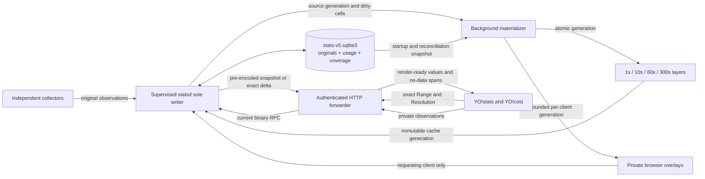

# YO!stats current API and storage contract

This document is the normative contract for the current YO!stats pipeline. The current system has one durable schema, one writer, one materializer, one exact snapshot shape, and one exact live-delta shape. Retired schemas, derived retention buckets, request dialects, readers, and compatibility responses are not part of the current API.

## Architecture and ownership



- `statsd` is the sole SQLite writer and the sole owner of source generations, materialization generations, family aggregation, coverage, usage/cost projection, precomputed Range-level cost reports, and exact snapshot bytes. Current snapshot/delta wire protocol version 2 requires the complete `cost_report`; version 1 is not accepted as a compatibility shape.
- The SQLite database stores original per-family observations at their real timestamps and cadences, identity-deduplicated usage atoms, covered epochs, explicit unavailable spans, and schema metadata. Explicit unavailable spans are coverage facts used when an old aggregate or a known source outage cannot be represented by an original observation; they are never display buckets.
- One background materializer reads a consistent database snapshot and builds the four epoch-aligned immutable resolution layers. Full rebuilds, incremental dirty-cell recomputation, coverage generation, and encoding never run on the statsd listener/writer thread or an HTTP request thread.
- The web process does not open the stats database. It authenticates and validates HTTP, forwards current RPC requests, and returns statsd's pre-encoded JSON bytes without temporal aggregation or decode/re-encode work.
- The browser renders returned values, axes, geometry, hover, visibility, and zoom clipping. It does not bucket, merge, average, compute rates, sample-hold, interpolate, infer coverage, prefetch other ranges, combine generations, or choose another resolution.

## Schema and writer fence

- The current database records `application_id`, `user_version`, current schema generation, minimum writer protocol, and minimum writer build. Schema 5 contains only metadata, observations, usage atoms, covered epochs, explicit unavailable spans, and migration reconciliation; derived display buckets are absent.
- Its active filename is schema-versioned (`stats-v5.sqlite3` for schema 5, minimum writer/service protocol 24, minimum writer build 2) and is not aliased to the retired `stats-history.sqlite3` path. This keeps a runner that predates the fence physically separated from the current database even when no current daemon holds the service lock. Build 2 transactionally normalizes overlapping synthetic coarse-loss spans left by the initial schema-5 migration and advances the source generation once; exact coverage/loss overlap fails closed, and build 1 is fenced before serving resumes. Protocol 24 also embeds the exact-model fork-repair contract in the database header and side fence, so a protocol-23 runner cannot reopen repaired schema-5 data.
- Every binary that can write performs a minimal read-only preflight of those markers before `CREATE TABLE`, migration, WAL-mode changes, quarantine, vacuum, or DML. A database newer than the binary supports raises the typed `SchemaTooNewError` result and closes unchanged.
- A too-new database is not corrupt. The database, WAL, SHM, inode, bytes, timestamps, schema, and service record must not be renamed, recreated, downgraded, quarantined, or repaired.
- Every mutating statsd RPC and HTTP observation upload carries the writer protocol and schema generation. A mismatch returns `upgrade_required` before dispatch, queueing, daemon replacement, or database mutation.
- A web process that receives `upgrade_required` stops its stats client, exposes that terminal state in System, and does not retry, spawn an older statsd, retire the newer owner, or replace its socket.
- Binaries that predate the fence are contained by the sole-writer boundary and exclusive writer lock. Schema activation first stops every old statsd owner, proves there is one current owner, and never exposes the database path as a web-process write surface.
- The current daemon acquires the generic singleton lock before opening the versioned database and rejects old shutdown or mutation requests before dispatch. An old runner may recreate only retired-path files; current startup never imports them into serving and removes them through idempotent retirement cleanup.
- A genuinely unreadable database is preserved as a timestamped forensic sidecar before a fresh current database is created with a visible warning. A merely newer database never enters that path.

## Range and Resolution policy

The complete numeric resolution universe is exactly `1s`, `10s`, `60s`, and `300s`. `AUTO` is the only nonnumeric choice. One server-owned policy supplies capabilities, validates requests, resolves AUTO, defines cache keys, and drives YO!stats, YO!cost, tests, and documentation.

| Range | AUTO concrete | Explicit resolutions |
| --- | ---: | --- |
| 5m | 1s | 1s, 10s |
| 15m | 10s | 10s, 60s |
| 30m | 10s | 10s, 60s |
| 1h | 10s | 10s, 60s, 300s |
| 2h | 60s | 60s, 300s |
| 4h | 60s | 60s, 300s |
| 8h | 60s | 60s, 300s |
| 16h | 300s | 300s |
| 24h | 300s | 300s |

Explicit choices are the values `r` in `{1,10,60,300}` for which `12 <= range_seconds / r <= 600`. AUTO is the finest value for which `range_seconds / r <= 600`. Every materialized bucket starts at `floor(timestamp / resolution) * resolution`, so its identity is stable across ranges, refreshes, ports, and clients.

`2s`, `5s`, `30s`, `120s`, `600s`, and every other numeric duration are unsupported current values. They may be read only inside the atomic migration transaction and never survive as accepted current rows, cache keys, requests, responses, controls, preferences, or labels. Tests and documentation may name them only to prove or explain rejection and migration. An invalid persisted browser choice normalizes visibly to AUTO before a request; an invalid wire request is rejected and never promoted, clamped, or substituted.

## Current routes

- `GET /api/stats-capabilities` returns the one server-owned Range/Resolution matrix.
- `GET /api/stats-snapshot` returns one exact immutable generation or a structured terminal/pending result.
- `GET /api/stats-delta` returns the bounded one-shot exact delta for an active cache cursor.
- `GET /api/stats-stream` carries the same delta cursor as SSE and emits `delta`, `ready`, `repair`, or `unavailable`.
- `POST /api/stats-observations` durably appends bounded browser-originated originals under the server-bound private identity.

## Exact snapshot endpoint

`GET /api/stats-snapshot` is the only current full retained-data snapshot endpoint. It requires normal read authentication and accepts these query parameters:

| Parameter | Contract |
| --- | --- |
| `range_seconds` | Required preset range from the server capabilities. |
| `resolution` | Required `AUTO`, `1`, `10`, `60`, or `300`. An explicit value must be valid for the selected range. |
| `client_id` | Required bounded opaque browser identity issued or bound by the server and used only to select that authenticated browser's private overlay. A caller cannot select another client's data. |
| `since_generation` | Optional non-negative cache generation for a bounded unchanged response. |

There is no current `history`, `history_start`, `history_end`, `history_resolution`, `history_max_points`, `max_points`, `token_*`, cursor-paging, or alternate encoded-sample parameter. Unknown or retired parameters are rejected rather than ignored or translated.

A successful response contains:

```json
{
  "protocol_version": 2,
  "range_seconds": 300,
  "requested_resolution": "AUTO",
  "resolution_seconds": 1,
  "window_start": 0,
  "window_end": 0,
  "generated_at": 0,
  "source_generation": 0,
  "cache_generation": 0,
  "rightmost_open": true,
  "buckets": [],
  "no_data": [],
  "cost_report": {
    "schema_version": 1,
    "total_micro_usd": 0,
    "total_tokens": 0,
    "dimensions": {
      "input": {"tokens": 0, "micro_usd": 0},
      "cache_read": {"tokens": 0, "micro_usd": 0},
      "cache_write": {"tokens": 0, "micro_usd": 0},
      "output": {"tokens": 0, "micro_usd": 0},
      "other": {"tokens": 0, "micro_usd": 0}
    },
    "priced": {"atoms": 0, "tokens": 0},
    "unpriced": {"atoms": 0, "tokens": 0},
    "models": [],
    "agents": [],
    "evidence": [],
    "catalog_revision": 0,
    "omissions": {"models": 0, "agents": 0, "evidence": 0},
    "reasoning_available": false
  }
}
```

- `range_seconds` echoes the exact requested range. `resolution_seconds` is the requested explicit resolution or statsd's concrete AUTO result.
- Every bucket has `start`, `duration == resolution_seconds`, server-final plot-ready `series`, source timestamps/counts, and open/complete state. Exact slices keep their uniform bucket identities; a covered sparse bucket may have an empty `series` object with source count zero and null timestamps, which is not a fabricated zero and is distinct from an unavailable `no_data` span. The response contains at most 600 bucket identities and never mixes durations.
- `no_data` is the authoritative bounded per-family/source list of inclusive-start, exclusive-end spans with a privacy-safe `source_id`, epoch, reason, and source-cadence facts. It is the union of persisted explicit unavailable spans and gaps between covered epochs; a persisted unavailable span cannot overlap covered time. Dynamic process, device, service, and browser series may therefore have different gaps; raw browser identities never appear. Missing observations are absent or no-data, never fabricated zeros.
- A measured zero is a real plotted value. Counts, tokens, costs, and usage rates are never repeated or multiplied to fill a finer display grid.
- Sparse or slow-cadence sources remain sparse in every materialized layer. statsd does not repeat an observation to fill a finer display grid, and Agent/Model tokens, costs, counts, event rates, GPU, status, and memory gain values only from real committed source evidence.
- Shared host, process, agent, token, and cost values are materialized once. Browser API/SSE, latency, bandwidth, and disconnect values are selected from a bounded private overlay by normalized `client_id` and are never returned to another client.
- `cost_report` is computed once while each exact cached Range/Resolution entry is published, not in HTTP and not in the browser. It contains exact total micro-USD and tokens, mutually exclusive `input/cache_read/cache_write/output/other` dimensions, priced/unpriced atom and token coverage, at most 16 deterministically ranked model rows, 16 agent rows, and 32 pricing-evidence rows, catalog revision and reviewed HTTP(S) source links, and exact omission counts. A missing source rate stays unpriced rather than free; `reasoning_available` is false because the current usage atoms cannot distinguish reasoning from ordinary output without invention.
- If a complete older cache generation exists while a rebuild runs, statsd may serve it with honest generation/freshness metadata. If no complete generation exists, it returns `pending`; it never scans SQLite or aggregates synchronously.
- When `since_generation` is still current and no open bucket or no-data fact changed, the endpoint may return `304 Not Modified` with the current cache generation and no body.
- The HTTP process forwards statsd's bounded pre-encoded JSON body and may apply the shared HTTP gzip representation. A cache hit performs no SQLite history query, family fold, temporal aggregation, or response encoding.

## Observation upload endpoint

`POST /api/stats-observations` is the only browser-observation write endpoint. It requires normal authenticated client access, the current writer protocol/schema generation, one server-bound normalized `client_id`, and at most 1,000 observations in a body of at most 128 KiB.

- Every observation has a stable event identity, native timestamp, family, source identity, and bounded family payload. Retries deduplicate by identity.
- The endpoint returns only an acknowledgement with the durable source generation and accepted/duplicate counts. It never returns retained history.
- Independent server collectors write through the same current statsd append owner rather than this HTTP surface.
- A stale writer protocol/schema returns `upgrade_required` before an observation is queued or written.
- The HTML bootstrap emits `statsWriterFence` directly from the storage protocol/schema constants. The matching cache-busted browser bundle validates and retains that immutable boot-time fence; it never fetches a newer fence into already-loaded code. Missing/invalid bootstrap data or HTTP 426 stops that page's uploader and clears its pending writes, transient 5xx failures retain the deduplicated queue with bounded exponential backoff, and a real page reload starts a new event epoch.

## Live delta delivery and cadence

`GET /api/stats-stream` carries the exact delta SSE shape; `GET /api/stats-delta` exposes the same cursor as a one-shot response. Each delta contains `protocol_version`, `range_seconds`, concrete `resolution_seconds`, `source_generation`, `base_cache_generation`, `cache_generation`, consecutive `revision`, complete replacement `buckets` and `no_data`, explicit `tombstones`, and one full precomputed `cost_report` replacement rather than a client-calculated patch. A bucket identity is `(start, duration)` because its `series` map is replaced atomically. A no-data identity is `(family, source_id, epoch, start, end)`. The server retains only the previous-to-current delta for each exact key; the browser applies it only when its key and base generation continue the active snapshot, and any older or mismatched cursor schedules one exact snapshot repair.

Delivery and repaint cadence is derived only from the server-echoed concrete resolution, never from the selected range:

| Resolution | Live behavior |
| --- | --- |
| 1s | statsd publishes the committed exact tail through SSE and the browser applies/repaints once per second. The X axis includes seconds and the live domain advances once per second. |
| 10s | statsd coalesces exact tail changes and the browser applies/repaints on aligned 10-second boundaries. |
| 60s | The stream checks for an exact delta and the browser performs presentation work once per minute. |
| 300s | The stream checks for an exact open-bucket delta and the browser performs presentation work once per minute; it does not wait five minutes to show a changed open bucket. |

The general coarse rule is a maximum one-minute interval, but `600s` is not a current resolution. Equivalently, live stream and presentation cadence is `min(resolution_seconds, 60 seconds)`; all four resolutions use the exact delta stream and a missed cursor uses one bounded snapshot repair.

CPU observations can therefore change a 1s chart every second. Slower or sparse families such as Agent/Model tokens, cost, GPU, Agent Status, and memory do not repeat values into artificial 1s observations: their existing geometry drifts left with the live axis, or remains empty, until a real source observation changes the materialized result.

A Range/Resolution selection, reconnect, missed generation, server identity change, or visibility restoration triggers one immediate exact snapshot. One-second activity never downloads a complete 5m/1s snapshot every second. Hidden documents and fixed historical zooms have no live delivery or repaint work and recover from one exact snapshot when activated.

## Native collection and materialization

- Collection is independent, asynchronous, and non-overlapping: CPU is sampled every second; Agent Status, GPU, and local-service load every 10 seconds; system memory every 60 seconds; transcript/usage tokens every 10 seconds while watched and every 60 seconds while idle. One slow family cannot delay another. A steady-state transcript pass is globally bounded to 4 MiB or 4096 complete records, deduplicates physical Claude/Codex transcript files, persists only complete-line offsets, rereads no unchanged bytes, and resumes cold backfill on later token-cadence passes. Each demanded Claude project enumerates a bounded top-level reverse-name/newest-mtime session window through the shared directory catalog, expands each root through only its own subagents, and gives unowned background roots stable project/session agent attribution; independent sibling sessions are never relabeled as pane children. The protocol-24 one-time orphan-fork repair may use up to 8 MiB or 8192 records per asynchronous pass until its durable completion marker is committed; this keeps each tombstone receipt small enough to acknowledge and persist promptly on a limited-RAM Mac. It stops each orphan at the explicit child handoff and then permanently returns to the steady-state ceiling.
- Each committed original advances the source generation and identifies deterministic dirty cells in the four resolution layers. Full rebuild and incremental refresh call the same family fold; there is no request-specific or range-specific aggregation algorithm.
- The 1s layer spans the longest range that offers 1s, the 10s layer spans the longest range that offers 10s, the 60s layer spans the longest range that offers 60s, and the 300s layer spans 24h. Shorter range snapshots are immutable slices, and AUTO shares the same concrete layer as its explicit equivalent.
- A full startup/reconciliation build reads one consistent SQLite snapshot and publishes by one atomic reference swap. Stale builders cannot overwrite a newer generation. Every full build carries a labelled reason (`startup`, `stale_generation_repair`, `cold_cache`) in `status.build.last_full_reason`.
- Incremental work coalesces duplicate dirty identities, updates only affected cells, and encodes outside the writer/listener path. The periodic reconciliation applies retention/pricing/backfill/coverage changes WITHOUT a full rebuild when nothing changed: a no-change prune schedules no build, and retention deletions dirty only the cutoff cells per resolution.
- Wire encoding is demand-gated at three levels with one shared 120 s grace: private browser overlays exist only for clients with a recent request or browser-family append; PUBLIC encoding stops entirely when no client asked within the grace (`status.build.encodes_skipped_idle` counts skips; the generation still publishes and previous entries are retained as stale bodies, so a returning client is served instantly and the next build re-encodes fresh); and within an active grace, only DEMANDED `(range, resolution)` views encode at their live cadence while undemanded views refresh together once per 60 s — a range/resolution switch renders instantly from a <=60 s-stale retained entry and catches up on the next one-second build. Service startup counts as demand.
- Delta entries are generated only for demanded views at their published cadence (an undemanded view's returning cursor repairs through the retained snapshot), reuse the encode-pass cost report for the same generation, and contain only changed buckets, changed gaps, and tombstones — never a serialized full snapshot.
- Unchanged frozen `Bucket` objects are reused across incremental generations, and their wire dicts are memoized by object identity, so an advancing tail rebuilds only the changed bucket dictionaries; memoized bodies are byte-for-byte identical to fresh builds.
- Encode work is accounted per build in `status.build.last_encode` and cumulatively in `status.build.encode_totals` (slices produced, `AUTO` alias reuses, entries, bytes, bucket instances visited); each concrete resolution is sliced once per range and `AUTO` aliases that same body, differing only in the echoed `requested_resolution`.
- Usage atoms are deduplicated by stable event identity. Agent and Model token dimensions and YO!cost projections derive from the same atoms and reconcile exactly. A Codex subagent fork suppresses the full cloned parent prelude until its explicit inter-agent handoff marker, establishes the inherited cumulative counter as a baseline, and emits only later child deltas. Versioned replay removes previously stored cloned-prefix atoms only when event identity, timestamp, quantity, provider, model, child thread, and Codex source all match; rewritten recent timestamps alone never authorize deletion. Each stored atom owns its immutable `pricing_profile`; cost reports carry selected-profile marginal micro-USD and default-profile API-list counterfactual micro-USD separately at report, dimension, model, agent, evidence, and chart-series levels. `subscription` means zero marginal cost only for subscription-covered CLI usage, never that direct API usage or unknown pricing is free. Incomplete or unpriced usage remains visibly incomplete or a lower-bound estimate rather than acquiring fabricated components.

## Errors and version behavior

| Condition | HTTP result | Contract |
| --- | ---: | --- |
| Unsupported Range/Resolution or retired parameter | `400` | Structured `unsupported` response with current valid choices; no substitution or fallback. |
| No complete materialization yet | `503` | Structured `pending` response with bounded `retry_after_seconds`; no synchronous build. |
| Current statsd unavailable | `503` | Structured `unavailable` response; no in-process database reader or older transport retry. |
| Client/writer protocol or schema is too old | `426` | Structured `upgrade_required`; the client stops mutation and automatic retry. |

Current clients reject a response whose echoed key, concrete resolution, bucket duration, generation, or protocol does not match the active request. Stale success, failure, and cleanup handlers cannot replace or clear a newer request.

There is no rolling compatibility path in current stats serving. Retired read and write routes, RPC actions, parameters, and payloads return an error and never reach storage or current serving.

## Atomic migration

- Before current serving begins, statsd quiesces collectors, acquires the exclusive writer fence, and discovers every supported old table, history/journal file, token stream, usage/cost source, and protocol marker.
- The migration recovers the finest original evidence, deduplicates stable identities, converts every recoverable fact to the current schema, and records unreconstructable coarse-only spans as explicit current no-data. It never splits, repeats, or relabels a coarse aggregate as finer observations.
- The migration recalculates all four current layers and reconciles per-family counts, coverage, retained bounds, epochs, Agent/Model totals, usage atoms, tokens, and costs before commit.
- Any mismatch or interruption aborts without activating a partial schema. Restart retries the idempotent migration.
- A successful commit installs the current schema/minimum-writer markers, switches the active database, verifies integrity, deletes every old table, file, sidecar, import marker, and protocol state, and reclaims space. Normal startup thereafter accepts only the current schema.
- No old table, reader, writer, importer, derived retention tier, token side stream, request dialect, response shape, flag, fallback, or compatibility branch survives the cutover.

## Diagnostics

YO!stats `System` renders the bounded `/api/system-status` result and `Logs` renders the bounded `/api/logs` result. Each polls only while its subview is selected, has an explicit Refresh action, preserves its internal scroll position across refreshes, and shows terminal upgrade state instead of retrying an incompatible stats owner. Service diagnostics may include schema/minimum-writer, sole-writer identity, generations, queue/build state, sampler state, and bounded failures; they never create a second stats data path.

Diagnostics never expose raw client IDs, private series values, prompts, transcripts, paths, credentials, or secrets.

## Required contract coverage

- Sweep every canonical Range x AUTO/explicit Resolution through the real browser request builder, HTTP forwarder, statsd cache, and renderer; assert the echoed key, concrete allowed resolution, uniform duration, stable alignment, at most 600 buckets, and zero browser temporal transformation.
- Reject `15m/1s`, `2h/10s`, `4h/120s`, `16h/1s`, `24h/600s`, retired parameters, mixed durations, silent point-limit substitution, and stale generations.
- Cover every family fold at all four resolutions, observed zero versus no-data, epoch boundaries, usage-atom deduplication, Agent/Model/Cost reconciliation, private-client isolation, exact SSE replacement, missed-delta repair, and the 1s/10s/60s/300s delivery cadence. Fork coverage includes two metadata records, copied contexts, multiple parent lengths, recent rewritten copied timestamps, explicit handoff, genuine child suffix deltas, replay receipts, lost acknowledgements, idempotent restart, and unchanged historical Input/Cache/Output/cost totals apart from real child usage.
- Open a newer fixture with an older supported writer/client and prove `upgrade_required`, no mutation or daemon replacement, no retry loop, and unchanged database/WAL/SHM hashes and metadata.
- Cover all-source migration, duplicate inputs, irreconstructable coarse spans, rollback, interruption, idempotent reopen, corrupt-input preservation, successful old-format deletion, and current-only restart.
- Prove a cache hit performs zero SQLite scans, folds, or encoding; block a full materializer build and prove CPU durable writes still meet their deadline; exercise concurrent readers/writes/restart, bounded private-overlay eviction, and cold/warm CPU/RSS and payload measurements on the target Mac without brittle machine-specific timing assertions.
- Negative-search tests forbid current production references to retired history endpoints/actions, in-web-process database history readers, derived retention tiers, temporal browser aggregation/prefetch, compatibility flags, and numeric resolutions outside `1/10/60/300`.
